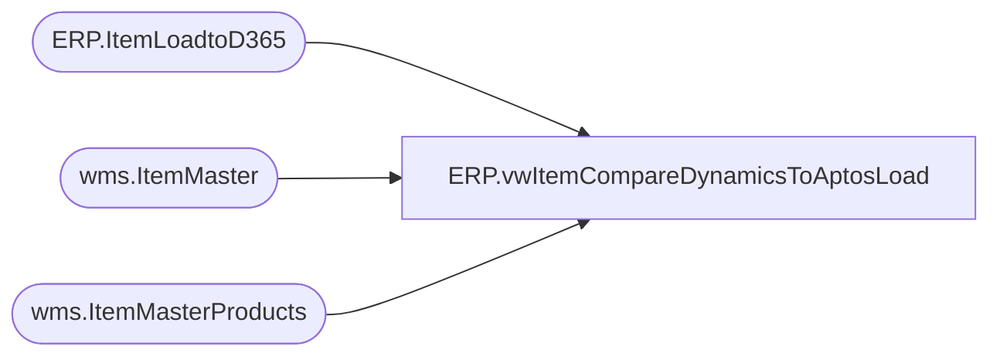

# ERP.vwItemCompareDynamicsToAptosLoad

**Database:** IntegrationStaging  
**Server:** STL-SSIS-P-01  

## Architecture Diagram



## Table Dependencies

| Referenced Table |
|---|
| ERP.ItemLoadtoD365 |
| wms.ItemMaster |
| wms.ItemMasterProducts |

## View Code

```sql
CREATE view [ERP].[vwItemCompareDynamicsToAptosLoad]

as 

with DynamicsData as (
select im.entity,
im.ItemNumber,
im.ProductNumber,
p.ProductDescription, 
p.ProductName,
im.SearchName, 	
p.HarmonizedSystemCode,
im.OriginCountryRegionId
from wms.ItemMaster im 
join wms.ItemMasterProducts p on im.ItemNumber=p.ProductNumber
where 1=1
and isnumeric(im.ItemNumber)=1
),

LoadData as (

select 			e.entity,
			e.ITEMNUMBER, 
			e.PRODUCTNUMBER, 
			e.PRODUCTDESCRIPTION,	
			e.PRODUCTNAME,	
			isnull(e.SEARCHNAME,'') as SEARCHNAME,
			isnull(e.HARMONIZEDSYSTEMCODE,'') as HARMONIZEDSYSTEMCODE,
			isnull(e.ORIGINCOUNTRYREGIONID,'') as ORIGINCOUNTRYREGIONID
FROM ERP.ItemLoadtoD365 e
where 1=1
)


--select d.*, l.*
--select d.entity, d.ItemNumber 

select d.Entity, 
d.ItemNumber, 
d.ProductNumber, 
l.PRODUCTDESCRIPTION, 
l.PRODUCTNAME, 
l.SEARCHNAME,
l.HARMONIZEDSYSTEMCODE,
l.ORIGINCOUNTRYREGIONID, 
			'Merchandise' as PRODUCTCATEGORYNAME, 
			'Procurement Categories' as PRODUCTCATEGORYHIERARCHYNAME, 
			'0' as UNDERDELIVERYPCT, 
			'Merch' as PROPERTYID, 
			'0' as OVERDELIVERYPCT, 
			'MERCH' as ITEMGROUPID, 
			'1' as PRODUCTTYPE,	
			'1' as PRODUCTSUBTYPE
from DynamicsData D
join LoadData L on D.Entity=l.Entity
				and D.ItemNumber=L.ITEMNUMBER
where (
		d.ProductDescription<>l.PRODUCTDESCRIPTION or 
		d.ProductName <> l.ProductName or
		d.SearchName <> l.SearchName or
		d.HarmonizedSystemCode <> l.HarmonizedSystemCode or
		d.OriginCountryRegionId <> l.OriginCountryRegionId
		)
group by d.Entity, 
d.ItemNumber, 
d.ProductNumber, 
l.PRODUCTDESCRIPTION, 
l.PRODUCTNAME, 
l.SEARCHNAME,
l.HARMONIZEDSYSTEMCODE,
l.ORIGINCOUNTRYREGIONID
--group by d.entity, d.ItemNumber 
--Order by 1 , 2
```

