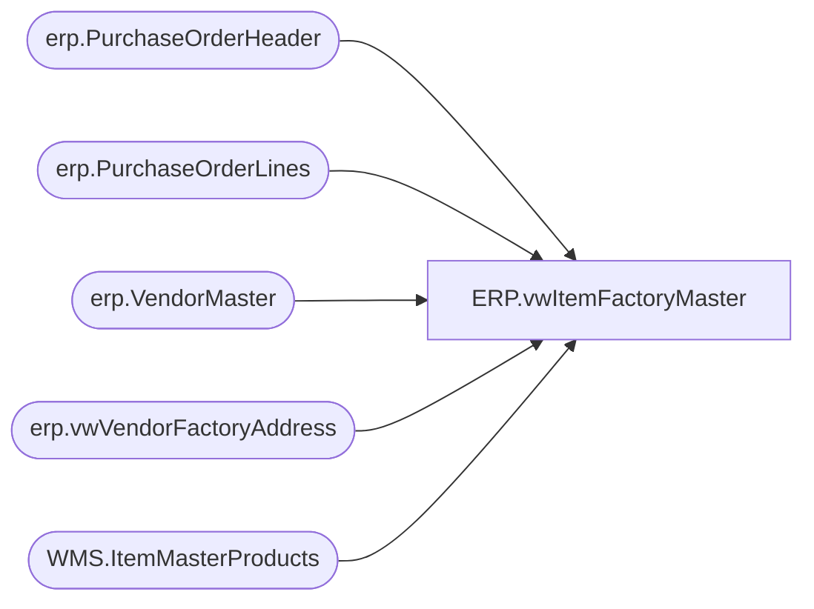

# ERP.vwItemFactoryMaster

**Database:** IntegrationStaging  
**Server:** STL-SSIS-P-01  

## Architecture Diagram



## Table Dependencies

| Referenced Table |
|---|
| erp.PurchaseOrderHeader |
| erp.PurchaseOrderLines |
| erp.VendorMaster |
| erp.vwVendorFactoryAddress |
| WMS.ItemMasterProducts |

## View Code

```sql
CREATE view [ERP].[vwItemFactoryMaster] 

as


with 
PO as
	(
		select 
			ph.Entity, 
			max(ph.PurchaseOrderNumber) PurchaseOrderNumber,
			pl.ItemID
		from erp.PurchaseOrderHeader ph
		join erp.PurchaseOrderLines pl 
			on ph.entity = pl.entity 
			and ph.PurchaseOrderNumber = pl.PurchaseOrderNumber
		group by ph.Entity, pl.ItemID 
	),
VendorAccount as 
	(
		select distinct poh.ShipFromID as VendorAccountNumber, po.ItemID, poh.Entity 
		from erp.PurchaseOrderHeader poh
		join PO 
			on poh.Entity = PO.Entity 
			and poh.PurchaseOrderNumber = PO.PurchaseOrderNumber
	),
FactoryCountry as
	(
		select distinct	
			va.Entity, 
			p.ProductNumber,
			case 
				when fa.country = 'P.R. of China'
					then 'CN'
				when fa.country = 'Vietnam'
					then 'VN'
				when fa.country = 'Indonesia'
					then 'ID'
				else isnull(fa.country, 'CN')
			end as FactoryCountry
		from VendorAccount va
		join erp.VendorMaster v 
			on va.entity = v.entity 
			and va.VendorAccountNumber = v.VendorAccountNumber
		join WMS.ItemMasterProducts p 
			on va.ItemID = p.PRODUCTNUMBER
		left join erp.vwVendorFactoryAddress fa 
			on v.entity = fa.Entity 
			and v.VendorAccountNumber = fa.VendorAccountNumber 
		where left(p.ProductNumber, 1) in ('S', 'P')
	)
select 
	Entity,
	ProductNumber,
	min(FactoryCountry) as FactoryCountry --in case we have multiples, CN is likely to be the min and we'll therefor default to CN/China
from FactoryCountry
group by Entity, ProductNumber
```

