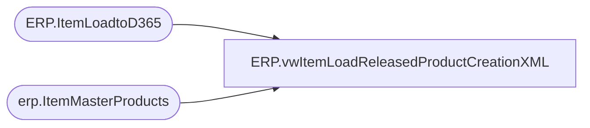

# ERP.vwItemLoadReleasedProductCreationXML

**Database:** IntegrationStaging  
**Server:** STL-SSIS-P-01  

## Architecture Diagram



## Table Dependencies

| Referenced Table |
|---|
| ERP.ItemLoadtoD365 |
| erp.ItemMasterProducts |

## View Code

```sql
CREATE view [ERP].[vwItemLoadReleasedProductCreationXML]

as

-------------------------------------------------------------------------------
--2017-08-16	-	Dan Tweedie	- Created view to output ItemLoad XML for D365
-------------------------------------------------------------------------------
WITH
XMLStage (XMLData) as 
	(
		select (
					select 
						--'' as BomUnitSymbol, NULL as xtra1,
						--'' as InventoryReservationHierarchyName, NULL as xtra2,
						e.InventoryUnitSymbol,
						e.IsCatchWeightProduct,
						e.IsProductKit,
						e.ItemModelGroupId,
						e.ItemNumber,
						e.ProductDescription,
						--'' as ProductDimensionGroupName, NULL as xtra3,
						e.ProductGroupId,
						e.ProductName,
						e.ProductNumber,
						--'' as ProductSearchName, NULL as xtra4,
						e.ProductSubType,
						e.ProductType as PrductType,
						--'' as PurchaseSalesTaxItemGroupCode, NULL as xtra5,
						e.PurchaseUnitSymbol,
						--'' as RetailProductCategoryName, NULL as xtra6,
						--'' as SalesSalesTaxItemGroupCode, NULL as xtra7,
						e.SalesUnitSymbol,
						--'' as SearchName, NULL as xtra8,
						e.StorageDimensionGroupName,
						e.TrackingDimensionGroupName,
						--'' as VariantConfigurationTechnology, NULL as xtra9,
						e.HarmonizedSystemCode
					FROM ERP.ItemLoadtoD365 e
					where 
						e.SendData = 1
					AND not exists (select distinct im.ProductNumber from erp.ItemMasterProducts im where im.ProductNumber = e.ProductNumber) --ASSUMES THIS FILE IS ONLY FOR FIRST PRODUCT CREATION, NOT UPDATES
					for xml path('EcoResReleasedProductCreationEntity'), Type
			)
		 for xml path('Document')
	)
select cast(XMLData as xml) as XMLData
from XMLStage
```

