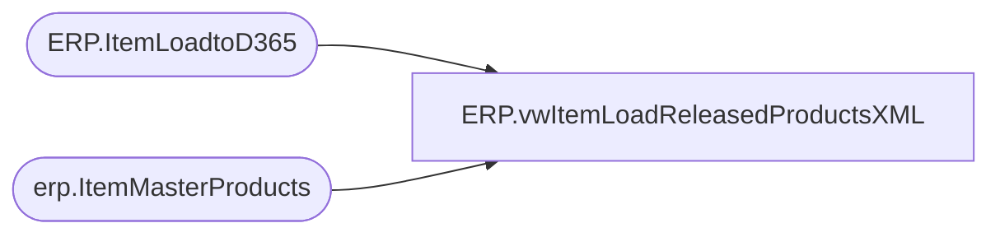

# ERP.vwItemLoadReleasedProductsXML

**Database:** IntegrationStaging  
**Server:** STL-SSIS-P-01  

## Architecture Diagram



## Table Dependencies

| Referenced Table |
|---|
| ERP.ItemLoadtoD365 |
| erp.ItemMasterProducts |

## View Code

```sql
CREATE view [ERP].[vwItemLoadReleasedProductsXML]

as

-------------------------------------------------------------------------------
--2017-08-16	-	Dan Tweedie	- Created view to output ItemLoad XML for D365
-------------------------------------------------------------------------------
WITH
XMLStage (XMLData) as 
	(
		select 
			e.PURCHASEPRICE,
			e.INVENTORYUNITSYMBOL,
			e.ISPURCHASEPRICEAUTOMATICALLYUPDATED,
			e.ITEMMODELGROUPID,
			e.ITEMNUMBER,
			e.PRODUCTDESCRIPTION,
			e.PRODUCTGROUPID,
			e.PRODUCTNUMBER,
			e.PRODUCTSUBTYPE,
			e.PRODUCTTYPE,
			e.PURCHASEUNITSYMBOL,
			e.SALESUNITSYMBOL,
			e.SEARCHNAME,
			e.STORAGEDIMENSIONGROUPNAME,
			e.TRACKINGDIMENSIONGROUPNAME,
			e.SALESPRICE,
			e.UNITCONVERSIONSEQUENCEGROUPID,
			e.UNITCOST,
			e.UNITCOSTQUANTITY
		FROM ERP.ItemLoadtoD365 e
		where e.SendData = 1
		or not exists (select distinct im.ProductNumber from erp.ItemMasterProducts im where im.ProductNumber = e.ProductNumber)
		for xml path('EcoResReleasedProductEntity'), root('Document'), Type
	)
select XMLData
from XMLStage
```

