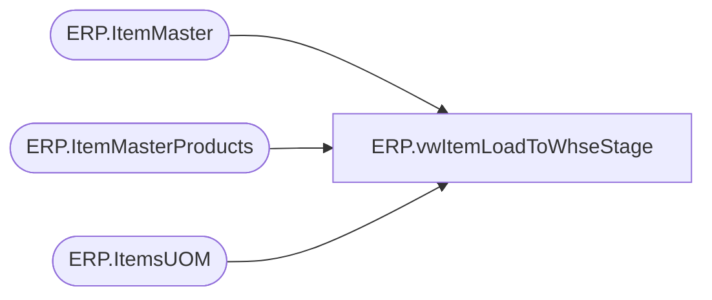

# ERP.vwItemLoadToWhseStage

**Database:** IntegrationStaging  
**Server:** STL-SSIS-P-01  

## Architecture Diagram



## Table Dependencies

| Referenced Table |
|---|
| ERP.ItemMaster |
| ERP.ItemMasterProducts |
| ERP.ItemsUOM |

## View Code

```sql
CREATE view [ERP].[vwItemLoadToWhseStage]

as 

select 
	im.Entity,
	'001' as CO,
	'001' as DIV,
	cast(right(im.ItemNumber,6) as varchar(6)) as StyleCode,
	left(replace(replace(replace(p.ProductName,'"',' ') ,'[',' '), ',', ''),40) as SKUDescription,
	'' as CARTON_TYPE,
	cast(im.InventoryUnitSymbol as varchar(10)) as InventoryUnitSymbol,
	cast(uom.Factor as int) as InventoryUnitQty, 
	case 
		when cast((im.SalesPrice / uom.Factor) as decimal(10,2)) = 0.00
			or cast((im.SalesPrice / uom.Factor) as decimal(10,2)) is NULL 
			then 0.01
		else cast((im.SalesPrice / uom.Factor) as decimal(10,2))
	end as UnitSalesPrice,
	case 
		when cast(im.SalesPrice as decimal(10,2)) = 0.00
			or cast(im.SalesPrice as decimal(10,2)) is NULL 
			then 0.01
		else cast(im.SalesPrice as decimal(10,2))
	end as SalesPrice,
	1 as STD_CASE_QTY,
	0 as MAX_CASE_QTY,
	0 as STD_CASE_LEN,
	0 as STD_CASE_WIDTH,
	0 as STD_CASE_HT,
	1 as UNIT_WT,
	1 as UNIT_VOL,
	0 as STD_PACK_WT,
	0 as STD_PACK_VOL,
	0 as STD_CASE_WT,
	0 as STD_CASE_VOL,
	0 as CRITCL_DIM_1,
	0 as CRITCL_DIM_2,
	0 as CRITCL_DIM_3,
	0 as STAT_CODE,
	cast(right(im.ItemNumber,6) as varchar(6)) as SKU_BRCD,
	0 as STD_PACK_WIDTH,
	0 as STD_PACK_LEN,
	0 as STD_PACK_HT,
	0 as UNIT_WIDTH,
	0 as UNIT_LEN,
	0 as UNIT_HT,
	'999' as SKU_PROFILE_ID,
	'EAR99' as ECCN_NBR,
	'NLR' as EXP_LICN_NBR,
	'NONE ASSIGN' as COMMODITY_CODE,
	'980' as WHSE,
	'SUP' as STORE_DEPT,
	'CN' as ORGN_CERT_CODE
from ERP.ItemMasterProducts p with (nolock)
join ERP.ItemMaster im with (nolock) on p.PRODUCTNUMBER = im.PRODUCTNUMBER
join ERP.ItemsUOM uom with (nolock)
	on im.Entity = uom.Entity 
	and im.PRODUCTNUMBER = uom.PRODUCTNUMBER
	and im.INVENTORYUNITSYMBOL = uom.FROMUNITSYMBOL
	and uom.TOUNITSYMBOL = 'wmea'
where left(ItemNumber, 1) = 'S'
```

