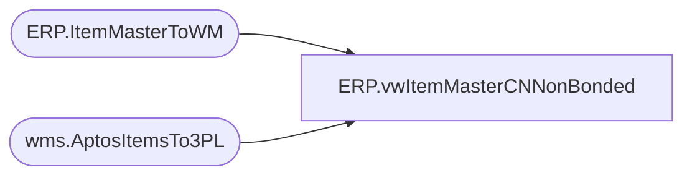

# ERP.vwItemMasterCNNonBonded

**Database:** IntegrationStaging  
**Server:** STL-SSIS-P-01  

## Architecture Diagram



## Table Dependencies

| Referenced Table |
|---|
| ERP.ItemMasterToWM |
| wms.AptosItemsTo3PL |

## View Code

```sql
CREATE view [ERP].[vwItemMasterCNNonBonded]

as

with
Dynamics as
	(
		select  Style as style_code,
				isnull(replace(SKU_DESC, ',','' ), '') as short_desc,
				std_pack_qty as distribution_multiple,
				std_case_qty as order_multiple,
				isnull(UpdateDate, InsertDate) as ItemDate
		from ERP.ItemMasterToWM with (nolock)
		where entity = 3001
		and len(Style)=6
		and left(style, 1) in ('0','8','9')
	)
,Aptos as -- comment out CTE for go live
	(
		 select 
			style_code,
			short_desc,
			distribution_multiple,
			order_multiple,
			isnull(UpdateDate, InsertDate) as ItemDate
		 from wms.AptosItemsTo3PL with (nolock)
	)
	-- uncomment for go live
--, PLM as
--	(
--		  select 
--			StyleCode style_code,
--			ItemDesc short_desc,
--			DistribMultiple distribution_multiple,
--			OrderMultiple order_multiple,
--			ItemDate
--		 from  WMS.vwItemCasePackCN with (nolock)
--			WHERE left(StyleCode, 1) in ('0','8','9')
--	)
select 
	cast(style_code as nvarchar(6)) as style_code,
	cast(short_desc as nvarchar(200)) as short_desc,
	distribution_multiple,
	--order_multiple,
	distribution_multiple as order_multiple, --per Jason Lu @ China Whse, we need to send this value for supplies, as this is the value the WMS uses for inventory
	cast(ItemDate as date) as ItemDate
from Dynamics
UNION
select 
	cast(style_code as nvarchar(6)) as style_code,
	cast(short_desc as nvarchar(200)) as short_desc,
	distribution_multiple,
	order_multiple,
	cast(ItemDate as date) as ItemDate
from Aptos -- Comment out for go live
--from PLM -- Unomment for go live
```

