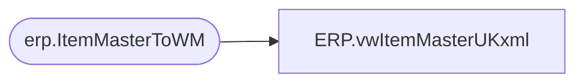

# ERP.vwItemMasterUKxml

**Database:** IntegrationStaging  
**Server:** STL-SSIS-P-01  

## Architecture Diagram



## Table Dependencies

| Referenced Table |
|---|
| erp.ItemMasterToWM |

## View Code

```sql
CREATE view [ERP].[vwItemMasterUKxml]

as

with 
XMLStage (XML) as
	(
		select 
			co as [Item/SKUDefinition/Company], 
			div as [Item/SKUDefinition/Division],
			style as [Item/SKUDefinition/Style],
			sku_desc as [Item/ItemMasterFields/StyleDescription],
			sku_brcd as [Item/ItemMasterFields/PackageBarcode],
			carton_type as [Item/ItemMasterFields/CartonType],
			unit_price as [Item/ItemMasterFields/Price],
			retail_price as [Item/ItemMasterFields/RetailPrice],
			std_pack_qty as [Item/ItemMasterFields/InnerPackQuantity],
			std_case_qty as [Item/ItemMasterFields/StandardCaseQuantity],
			max_case_qty as [Item/ItemMasterFields/MaximumCaseQuantity],
			std_case_len as [Item/ItemMasterFields/StandardCaseLength],
			std_case_width as [Item/ItemMasterFields/StandardCaseWidth],
			std_case_ht as [Item/ItemMasterFields/StandardCaseHeight],
			std_pack_qty as [Item/ItemMasterFields/PackMultipleQuantity],
			unit_wt as [Item/ItemMasterFields/UnitWeight],
			unit_vol as [Item/ItemMasterFields/UnitVolume],
			std_pack_wt as [Item/ItemMasterFields/InnerPackWeight],
			std_pack_vol as [Item/ItemMasterFields/InnerPackVolume],
			std_case_wt as [Item/ItemMasterFields/StandardCaseWeight],
			std_case_vol as [Item/ItemMasterFields/StandardCaseVolume],
			commodity_code as [Item/ItemMasterFields/HarmonizedTariffSchedule],
			store_dept as [Item/ItemMasterFields/StoreDepartment],
			critcl_dim_1 as [Item/ItemMasterFields/CriticalDimension1],
			critcl_dim_2 as [Item/ItemMasterFields/CriticalDimension2],
			critcl_dim_3 as [Item/ItemMasterFields/CriticalDimension3],
			stat_code as [Item/ItemMasterFields/StatusCode],
			std_pack_width as [Item/ItemMasterFields/StandardInnerPackWidth],
			std_pack_len as [Item/ItemMasterFields/StandardInnerPackLength],
			std_pack_ht as [Item/ItemMasterFields/StandardInnerPackHeight],
			unit_width as [Item/ItemMasterFields/UnitWidth],
			unit_len as [Item/ItemMasterFields/UnitLength],
			unit_ht as [Item/ItemMasterFields/UnitHeight],
			exp_licn_nbr as [Item/ItemMasterFields/ExportLicenseNbr],
			eccn_nbr as [Item/ItemMasterFields/ExportControlClassNbr],
			exp_licn_nbr as [Item/ItemMasterFields/ExportLicenseExceptSymbol],
			orgn_cert_code as [Item/ItemMasterFields/OrgnCertCode],
			nmfc_code as [Item/ItemMasterFields/NMFCCode],
			frt_class as [Item/ItemMasterFields/FreightClass],
			commodity_code as [Item/ItemMasterFields/CommodityCode],
			commodity_level_desc as [Item/ItemMasterFields/CommodityLevelDesc],
			sku_profile_id as [Item/ItemMasterFields/SkuProfileID],
			whse as [ListOfItemWarehouses/ItemWarehouse/Warehouse],
			sku_profile_id as [ListOfItemWarehouses/ItemWarehouse/ItemWarehouseFields/SkuProfileID]
		from erp.ItemMasterToWM
		where entity = 2110
		and datediff(dd, isnull(UpdateDate, InsertDate), getdate()) = 0
		and left(style, 1) IN ('4','5','6')
		for xml path ('ItemMaster'), root('ItemMasterBridge')
	)
select cast(XML as xml) as XMLData
from XMLStage
```

