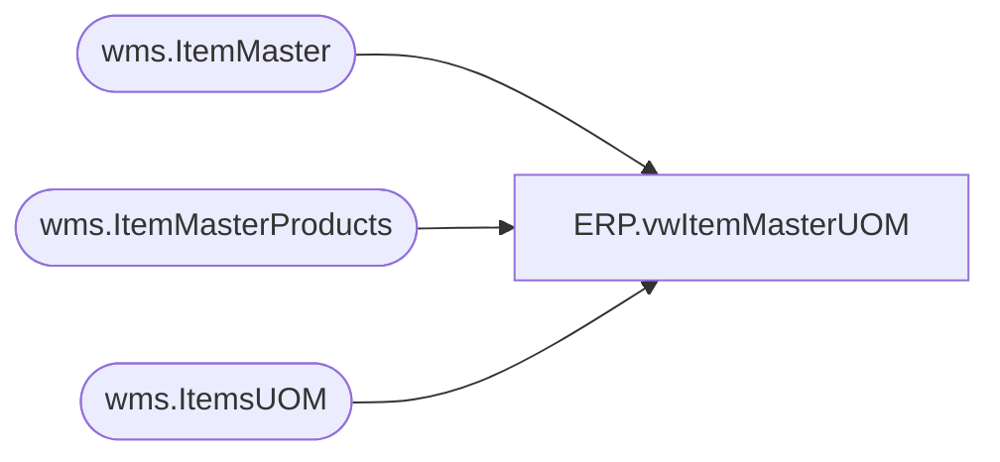

# ERP.vwItemMasterUOM

**Database:** IntegrationStaging  
**Server:** STL-SSIS-P-01  

## Architecture Diagram



## Table Dependencies

| Referenced Table |
|---|
| wms.ItemMaster |
| wms.ItemMasterProducts |
| wms.ItemsUOM |

## View Code

```sql
CREATE view [ERP].[vwItemMasterUOM]

------------------------------------------------------------------------------------------------------------------------------------
---Dan Tweedie - 2018-01-01 - View outputs Merchandise and Supply data, where Unit of Measure is converted to WMEA which is Units
------------------------------------------------------------------------------------------------------------------------------------

as

WITH 
UpdatedTodayFlag as
(
	select ProductNumber, 1 as Updated from wms.ItemMaster with (nolock) where datediff(dd, isnull(UpdateDate, InsertDate), getdate()) = 0 
	UNION
	select ProductNumber, 1 as Updated from wms.ItemsUOM with (nolock) where datediff(dd, isnull(UpdateDate, InsertDate), getdate()) = 0 
	UNION
	select ProductNumber, 1 as Updated from wms.ItemMasterProducts with (nolock) where datediff(dd, isnull(UpdateDate, InsertDate), getdate()) = 0 
),
Products as
	(
		select 
			im.ProductNumber,
			--case when left(im.ProductNumber,1) = 'S' then 1 else 0 end as Supply,
			im.ProductNumber StyleCode, 
			im.ProductSearchname as ProductName,
			im.PurchaseUnitSymbol,
			im.SalesUnitSymbol,
			im.InventoryUnitSymbol,
			im.SalesPrice,
			im.PurchasePrice,
			im.Entity
		from wms.ItemMaster im with (nolock) 
		where isnumeric(im.ProductNumber) = 1
	),
PurchaseMultiple as
	(
		select 
			p.ProductNumber,
			uom.Factor,
			uom.Entity 
		from Products p
		join wms.ItemsUOM uom with (nolock) on p.ProductNumber = uom.ProductNumber and p.Entity = uom.Entity
		where uom.ToUnitSymbol = 'wmea'
		and uom.FromUnitSymbol = p.PurchaseUnitSymbol
	),
InventoryMultiple as
	(
		select 
			p.ProductNumber,
			uom.Factor,
			uom.Entity 
		from Products p
		join wms.ItemsUOM uom with (nolock) on p.ProductNumber = uom.ProductNumber and p.Entity = uom.Entity
		where uom.ToUnitSymbol = 'wmea'
		and uom.FromUnitSymbol = p.InventoryUnitSymbol
	),
SalesMultiple as
	(
		select 
			p.ProductNumber,
			uom.Factor,
			uom.Entity 
		from Products p
		join wms.ItemsUOM uom with (nolock) on p.ProductNumber = uom.ProductNumber and p.Entity = uom.Entity
		where uom.ToUnitSymbol = 'wmea'
		and uom.FromUnitSymbol = p.SalesUnitSymbol
	)
select 
	p.ProductNumber,
	p.StyleCode,
	p.ProductName,
	p.PurchaseUnitSymbol,
	p.InventoryUnitSymbol,
	p.SalesUnitSymbol,
	cast(isnull(pm.Factor,1) as int) as PurchaseMultiple,
	cast(isnull(i.Factor,1) as int) as InventoryMultiple,
	cast(isnull(sm.Factor,1) as int) as SalesMultiple,
	p.PurchasePrice,
	p.SalesPrice,
	--p.Supply,
	p.Entity,
	isnull(u.Updated,0) as UpdatedToday
from Products p
left join PurchaseMultiple pm on p.ProductNumber = pm.ProductNumber and p.entity = pm.Entity
left join InventoryMultiple i on p.ProductNumber = i.ProductNumber and p.entity = i.Entity
left join SalesMultiple sm on p.ProductNumber = sm.ProductNumber and p.entity = sm.Entity
left join UpdatedTodayFlag u on p.ProductNumber = u.ProductNumber
```

