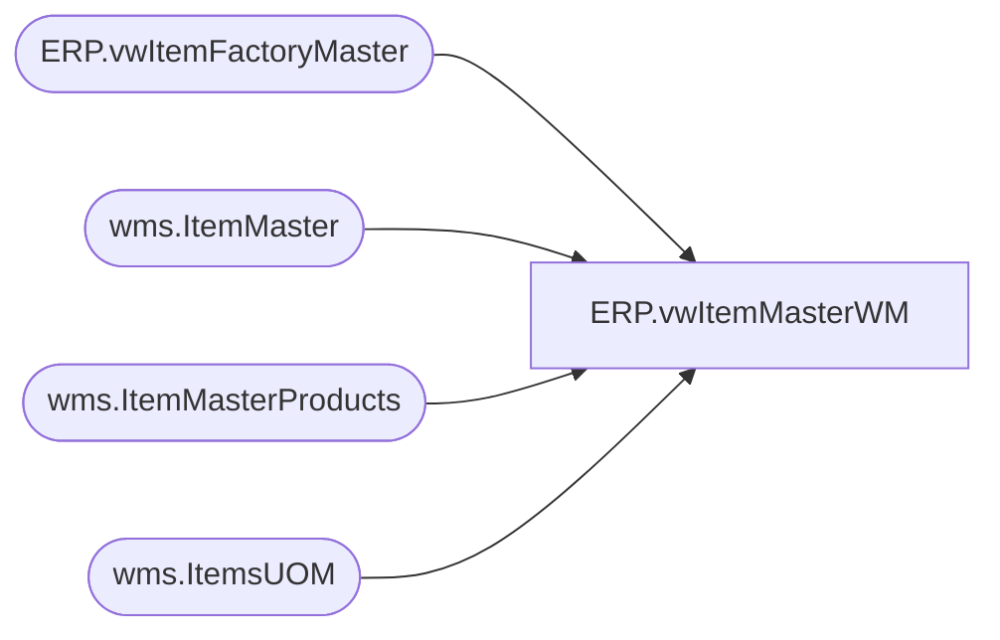

# ERP.vwItemMasterWM

**Database:** IntegrationStaging  
**Server:** STL-SSIS-P-01  

## Architecture Diagram



## Table Dependencies

| Referenced Table |
|---|
| ERP.vwItemFactoryMaster |
| wms.ItemMaster |
| wms.ItemMasterProducts |
| wms.ItemsUOM |

## View Code

```sql
CREATE view [ERP].[vwItemMasterWM]

as

--------------------------------------------------------------------------------------
--Dan Tweedie	-	 20180124	- Created view to capture data for WM item maste xml
--------------------------------------------------------------------------------------
with 
CountryOfOrigin as
	(
		select Entity, ProductNumber, FactoryCountry
		from ERP.vwItemFactoryMaster 
		where Entity in ('1100', '2110', '3001')
	),
Items as
	(
		select distinct 
			im.entity, 
			cast(im.ProductNumber as varchar) as STYLE,
			cast(left(replace(replace(replace(p.ProductName,'"',' ') ,'[',' '), ',', ''),40) as varchar) as SKU_DESC,
			case 
				when cast(im.PurchasePrice as decimal(10,2)) = 0.00 
					or cast(im.PurchasePrice as decimal(10,2)) is null
					then 0.01
				else cast(im.PurchasePrice as decimal(10,2))
			end as UNIT_PRICE,
			cast(im.PurchasePrice as decimal(10,2)) as RETAIL_PRICE,
			cast(uom.Factor as int) as STD_PACK_QTY,
			cast(im.ProductNumber as varchar) as SKU_BRCD,
			cast(isnull(p.HarmonizedSystemCode,'NONE ASSIGN') as varchar) as HTS,
			cast(p.NMFCCode as varchar) as nmfc_code
		from wms.ItemMasterProducts p with (nolock)
		join wms.ItemMaster im with (nolock) 
			on p.PRODUCTNUMBER = im.PRODUCTNUMBER
			and im.Entity in ('1100', '2110', '3001')
			and im.NecessaryProductionWorkingTimeSchedulingPropertyId = 'Supplies'
			and isnumeric(im.ItemNumber) = 1
		join wms.ItemsUOM uom with (nolock)
			on im.Entity = uom.Entity 
			and im.PRODUCTNUMBER = uom.PRODUCTNUMBER
			and im.INVENTORYUNITSYMBOL = uom.FROMUNITSYMBOL
			and uom.TOUNITSYMBOL = 'wmea'
	)
select 
	i.entity, 
	'001' as CO,
	'001' as DIV,
	i.STYLE,
	i.SKU_DESC,
	'' as CARTON_TYPE,
	i.UNIT_PRICE,
	i.RETAIL_PRICE,
	i.STD_PACK_QTY,
	1 as STD_CASE_QTY,
	0 as MAX_CASE_QTY,
	0 as STD_CASE_LEN,
	0 as STD_CASE_WIDTH,
	0 as STD_CASE_HT,
	1 as UNIT_WT,
	1 as UNIT_VOL,
	0 as STD_PACK_WT,
	0 as STD_PACK_VOL,
	0 as STD_CASE_WT,
	0 as STD_CASE_VOL,
	0 as CRITCL_DIM_1,
	0 as CRITCL_DIM_2,
	0 as CRITCL_DIM_3,
	0 as STAT_CODE,
	i.SKU_BRCD,
	0 as STD_PACK_WIDTH,
	0 as STD_PACK_LEN,
	0 as STD_PACK_HT,
	0 as UNIT_WIDTH,
	0 as UNIT_LEN,
	0 as UNIT_HT,
	'999' as SKU_PROFILE_ID,
	'EAR99' as ECCN_NBR,
	'NLR' as EXP_LICN_NBR,
	'NONE ASSIGN' as COMMODITY_CODE,
	'980' as WHSE,
	'SUP' as STORE_DEPT,
	cast(isnull(coo.FactoryCountry, 'CN') as varchar) as ORGN_CERT_CODE, -- need to get this from the new field 
	i.HTS,
	i.nmfc_code
from Items i 
left join CountryOfOrigin coo 
	on i.Style=coo.ProductNumber
	and i.Entity=coo.Entity
```

