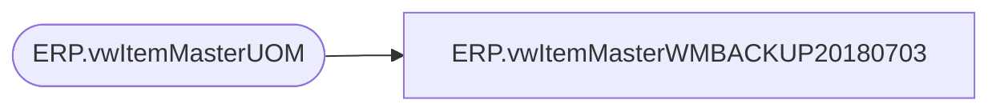

# ERP.vwItemMasterWMBACKUP20180703

**Database:** IntegrationStaging  
**Server:** STL-SSIS-P-01  

## Architecture Diagram



## Table Dependencies

| Referenced Table |
|---|
| ERP.vwItemMasterUOM |

## View Code

```sql
CREATE view [ERP].[vwItemMasterWMBACKUP20180703]

as

--------------------------------------------------------------------------------------
--Dan Tweedie	-	 20180124	- Created view to capture data for WM item maste xml
--------------------------------------------------------------------------------------

select  
	'001' as CO,
	'001' as DIV,
	StyleCode as STYLE,
	left(replace(replace(replace(ProductName,'"',' ') ,'[',' '), ',', ''),40) as SKU_DESC,
	'' as CARTON_TYPE,
	case 
		when cast(PurchasePrice as decimal(10,2)) = 0.00 
			or cast(PurchasePrice as decimal(10,2)) is null
			then 0.01
		else cast(PurchasePrice as decimal(10,2))
	end as UNIT_PRICE,
	cast(SalesPrice as decimal(10,2)) as RETAIL_PRICE, 
	InventoryMultiple as STD_PACK_QTY,
	1 as STD_CASE_QTY,
	0 as MAX_CASE_QTY,
	0 as STD_CASE_LEN,
	0 as STD_CASE_WIDTH,
	0 as STD_CASE_HT,
	1 as UNIT_WT,
	1 as UNIT_VOL,
	0 as STD_PACK_WT,
	0 as STD_PACK_VOL,
	0 as STD_CASE_WT,
	0 as STD_CASE_VOL,
	0 as CRITCL_DIM_1,
	0 as CRITCL_DIM_2,
	0 as CRITCL_DIM_3,
	0 as STAT_CODE,
	StyleCode as SKU_BRCD,
	0 as STD_PACK_WIDTH,
	0 as STD_PACK_LEN,
	0 as STD_PACK_HT,
	0 as UNIT_WIDTH,
	0 as UNIT_LEN,
	0 as UNIT_HT,
	'999' as SKU_PROFILE_ID,
	'EAR99' as ECCN_NBR,
	'NLR' as EXP_LICN_NBR,
	'NONE ASSIGN' as COMMODITY_CODE,
	'980' as WHSE,
	'SUP' as STORE_DEPT,
	'CN' as ORGN_CERT_CODE
from ERP.vwItemMasterUOM with (nolock)
where Entity = 1100
and Supply = 1
--and UpdatedToday = 1
```

