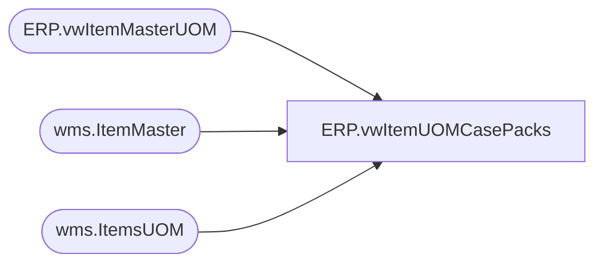

# ERP.vwItemUOMCasePacks

**Database:** IntegrationStaging  
**Server:** STL-SSIS-P-01  

## Architecture Diagram



## Table Dependencies

| Referenced Table |
|---|
| ERP.vwItemMasterUOM |
| wms.ItemMaster |
| wms.ItemsUOM |

## View Code

```sql
CREATE view [ERP].[vwItemUOMCasePacks]

as

-----------------------------------------------------------------------------------------------------------------------------
----	Lizzy Timm	-	2024-03-11	-	Created view for FDD WMS PURCHASE ORDER EXPORT DYNAMICS TO DBS; Jira BIB-776
-----------------------------------------------------------------------------------------------------------------------------
WITH Supplies AS (
	select  CONCAT(im.ProductNumber,im.Entity) [ID],
			im.ProductNumber,
			im.PurchaseUnitSymbol,
			im.Entity
		from wms.ItemMaster im with (nolock) 
		where isnumeric(im.ProductNumber) = 1
			AND im.NecessaryProductionWorkingTimeSchedulingPropertyId = 'Supplies'
)
-- Merch Items
SELECT DISTINCT uoma.ProductNumber
	, ISNULL(uomb.Factor,uoma.Factor) [StdPack] -- Distribution Multiple; when ip to ea conversion exists (OuterInner), use uomb factor but if only cs to ea exists (OuterNoInner) then use uoma factor
	, uoma.Factor [StdCase] -- Order Multiple; regardless of OuterInner or OuterNoInner, cs to ea factor is always the order_multiple
	, uoma.Entity
  FROM wms.ItemsUOM uoma --
  LEFT JOIN wms.ItemsUOM uomb ON uoma.ProductNumber = uomb.ProductNumber 
	AND uoma.Entity = uomb.Entity 
  -- OuterInner = ip to ea; order_multiple<>distribution_multiple
	AND uomb.FromUnitSymbol = 'ip' 
	AND uomb.ToUnitSymbol = 'ea'
  LEFT JOIN Supplies s ON s.ProductNumber = uoma.ProductNumber AND s.Entity = uoma.Entity
  WHERE 1=1
  -- OuterNoInner = cs to ea;  order_multiple=distribution_multiple
	AND uoma.FromUnitSymbol = 'cs' 
	AND uoma.ToUnitSymbol = 'ea'	
	AND isnumeric(uoma.ProductNumber) = 1
	--AND CONCAT(uoma.ProductNumber,uoma.Entity) NOT IN (SELECT DISTINCT ID FROM Supplies)
	AND s.ProductNumber IS NULL
UNION
-- Supply Items
SELECT DISTINCT uom.ProductNumber
	, cast(isnull(uom.PurchaseMultiple,1) as int) [StdPack] -- Distribution Multiple
	, cast(isnull(uom.PurchaseMultiple,1) as int) [StdCase] -- Order Multiple
	, uom.Entity
  FROM ERP.vwItemMasterUOM uom
	JOIN Supplies s ON s.ProductNumber = uom.ProductNumber AND s.Entity = uom.Entity

/*
SELECT DISTINCT uom.ProductNumber
	, cast(isnull(uom.Factor,1) as int) [StdPack] -- Distribution Multiple
	, cast(isnull(uom.Factor,1) as int) [StdCase] -- Order Multiple
	, uom.Entity
  FROM Supplies p
	JOIN wms.ItemsUOM uom with (nolock) on p.ProductNumber = uom.ProductNumber and p.Entity = uom.Entity
  WHERE uom.ToUnitSymbol = 'wmea'
*/
```

