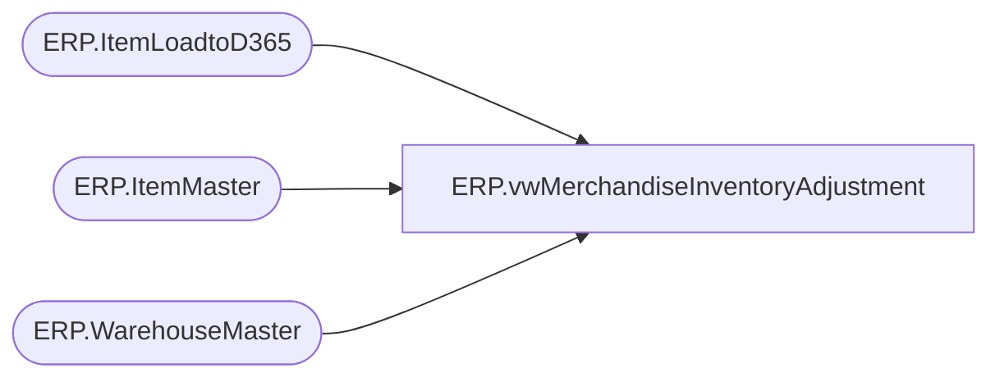

# ERP.vwMerchandiseInventoryAdjustment

**Database:** IntegrationStaging  
**Server:** STL-SSIS-P-01  

## Architecture Diagram



## Table Dependencies

| Referenced Table |
|---|
| ERP.ItemLoadtoD365 |
| ERP.ItemMaster |
| ERP.WarehouseMaster |

## View Code

```sql
CREATE view [ERP].[vwMerchandiseInventoryAdjustment]

--------------------------------------------------------------------------------------------------------------------------
--	Dan Tweedie	2018-09-25	Created view to capture to load infinite inventory for merchandise items into Dynamics
--------------------------------------------------------------------------------------------------------------------------
as 

with
Locations as
	(
		select Entity, WarehouseID
		from ERP.WarehouseMaster 
		where 1=1
		and (
				(Entity = 1100 and WarehouseID in ('9980', '9960'))
				OR
				(Entity = 1200 and WarehouseID in ('9941'))
				OR
				(Entity = 2110 and WarehouseID in ('9970'))
				OR
				(Entity = 3001 and WarehouseID in ('9940'))
			)
	)
select DISTINCT 
	i.Entity, 
	cast(l.WarehouseID as varchar(5)) as WarehouseID, 
	case 
		when WarehouseID = '9980' then '0980'
		when WarehouseID = '9960' then '0960'
		when WarehouseID = '9941' then '0941'
		when WarehouseID = '9970' then '2970'
		when WarehouseID = '9940' then '3001'
	end as LocationCode,
	cast(i.ItemNumber as varchar(7)) as ItemID, 
	cast(right(i.ItemNumber,6) as varchar(6)) as Style,
	100000 as qty, 
	cast('MerchInv' as varchar(52))  as Description, 
	isnull(i.UpdateDate, i.InsertDate) as AdjustmentDate
from ERP.ItemLoadtoD365 i 
join locations l on i.Entity = l.entity 
join ERP.ItemMaster im --ensures we only try to post inventory for items that exist in the entity item master in dynammics so posting doesn't fail 
	on i.Entity = im.Entity
	and i.ItemNumber = im.ItemNumber
```

