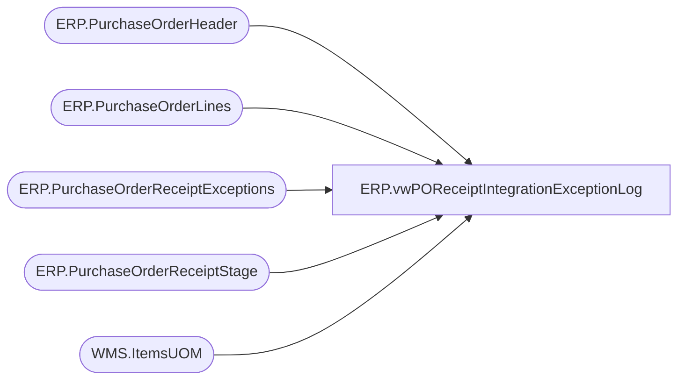

# ERP.vwPOReceiptIntegrationExceptionLog

**Database:** IntegrationStaging  
**Server:** STL-SSIS-P-01  

## Architecture Diagram



## Table Dependencies

| Referenced Table |
|---|
| ERP.PurchaseOrderHeader |
| ERP.PurchaseOrderLines |
| ERP.PurchaseOrderReceiptExceptions |
| ERP.PurchaseOrderReceiptStage |
| WMS.ItemsUOM |

## View Code

```sql
CREATE view [ERP].[vwPOReceiptIntegrationExceptionLog]

as

with 
LoggedExceptions as
	(
		select CaseNumber 
		from ERP.PurchaseOrderReceiptExceptions with (nolock)
	)
select 
	s.PurchaseOrderNumber,
	s.ReceiptLocation,
	s.BOL,
	l.ItemID,
	s.CaseNumber,
	(s.qty / uom.Factor)  as ConvertedQty,
	s.qty UnitQty,
	uom.Factor,
	l.UOM,
	s.ReceiptDate,
	s.Entity,
	getdate() as InsertDate
from ERP.PurchaseOrderReceiptStage s  with (nolock)
join ERP.PurchaseOrderHeader h with (nolock) 
	on s.PurchaseOrderNumber = h.PurchaseOrderNumber
	and s.Entity = h.Entity
	and h.Iscurrent = 1
join ERP.PurchaseOrderLines l with (nolock) 
	on h.PurchaseOrderNumber = l.PurchaseOrderNumber
	and h.ConfirmationNumber = l.ConfirmationNumber
	and h.Entity = l.Entity
	and h.Iscurrent = 1
	and l.IsCurrent = 1
	and s.ItemID = right(l.ItemID,6)
join WMS.ItemsUOM uom with (nolock) 
	on l.ItemID = uom.ProductNumber
	and l.UOM = uom.FromUnitSymbol
	and uom.ToUnitSymbol = 'wmea'
where (s.qty / uom.Factor) < 1
and not exists (select e.CaseNumber from LoggedExceptions e where e.CaseNumber = s.CaseNumber)
UNION
select 
	s.PurchaseOrderNumber,
	s.ReceiptLocation,
	s.BOL,
	l.ItemID,
	s.CaseNumber,
	(s.qty / uom.Factor)  as ConvertedQty,
	s.qty UnitQty,
	uom.Factor,
	l.UOM,
	s.ReceiptDate,
	s.Entity,
	getdate() as InsertDate
from ERP.PurchaseOrderReceiptStage s  with (nolock)
join ERP.PurchaseOrderHeader h with (nolock) 
	on s.PurchaseOrderNumber = h.PurchaseOrderNumber
	and s.Entity = h.Entity
	and h.Iscurrent = 1
join ERP.PurchaseOrderLines l with (nolock) 
	on h.PurchaseOrderNumber = l.PurchaseOrderNumber
	and h.ConfirmationNumber = l.ConfirmationNumber
	and h.Entity = l.Entity
	and h.Iscurrent = 1
	and l.IsCurrent = 1
	and s.ItemID = right(l.ItemID,6)
left join WMS.ItemsUOM uom with (nolock) 
	on l.ItemID = uom.ProductNumber
	and l.UOM = uom.FromUnitSymbol
	and uom.ToUnitSymbol = 'wmea'
where 
		uom.PRODUCTNUMBER is NULL
```

