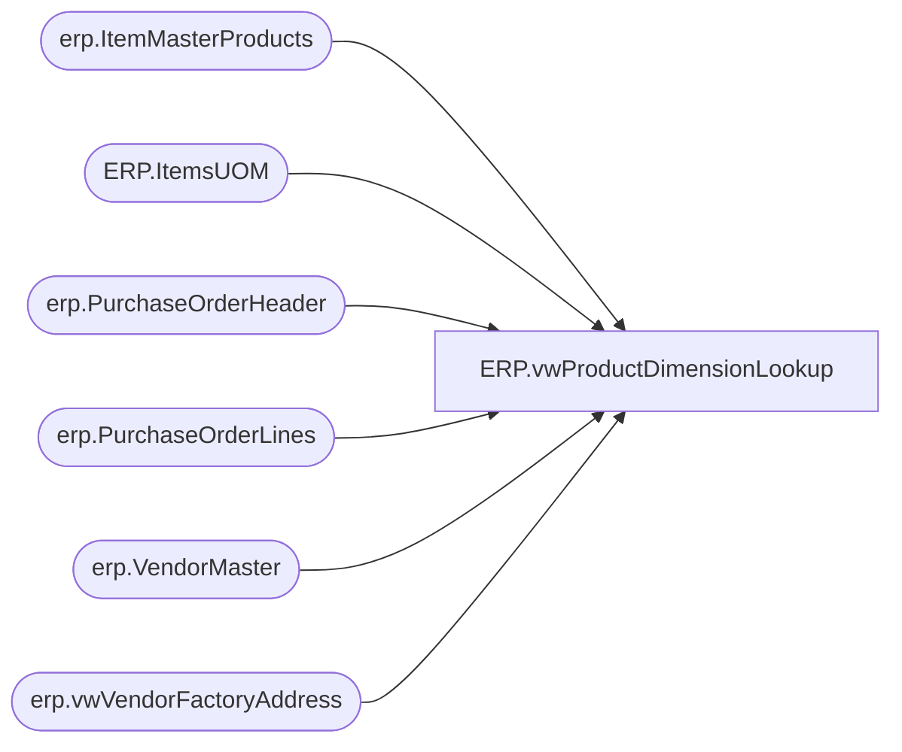

# ERP.vwProductDimensionLookup

**Database:** IntegrationStaging  
**Server:** STL-SSIS-P-01  

## Architecture Diagram



## Table Dependencies

| Referenced Table |
|---|
| erp.ItemMasterProducts |
| ERP.ItemsUOM |
| erp.PurchaseOrderHeader |
| erp.PurchaseOrderLines |
| erp.VendorMaster |
| erp.vwVendorFactoryAddress |

## View Code

```sql
CREATE view [ERP].[vwProductDimensionLookup]

as 

with 
PO as
	(
		select 
			ph.Entity, 
			max(ph.PurchaseOrderNumber) PurchaseOrderNumber,
			pl.ItemID
		from erp.PurchaseOrderHeader ph
		join erp.PurchaseOrderLines pl 
			on ph.entity = pl.entity 
			and ph.PurchaseOrderNumber = pl.PurchaseOrderNumber
		group by ph.Entity, pl.ItemID 
	),
VendorAccount as 
	(
		select distinct poh.ShipFromID as VendorAccountNumber, po.ItemID, poh.Entity 
		from erp.PurchaseOrderHeader poh
		join PO 
			on poh.Entity = PO.Entity 
			and poh.PurchaseOrderNumber = PO.PurchaseOrderNumber
	)
select distinct	
	va.Entity, 
	p.ProductNumber,
	v.VendorAccountNumber,
	v.ORGANIZATIONPHONETICNAME,
	v.VENDORSEARCHNAME,
	fa.VendorCode,
	fa.FactoryCode,
	fa.FactoryName,
	fa.Port,
	fa.address,
	fa.city,
	fa.province,
	fa.country,
	p.HARMONIZEDSYSTEMCODE,
	uom.FROMUNITSYMBOL,
	uom.TOUNITSYMBOL,
	cast(uom.FACTOR as int) as Factor
from VendorAccount va
join erp.VendorMaster v 
	on va.entity = v.entity 
	and va.VendorAccountNumber = v.VendorAccountNumber
join erp.ItemMasterProducts p 
	on va.ItemID = p.PRODUCTNUMBER
left join erp.vwVendorFactoryAddress fa 
	on v.entity = fa.Entity 
	and v.VendorAccountNumber = fa.VendorAccountNumber 
left join ERP.ItemsUOM uom 
	on va.Entity = uom.Entity 
	and p.ProductNumber = uom.PRODUCTNUMBER 
	and uom.ToUnitSymbol = 'wmea'
where left(p.ProductNumber, 1) in ('M', 'S')
```

