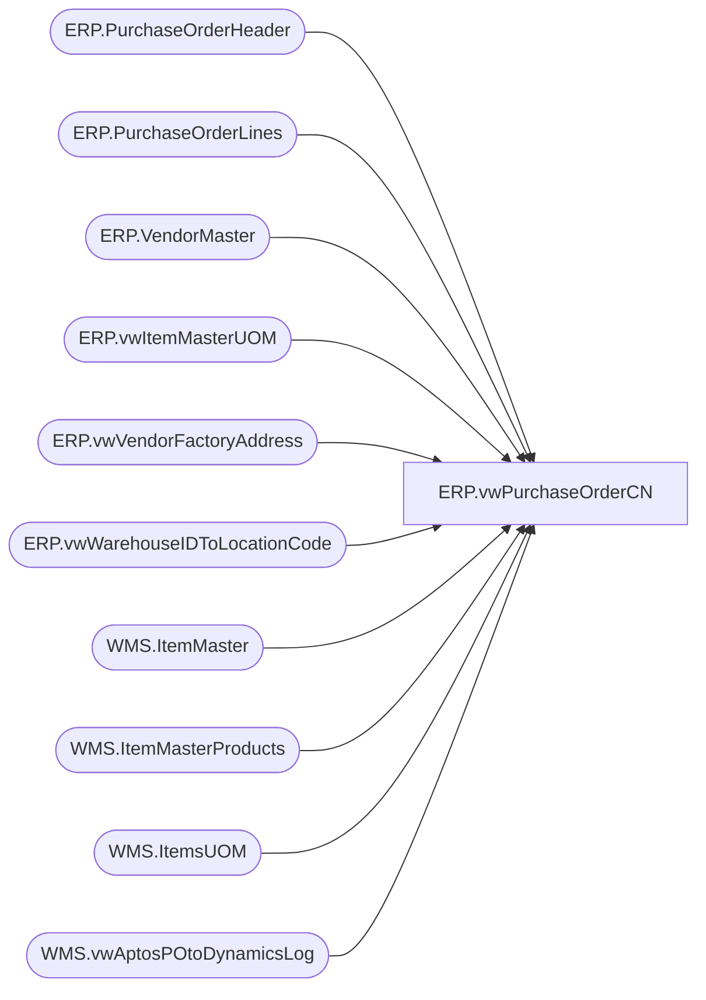

# ERP.vwPurchaseOrderCN

**Database:** IntegrationStaging  
**Server:** STL-SSIS-P-01  

## Architecture Diagram



## Table Dependencies

| Referenced Table |
|---|
| ERP.PurchaseOrderHeader |
| ERP.PurchaseOrderLines |
| ERP.VendorMaster |
| ERP.vwItemMasterUOM |
| ERP.vwVendorFactoryAddress |
| ERP.vwWarehouseIDToLocationCode |
| WMS.ItemMaster |
| WMS.ItemMasterProducts |
| WMS.ItemsUOM |
| WMS.vwAptosPOtoDynamicsLog |

## View Code

```sql
CREATE VIEW [ERP].[vwPurchaseOrderCN]
AS
SELECT 
	 concat(cast(h.PurchaseOrderNumber as varchar), cast(isnull(fa.FactoryCode, convert(varchar, getdate(), 12)) as nvarchar(6))) ASN
	,CAST(h.PurchaseOrderNumber AS NVARCHAR) AS PurchaseOrder
	,CAST(vm.VENDORORGANIZATIONNAME AS NVARCHAR(50)) AS SupplierName
	,CAST(ISNULL(REPLACE(lc.LocationCode, ',', ''), N'') AS NVARCHAR) AS ShipToCode
	,CAST(ISNULL(REPLACE(lc.PrimaryAddressDescription, ',', ''), N'') AS NVARCHAR) AS ShipToName
	,CAST(ISNULL(REPLACE(fa.FactoryName, ',', ''), N'no-factory-name') AS NVARCHAR) AS FactoryName
	,CAST(ISNULL(REPLACE(RIGHT(l.ItemID, 6), ',', ''), N'') AS NVARCHAR) AS StyleCode
	,CAST(ISNULL(REPLACE(p.ProductName, ',', ''), N'') AS NVARCHAR) AS StyleDescription
	,CAST(l.CurrQty * uom.Factor AS INT) AS Units
	,CAST(CONVERT(VARCHAR(10), ISNULL(l.EndDeliverDateTime, DATEADD(dd, 14, GETDATE())), 101) AS NVARCHAR(10)) AS ExpectedReceiptDate
	,CAST(l.CurrQty * uom.Factor AS INT) / iUOM.PurchaseMultiple AS EstimatedCartons
  FROM ERP.PurchaseOrderHeader AS h WITH (NOLOCK)
	JOIN ERP.PurchaseOrderLines AS l WITH (NOLOCK) ON h.PurchaseOrderNumber = l.PurchaseOrderNumber
		AND h.ConfirmationNumber = l.ConfirmationNumber
		AND h.Entity = l.Entity
		AND h.IsCurrent = 1
		AND l.IsCurrent = 1
	JOIN WMS.ItemMaster AS im WITH (NOLOCK) ON l.ItemID = im.ProductNumber
		AND l.Entity = im.Entity
		AND im.NecessaryProductionWorkingTimeSchedulingPropertyId IN ('Supplies')
		AND isnumeric(im.ItemNumber) = 1
	JOIN WMS.ItemMasterProducts AS p WITH (NOLOCK) ON l.ItemID = p.ProductNumber
	JOIN WMS.ItemsUOM AS uom WITH (NOLOCK) ON l.ItemID = uom.ProductNumber
		AND l.UOM = uom.FromUnitSymbol
		AND l.Entity = uom.Entity
		AND uom.ToUnitSymbol = 'wmea'
	JOIN ERP.vwItemMasterUOM AS iUOM ON l.ItemID = iUOM.ProductNumber
		AND l.Entity = iUOM.Entity
	JOIN ERP.VendorMaster AS vm WITH (NOLOCK) ON CAST(h.ShipFromId AS VARCHAR) = vm.VENDORACCOUNTNUMBER
		AND h.Entity = vm.Entity
	JOIN ERP.vwWarehouseIDToLocationCode AS lc WITH (NOLOCK) ON CAST(l.DestinationWarehouse AS VARCHAR) = lc.WarehouseID
		AND l.Entity = lc.Entity
	LEFT JOIN ERP.vwVendorFactoryAddress AS fa WITH (nolock) ON vm.VENDORACCOUNTNUMBER = fa.VENDORACCOUNTNUMBER AND vm.Entity = fa.Entity
  WHERE (1 = 1)
	AND (
		lc.LocationCode IN (
			'3970'
			,'3980'
			,'9942'
			,'8505'
			,'8502'
			)
		)
	AND (LEFT(h.PurchaseOrderNumber, 2) = 'PO')
	AND (h.IsCurrent = 1)
	AND (l.IsCurrent = 1)
	AND (vm.ORGANIZATIONPHONETICNAME IS NOT NULL)	
	and (
			(
				l.EndDeliverDateTime is NOT null 
				and 
				cast(l.EndDeliverDateTime as date) = cast(dateadd(dd, +14, getdate()) as date)
			)
			OR
			(
				l.EndDeliverDateTime is null 
				and datediff(dd, isnull(h.UpdateDate, h.InsertDate), getdate()) = 0
			)
			OR 
			(
				datepart(yyyy, l.EndDeliverDateTime) = 1900
				and datediff(dd, isnull(h.UpdateDate, h.InsertDate), getdate()) = 0
			)
		
	--	OR h.PurchaseOrderNumber in ('PO120012596','PO120012608')
	--OR h.PurchaseOrderNumber IN ('PO120012838', 'PO120012736')
	)
	AND (
		h.PurchaseOrderNumber NOT IN (
			SELECT Dynamics1200PO
			FROM WMS.vwAptosPOtoDynamicsLog
			WHERE (Dynamics1200PO IS NOT NULL)
			
			UNION
			
			SELECT Dynamics1100PO
			FROM WMS.vwAptosPOtoDynamicsLog AS vwAptosPOtoDynamicsLog_5
			WHERE (Dynamics1100PO IS NOT NULL)
			)
		)
```

