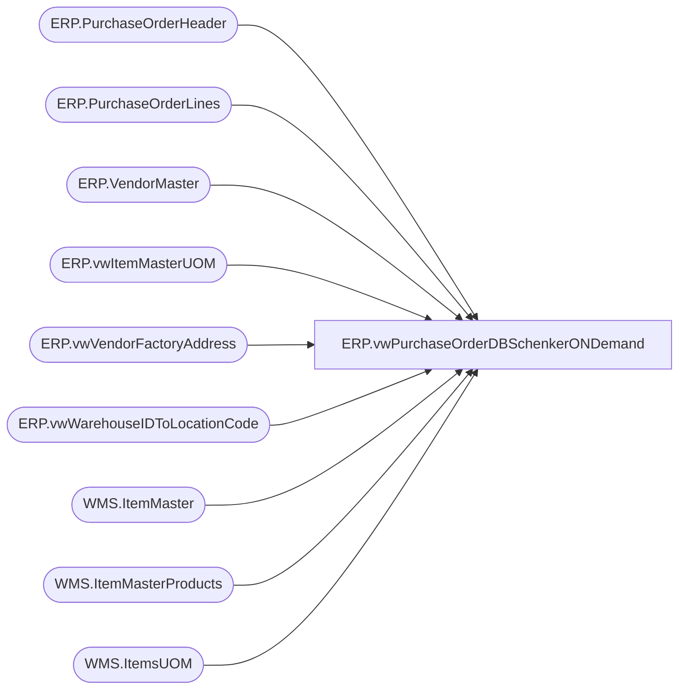

# ERP.vwPurchaseOrderDBSchenkerONDemand

**Database:** IntegrationStaging  
**Server:** STL-SSIS-P-01  

## Architecture Diagram



## Table Dependencies

| Referenced Table |
|---|
| ERP.PurchaseOrderHeader |
| ERP.PurchaseOrderLines |
| ERP.VendorMaster |
| ERP.vwItemMasterUOM |
| ERP.vwVendorFactoryAddress |
| ERP.vwWarehouseIDToLocationCode |
| WMS.ItemMaster |
| WMS.ItemMasterProducts |
| WMS.ItemsUOM |

## View Code

```sql
CREATE view [ERP].[vwPurchaseOrderDBSchenkerONDemand]

as

-----------------------------------------------------------------------------------------------------------------------------
----	Dan Tweedie	-	2017-11-07	-	Created view - Returns PO's staged from Dynamics, destination will be DBS staging table 
-----------------------------------------------------------------------------------------------------------------------------


SELECT 
	'ICBBW1' as ProjID,
	cast(h.PurchaseOrderNumber as nvarchar(20)) as PurchaseOrder,  
	case when l.MergeAction = 'Cancel' then 'Cancel' else 'Replace' end as PurposeCode,
	'' as Division,
	cast('SUPPLY' as nvarchar(8)) as Department, --NO DEPARTMENT CODES IN DYNAMICS... MERCH EXPORT USES left(hg.hierarchy_group_code,8) as Department,
	'' as Buyer,
	cast(VENDORORGANIZATIONNAME as nvarchar(50)) as SupplierName,
	cast(
			case 
				when vm.OrganizationPhoneticName like '%-%' 
				then substring(vm.OrganizationPhoneticName, 1, charindex('-',vm.OrganizationPhoneticName)-1) 
				else vm.OrganizationPhoneticName 
			end
		as nvarchar(20)
		) as SupplierCode,
	'' as SupplierAddress1,
	'' as SupplierAddress2,
	'' as SupplierAddress3,
	'' as	SupplierAddress4,
	'' as	UNLOCCodeValue,
	'' as	ScheduleKCode1,
	'' as	SupplierCity,
	'' as	SupplierState,
	'' as SupplierCountry,
	'' as	SupplierPostal,
	'FOB' as OrderPaymentTerms,
	'COLLECT' as FreightPaymentTerms,
	convert(varchar, h.OrderCreateDate , 101) as OrderDate, 
	cast(h.FOBDesc as nvarchar(20)) as PORef1, 
	'' as PORef2,
	'' as PORef3,
	cast(lc.PrimaryAddressDescription as nvarchar(20)) as ShipToName, 
	--cast(lc.LocationCode as int) as ShipToCode, 
	cast(lc.LocationCode as nvarchar(20)) as ShipToCode,
	'' as ShipToEmail,
	'' as	ShipToAddress1,
	'' as ShipToAddress2,
	'' as ShipToAddress3,
	'' as	ShiptoAddress4,
	'' as	UNLOCCode1,
	'' as	ScheduleDorKCode,
	'' as	ShipToCountry,
	'' as	ShipToCity,
	'' as ShipToState,
	'' as	ShipToZipCode,
	cast(fa.FactoryName as nvarchar(20)) as FactoryName,
	cast(fa.FactoryCode as nvarchar(6)) as FactoryCode,
	'' as FactoryAddress1,
	'' as FactoryAddress2,
	'' as FactoryAddress3,
	'' as FactoryAddress4,
	'' as UNLOCCode2,
	'' as ScheduleKCode2,
	'' as FactoryCity,
	'' as FactoryState,
	'' as FactoryCountry,
	'' as FactoryPostal,
	convert(varchar, l.StartShipDate, 101) as ShipWindowStart,  
	--convert(varchar, l.EndDeliverDateTime, 101) as ShipWindowEnd, 
	convert(varchar, dateadd(dd, +7, l.StartShipDate), 101) as ShipWindowEnd,
	'' as ShipWindowCancelDate,
	l.LineNumber as ProductDetailID,---line number>>??
	cast(right(l.ItemID,6) as nvarchar(6)) as ProductDetailProductCode,
	cast(replace(p.ProductName,',',' ') as nvarchar(20)) as ProductDetailProductDesc,
	cast(p.HarmonizedSystemCode as nvarchar(20)) as ProductDetailHTS,
	cast((l.CurrQty * uom.Factor) as int) as ProductDetailOrderQuantity,
	'UN' as QuantityUOM,
	
	case when 
		case when vm.OrganizationPhoneticName like '%-%' 
				then substring(vm.OrganizationPhoneticName, 1, charindex('-',vm.OrganizationPhoneticName)-1) 
				else vm.OrganizationPhoneticName 
			end 
		in ('KIDPSHA', 'KIDPREF', 'KIDPIND', 'KIDQING') 
			then 0
			--else cast(((l.UnitCost * isnull(uom.Denominator,1)) / isnull(uom.Factor,1)) as int)
			else (l.UnitCost * uom.Factor) / cast((l.CurrQty * uom.Factor) as int) 
		end as UnitCost, --- excludes KDP vendor from viewing cost
	'OCEAN' as Mode,
	iUOM.PurchaseMultiple as ProductDetailMasterPackQty,
	'' as ProductDetailNoOfPackages,
	iUOM.PurchaseMultiple as ProductDetailInnerPackQty,
	'' as ProductDetailTotalVolume,
	'' as ProductDetailTotalWeight,
	'' as ProductDetailProductPriority,	
	'' as ProductDetailManufacturerID,	
	'' as ProductDetailProductRef,
	'' as ProductDetailProductRef2,	
	'' as ProductDetailProductRef3,
	'' as ProductDetailProductRef4,
	'' as ProductDetailProductRef5,
	cast(fa.country as nvarchar(2)) as OriginCountry, 
	cast(fa.city as nvarchar(20)) as OriginCity,
	'' as FinalDestination,
	'' as POETA,
	case 
		when datepart(yyyy, l.EndDeliverDateTime) = 1900
			then convert(varchar, dateadd(dd, +55, l.StartShipDate), 101)
		else convert(varchar, l.EndDeliverDateTime, 101)
	end as ProductDate1,
	'' as ProductDate2,
	'' as Consolidator,
	'' as Broker,
	'' as Currency,
	'' as SKUNumber,
	'' as Size,
	cast('' as nvarchar(8)) as Color,
	'~' as LineEndIndicator
from ERP.PurchaseOrderHeader h with (nolock) 
join ERP.PurchaseOrderLines l with (nolock) 
	on h.PurchaseOrderNumber = l.PurchaseOrderNumber
	and h.ConfirmationNumber = l.ConfirmationNumber
	and h.Entity = l.Entity
	and h.Iscurrent = 1
	and l.IsCurrent = 1
join WMS.ItemMaster im with (nolock)  on l.ItemID = im.ProductNumber and l.Entity = im.Entity
join WMS.ItemMasterProducts p with (nolock) on l.ItemID = p.ProductNumber
left join WMS.ItemsUOM uom with (nolock) 
	on l.ItemID = uom.ProductNumber
	and l.UOM = uom.FromUnitSymbol
	and l.Entity = uom.Entity
	and uom.ToUnitSymbol = 'wmea'
join ERP.vwItemMasterUOM iUOM on l.ItemID = iUOM.ProductNumber and l.Entity = iUOM.Entity
join ERP.VendorMaster vm with (nolock) on cast(h.ShipFromID as varchar) = vm.VendorAccountNumber and h.Entity = vm.Entity
join ERP.vwWarehouseIDToLocationCode lc with (nolock) on cast(l.DestinationWarehouse as varchar(10)) = cast(lc.WarehouseID as varchar(10)) and l.Entity = lc.entity 
join ERP.vwVendorFactoryAddress fa with (nolock) 
	on vm.VENDORACCOUNTNUMBER = fa.VENDORACCOUNTNUMBER
	and vm.entity = fa.entity 
WHERE 1=1
and lc.LocationCode in ('0980','0960','0013','9999','9975','2970','2999','2013','1971','1972','3970','3980','9991','8175')
and h.IsCurrent = 1
and l.IsCurrent = 1
and datepart(yyyy, h.OrderCreateDate) >= 2018
and datepart(yyyy, l.StartShipDate) >= 2018
and cast(isnull((l.CurrQty * uom.Factor),0) as int) <> 0
--and cast(fa.country as nvarchar(2)) <> 'US'
--and h.PurchaseOrderNumber in ('PO210008158')
```

