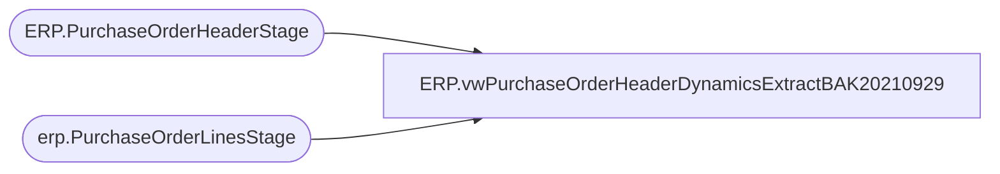

# ERP.vwPurchaseOrderHeaderDynamicsExtractBAK20210929

**Database:** IntegrationStaging  
**Server:** STL-SSIS-P-01  

## Architecture Diagram



## Table Dependencies

| Referenced Table |
|---|
| ERP.PurchaseOrderHeaderStage |
| erp.PurchaseOrderLinesStage |

## View Code

```sql
CREATE view [ERP].[vwPurchaseOrderHeaderDynamicsExtractBAK20210929]

---------------------------------------------------------------------------------------------------------------------------
--	Tim Callahan -	2021-01-16	-	Created view - Stages data for Merge into ERP.PurchaseOrderHeader 
---------------------------------------------------------------------------------------------------------------------------

as

with MaxConfirmationNumberHeader as (

select distinct PurchaseOrderNumber, Entity, max (ConfirmationNumber) as MaxConfirmationNumber
from ERP.PurchaseOrderHeaderStage 
group by PurchaseOrderNumber, Entity


) 

select h.PurchaseOrderNumber, 
ConfirmationNumber, 
TransportMethodDesc,
FOBDesc,
ShipFromId, 
'BAB Purchasing' as Rep2id, -- Hard Coding this as Cannot Find Function Data Entity Surce for Personnell Number Lookup 
CurrencyDesc, 
OrderCreateDate, 
PaymentTerms, 
h.Entity, 
1 as IsCurrent -- Hardcoding to 1 as we are leveraging max entry in CTE above for merge source 
from ERP.PurchaseOrderHeaderStage  H
join MaxConfirmationNumberHeader M on h.PurchaseOrderNumber=m.PurchaseOrderNumber
								  and h.Entity=m.Entity
								  and h.ConfirmationNumber=m.MaxConfirmationNumber
where h.PurchaseOrderNumber not in ( select distinct PurchaseOrderNumber from erp.PurchaseOrderLinesStage (nolock) where ItemID = '') -- Exclude POs with empty item numbers, likely maintenance
```

