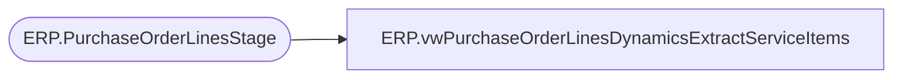

# ERP.vwPurchaseOrderLinesDynamicsExtractServiceItems

**Database:** IntegrationStaging  
**Server:** STL-SSIS-P-01  

## Architecture Diagram



## Table Dependencies

| Referenced Table |
|---|
| ERP.PurchaseOrderLinesStage |

## View Code

```sql
CREATE view [ERP].[vwPurchaseOrderLinesDynamicsExtractServiceItems]
as 
---------------------------------------------------------------------------------------------------------------------------
--	Tim Callahan -	2021-09-21	-	Created view - Stages data for Merge into ERP.PurchaseOrderLInesServiceItems
--				
---------------------------------------------------------------------------------------------------------------------------
with MaxConfirmationNumberLine as (

select distinct PurchaseOrderNumber, Entity, max (ConfirmationNumber) as MaxConfirmationNumber
from ERP.PurchaseOrderLinesStage
group by PurchaseOrderNumber, Entity


) 


select l.PurchaseOrderNumber, 
l.ConfirmationNumber,
LineNumber, 
DestinationWarehouse, 
ItemId,
CurrQty, 
UnitCost, 
case when StartShipDate = '1900-01-01 12:00:00.000'
	then dateadd(dd,-30,EndDeliverDateTime)
	else StartShipDate
end as StartShipDate,
EndDeliverDateTime,
dateadd(dd,7,EndDeliverDatetime) as CancelDate,
VendExtItemID, 
VendExtItemDescription, 	
FactoryCode, 
FactoryName, 
FactoryPort,  
FactoryAddress,  
FactoryCity,  
FactoryProvince,  
COOCode,  
l.Entity,  
1 as IsCurrent, -- Hardcoding to 1 as we are leveraging max entry in CTE above for merge source 
UOM
from  ERP.PurchaseOrderLinesStage  l
join MaxConfirmationNumberLine M on l.PurchaseOrderNumber=m.PurchaseOrderNumber
								and l.Entity=m.Entity
								and l.ConfirmationNumber=m.MaxConfirmationNumber
where l.ItemId = ''
```

