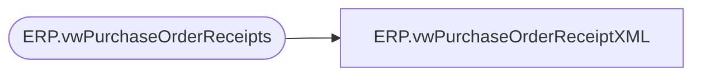

# ERP.vwPurchaseOrderReceiptXML

**Database:** IntegrationStaging  
**Server:** STL-SSIS-P-01  

## Architecture Diagram



## Table Dependencies

| Referenced Table |
|---|
| ERP.vwPurchaseOrderReceipts |

## View Code

```sql
CREATE view [ERP].[vwPurchaseOrderReceiptXML]

as

---------------------------------------------------------------------
-- Dan Tweedie	-	2017-11-15	-	Created view, work in progress --
--									Need to update to pull data from Fact table, not Stage, and to only capture NEW receipts
-- Tim Callahan -	2023-01-23	-	Updates as Related to JIRA BIB-464
---------------------------------------------------------------------

with 
Receipts as
	(
		select *
		from ERP.vwPurchaseOrderReceipts
	),
XMLStage (XML) as
	(
		select 
			'NO' as 'CLOSEFORRECEIPT',
			r.ReceiptLocation as 'INVENTLOCATIONID',
			r.ITEMID,
			--'' as 'LineNum', NULL,
			r.PurchaseOrderNumber as 'PURCHID',
			sum(r.QTY) as QTY,
			r.RECEIPTDATE,
			cast(concat(
			datepart(yyyy, getdate()), 
			datepart(mm, getdate()),
			datepart(dd, getdate()),
			datepart(hh, getdate()),
			datepart(mi, getdate()),
			datepart(ss, getdate()),
			datepart(ms, getdate()),
			cast(DENSE_RANK() OVER (ORDER BY r.ReceiptLocation, r.ITEMID, r.PurchaseOrderNumber, r.RECEIPTDATE, r.BOL) as varchar)
			) as varchar(25)) as RECEIPTID,
			r.UNITOFMEASURE
		from Receipts r 
		--join ERP.PurchaseOrderLines l on r.ItemID = l.ItemID
		--where exists (select ItemID from ERP.PurchaseOrderLines l with (nolock) where r.ItemID = l.ItemID)
		group by r.ReceiptLocation, r.ITEMID, r.PurchaseOrderNumber, r.RECEIPTDATE, r.BOL, r.UNITOFMEASURE
		order by r.ReceiptLocation, r.PurchaseOrderNumber, r.ITEMID, r.BOL
		--for xml path('RSMWMSPurchaseReceiptEntity'), root('Document'), Type -- Replaced 11/15/2022
		for xml path('rsmBABWMSPOReceiptEntity'), root('Document'), Type
		
	)
select XML as XMLData
from XMLStage
```

