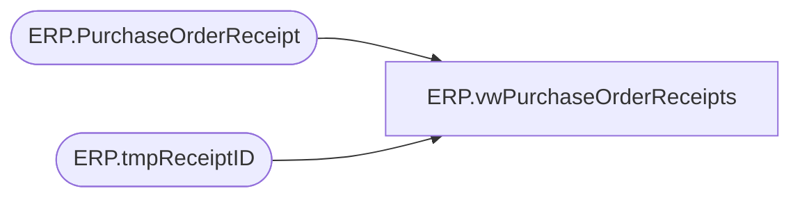

# ERP.vwPurchaseOrderReceipts

**Database:** IntegrationStaging  
**Server:** STL-SSIS-P-01  

## Architecture Diagram



## Table Dependencies

| Referenced Table |
|---|
| ERP.PurchaseOrderReceipt |
| ERP.tmpReceiptID |

## View Code

```sql
CREATE view [ERP].[vwPurchaseOrderReceipts]

as


with 
Receipts as
	(
		select ReceiptID 
		from ERP.tmpReceiptID
	)
select 
	pr.ReceiptLocation,
	pr.PurchaseOrderNumber,
	pr.BOL,
	pr.ItemID,
	sum(pr.Qty)	as Qty,
	pr.UOM as UnitOfMeasure,
	convert(varchar, ReceiptDate, 101) as ReceiptDate,
	pr.Entity
from ERP.PurchaseOrderReceipt pr
join Receipts r on pr.ReceiptID = r.ReceiptID
where pr.Transmitted = 0
group by 
	pr.ReceiptLocation,
	pr.PurchaseOrderNumber,
	pr.BOL,
	pr.ItemID,
	pr.UOM,
	convert(varchar, ReceiptDate, 101),
	pr.Entity
```

