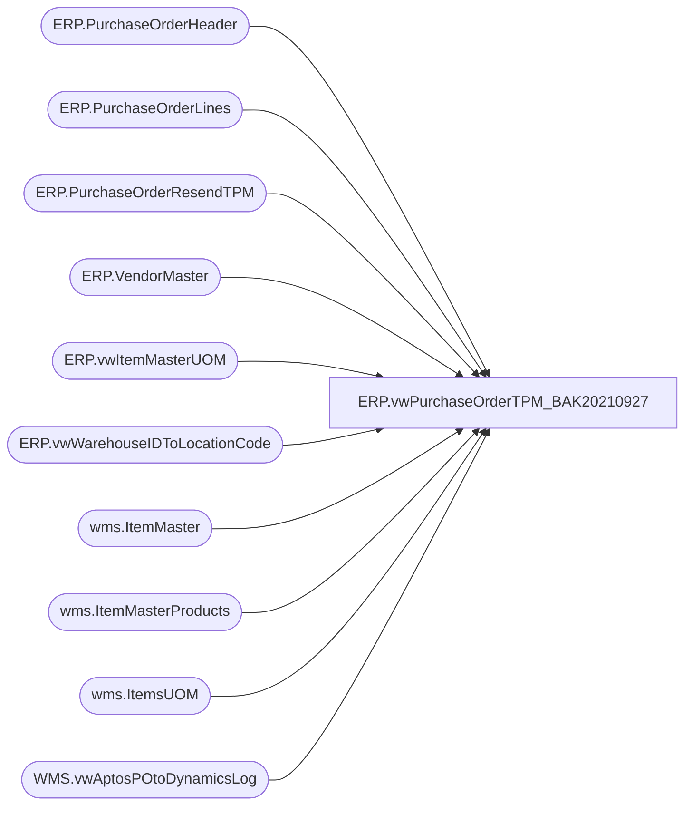

# ERP.vwPurchaseOrderTPM_BAK20210927

**Database:** IntegrationStaging  
**Server:** STL-SSIS-P-01  

## Architecture Diagram



## Table Dependencies

| Referenced Table |
|---|
| ERP.PurchaseOrderHeader |
| ERP.PurchaseOrderLines |
| ERP.PurchaseOrderResendTPM |
| ERP.VendorMaster |
| ERP.vwItemMasterUOM |
| ERP.vwWarehouseIDToLocationCode |
| wms.ItemMaster |
| wms.ItemMasterProducts |
| wms.ItemsUOM |
| WMS.vwAptosPOtoDynamicsLog |

## View Code

```sql
CREATE view [ERP].[vwPurchaseOrderTPM_BAK20210927]

---------------------------------------------------------------------------------------------------------------------------
--	Dan Tweedie	-	2017-11-07	-	Created view - Returns PO's staged from Dynamics, destination will be TPM staging table 
---------------------------------------------------------------------------------------------------------------------------

as

select
	cast(h.PurchaseOrderNumber as varchar(20)) as po_no,
	1 as "Type", --1= PO 4= transfer
	'1110' as "EventCode",
	'HostHQ' as "EventLocationInternalId",
	'HostHQ' as "EventSourceLocationInternalId",
	10 as "InternalStatus", -- 1=Planning,10=Open,85= Completed, 90=Closed,99=Cancelled
	1 as "FulFillFlag",
	2 as "AcceptRqdMode", -- 1 = Pending Partner Accept 2 = Auto Accept
	1 as "AcceptedFlag",  -- 5 = Pending Partner Accept 1= Auto Accept	'Host' as "OwnerID",
	'Host' as "OwnerID",
	cast(lc.LocationCode as int) as "ShipToldRef",
	cast(lc.LocationCode as int) as "ShipTo",
	case 
		when vm.OrganizationPhoneticName like '%-%' 
		then substring(vm.OrganizationPhoneticName, 1, charindex('-',vm.OrganizationPhoneticName)-1) 
		else vm.OrganizationPhoneticName 
	end as "ShipFromId",
	case 
		when vm.OrganizationPhoneticName like '%-%' 
		then substring(vm.OrganizationPhoneticName, 1, charindex('-',vm.OrganizationPhoneticName)-1) 
	else vm.OrganizationPhoneticName end as "SupplierId",
	'' as "Hub1Id",
	'HostHQ' as "BillTold",
	'1' as "TypeCode",
	cast(h.CurrencyDesc as varchar(50)) as "CurrencyDesc",
	h.OrderCreateDate as "OrderDate",
	cast(replace(h.PaymentTerms,',',' ') as varchar(50)) as "PayTermsDesc",
	cast(isnull(h.TransportMethodDesc,'Ocean') as varchar(50)) as "TransportMethodDesc",
	cast(replace(h.FOBDesc,',',' ') as varchar(20)) as "FOBDesc",
	l.COOCode as "COOCode", 
	cast(h.Rep2ID as varchar(30)) as "Rep1Id",
	l.LineNumber as "OrderLine", 
	0 as "AltDetailKey",
	cast(right(l.ItemID,6) as varchar(20)) as "ItemId",
	cast(isnull(replace(p.ProductName,',',' '),replace(p.ProductDescription,',',' ')) as varchar(20)) as "ItemDesc", 
	1 AS "AcceptedItemFlag",  -- 0 = Pending Parter Accept 1 = Auto Accept
	
	cast((l.CurrQty * isnull(uom.Factor,1)) as int) as "CurrQty",

	'' as "UOMCode",
	l.StartShipDate as "StartShipDate",
	l.EndDeliverDateTime as "EndDeliverDateTime",
	dateadd(dd, +7, l.EndDeliverDateTime) as "CancelDate",
	l.UnitCost,
	iUOM.SalesPrice as RetailPrice,
	NULL as "ColorCode", ---NOT FOUND IN ITEM MASTER OR PO
	NULL as "ColorDesc", ---NOT FOUND IN ITEM MASTER OR PO
	NULL as "ItemAttr1", ---NOT FOUND IN ITEM MASTER OR PO --SUPPOSED TO BE UPC NUMBER
	substring(left(l.VendExtItemID,25), 2,25) as "SupplierItemId", -- limit it to 25
	cast(replace(l.VendExtItemDescription,',',' ') as varchar(40)) as "SupplierItemDesc",
	cast(lc.LocationCode as int) as "ShipToId", 		
	iUOM.PurchaseMultiple as "StdPackQty",
	iUOM.PurchaseMultiple as "StdCaseQty",
	0 as "CatchWeightFlag",
	cast(h.Rep2ID as varchar(30)) as "Rep2Id",
	case
		when l.MergeAction in ('NEW', 'UPDATE') 
			then '10' 
		when l.MergeAction = 'CANCEL'
			then '99'
	end as "InternalStatusDetail",
	l.LineNumber as line_no,
	h.OrderCreateDate as TransactionDate,
	l.MergeAction as TransactionType

from ERP.PurchaseOrderHeader h with (nolock) 
join ERP.PurchaseOrderLines l with (nolock) 
	on h.PurchaseOrderNumber = l.PurchaseOrderNumber
	and h.ConfirmationNumber = l.ConfirmationNumber
	and h.Entity = l.Entity
	and h.Iscurrent = 1
	and l.IsCurrent = 1
	--and left(l.ItemID,1) = 'S'
--join wms.vwItemType it 
--	on l.Entity=it.Entity
--	and l.ItemID=it.ItemNumber
--	and it.ItemType in ('Merch', 'Supplies')
--	and isnumeric(it.ItemNumber) = 1
join wms.ItemMaster im with (nolock)  
	on l.ItemID = im.ProductNumber 
	and l.Entity = im.Entity
	and im.NecessaryProductionWorkingTimeSchedulingPropertyId in ('Merch', 'Supplies')
	and isnumeric(im.ItemNumber) = 1
join wms.ItemMasterProducts p with (nolock) on l.ItemID = p.ProductNumber 
left join wms.ItemsUOM uom with (nolock) 
	on l.ItemID = uom.ProductNumber
	and l.UOM = uom.FromUnitSymbol
	and l.entity = uom.entity 
	and uom.ToUnitSymbol = 'wmea'
left join ERP.vwItemMasterUOM iUOM with (nolock) on l.ItemID = iUOM.ProductNumber and l.Entity = iUOM.Entity
join ERP.VendorMaster vm with (nolock) on cast(h.ShipFromID as varchar) = vm.VendorAccountNumber and h.Entity = vm.Entity
join ERP.vwWarehouseIDToLocationCode lc with (nolock) on cast(l.DestinationWarehouse as varchar(10)) = cast(lc.WarehouseID as varchar(10)) and l.entity = lc.entity 
where 1=1 
--and lc.LocationCode in ('0980','0470','2970','0975','0960','3970','3980')
and lc.LocationCode in ('0980','0470','2970','0975','0960','3970','3980','8502','8505','8175','0013') 
and h.IsCurrent = 1
and l.IsCurrent = 1
and
	(
		h.SendData = 1
		or
		h.PurchaseOrderNumber in (select distinct PurchaseOrderNumber from ERP.PurchaseOrderLines with (nolock) where (IsCurrent=1 and SendData = 1) )
		OR
		h.PurchaseOrderNumber in (select PurchaseOrderNumber from ERP.PurchaseOrderResendTPM)
		OR
		l.Exported_TPM is NULL 
	)
and vm.OrganizationPhoneticName is not NULL
and not exists  
	(
		select a.Dynamics1200PO as PO
		from WMS.vwAptosPOtoDynamicsLog a
		where a.Dynamics1200PO=h.PurchaseOrderNumber
		UNION ALL
		select b.Dynamics1100PO as PO
		from WMS.vwAptosPOtoDynamicsLog b
		where b.Dynamics1100PO=h.PurchaseOrderNumber
	)
```

