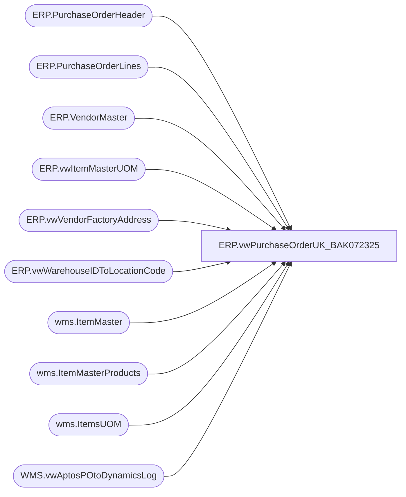

# ERP.vwPurchaseOrderUK_BAK072325

**Database:** IntegrationStaging  
**Server:** STL-SSIS-P-01  

## Architecture Diagram



## Table Dependencies

| Referenced Table |
|---|
| ERP.PurchaseOrderHeader |
| ERP.PurchaseOrderLines |
| ERP.VendorMaster |
| ERP.vwItemMasterUOM |
| ERP.vwVendorFactoryAddress |
| ERP.vwWarehouseIDToLocationCode |
| wms.ItemMaster |
| wms.ItemMasterProducts |
| wms.ItemsUOM |
| WMS.vwAptosPOtoDynamicsLog |

## View Code

```sql
CREATE view [ERP].[vwPurchaseOrderUK_BAK072325]

as

select cast((cast(h.PurchaseOrderNumber as varchar) + cast(fa.FactoryCode as nvarchar(6))) as nvarchar) ASN,
	 cast(h.PurchaseOrderNumber as nvarchar) as PurchaseOrder,
	 cast(VENDORORGANIZATIONNAME as nvarchar(50)) as SupplierName,  
	 cast(isnull(replace(lc.LocationCode, ',', '') , '') as nvarchar) ShipToCode,  
	-- cast(isnull(replace(lc.PrimaryAddressDescription, ',', '') , '') as nvarchar) ShipToName,  
	 cast('UK Warehouse' as nvarchar) ShipToName,
	 cast(isnull(replace(fa.FactoryName, ',', '') , '') as nvarchar) FactoryName,  
	 cast(isnull(replace(right(l.ItemID,6), ',', '') , '') as nvarchar) StyleCode,  
	 cast(isnull(replace(p.ProductDescription, ',', '') , '') as nvarchar) StyleDescription,  
	 cast((l.CurrQty * isnull(uom.Factor,1)) as int) as Units,  
	 --cast(isnull(replace(l.EndDeliverDateTime, ',', '') , '') as nvarchar) ExpectedReceiptDate,  
	 cast(isnull(convert(varchar, l.StartShipDate, 101), '') as nvarchar) ExpectedReceiptDate, 
	 cast((l.CurrQty * isnull(uom.Factor,1)) as int) / iUOM.PurchaseMultiple as EstimatedCartons
from ERP.PurchaseOrderHeader h with (nolock) 
join ERP.PurchaseOrderLines l with (nolock) 
	on h.PurchaseOrderNumber = l.PurchaseOrderNumber
	and h.ConfirmationNumber = l.ConfirmationNumber
	and h.Entity = l.Entity
	and h.Iscurrent = 1
	and l.IsCurrent = 1
--	and left(l.ItemID,1) = 'S'
--join wms.vwItemType it 
--	on l.Entity=it.Entity
--	and l.ItemID=it.ItemNumber
--	and it.ItemType in ('Supplies')
--	and isnumeric(it.ItemNumber) = 1
join wms.ItemMaster im with (nolock)
	on l.ItemID = im.ProductNumber 
	and l.entity = im.entity 
	and im.NecessaryProductionWorkingTimeSchedulingPropertyId in ('Supplies')
	and isnumeric(im.ItemNumber) = 1
join wms.ItemMasterProducts p with (nolock) on l.ItemID = p.ProductNumber
left join wms.ItemsUOM uom with (nolock) 
	on l.ItemID = uom.ProductNumber
	and l.UOM = uom.FromUnitSymbol
	and l.entity = uom.entity 
	and uom.ToUnitSymbol = 'wmea'
join ERP.vwItemMasterUOM iUOM on l.ItemID = iUOM.ProductNumber and l.Entity = iUOM.Entity
join ERP.VendorMaster vm with (nolock) on cast(h.ShipFromID as varchar) = vm.VendorAccountNumber and h.Entity = vm.Entity
join ERP.vwWarehouseIDToLocationCode lc with (nolock) on l.DestinationWarehouse = lc.WarehouseID and l.Entity = lc.Entity
--join ERP.FactoryAddress fa with (nolock) 
--	on case 
--			when vm.OrganizationPhoneticName like '%-%' 
--			then substring(vm.OrganizationPhoneticName, 1, charindex('-',vm.OrganizationPhoneticName)-1) 
--			else vm.OrganizationPhoneticName 
--		end = fa.FactoryCode  
join ERP.vwVendorFactoryAddress fa with (nolock) 
	on vm.VENDORACCOUNTNUMBER = fa.VENDORACCOUNTNUMBER
	and vm.entity = fa.entity 
where 1=1
and lc.LocationCode in ('2970')
and h.IsCurrent = 1
and l.IsCurrent = 1
and vm.OrganizationPhoneticName is not NULL
and datediff(dd, l.StartShipDate, getdate()+14) = 0 --NEED TO ADD THIS BACK FOR PROD
and h.PurchaseOrderNumber not in 
	(
		select Dynamics1200PO
		from WMS.vwAptosPOtoDynamicsLog
		UNION
		select Dynamics1100PO
		from WMS.vwAptosPOtoDynamicsLog
	)
```

