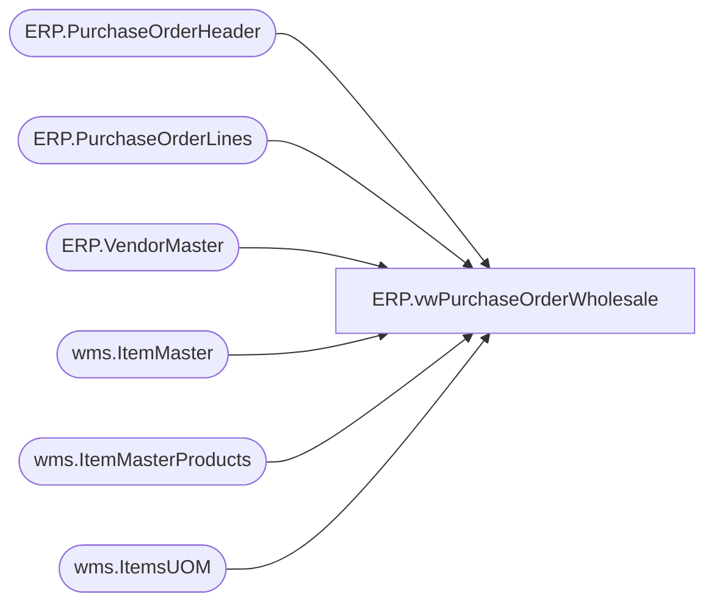

# ERP.vwPurchaseOrderWholesale

**Database:** IntegrationStaging  
**Server:** STL-SSIS-P-01  

## Architecture Diagram



## Table Dependencies

| Referenced Table |
|---|
| ERP.PurchaseOrderHeader |
| ERP.PurchaseOrderLines |
| ERP.VendorMaster |
| wms.ItemMaster |
| wms.ItemMasterProducts |
| wms.ItemsUOM |

## View Code

```sql
CREATE view [ERP].[vwPurchaseOrderWholesale]


as

select 
	cast(h.PurchaseOrderNumber as varchar(20)) as po_no,
	l.DestinationWarehouse as ShipTo,
	cast(replace(h.FOBDesc,',',' ') as varchar(20)) FOB,
	case 
		when vm.OrganizationPhoneticName like '%-%' 
		then substring(vm.OrganizationPhoneticName, 1, charindex('-',vm.OrganizationPhoneticName)-1) 
		else vm.OrganizationPhoneticName 
	end as ShipFromId,
	h.OrderCreateDate as "OrderDate",
	l.COOCode as "COOCode", 
	cast(h.Rep2ID as varchar(30)) as "Rep1Id",
	l.LineNumber as "OrderLine", 
	cast(right(l.ItemID,6) as varchar(20)) as ItemId,
	cast(isnull(replace(p.ProductName,',',' '),replace(p.ProductDescription,',',' ')) as varchar(20)) as ItemDesc, 
	cast((l.CurrQty * isnull(uom.Factor,1)) as int) as OrderQty,
	cast(l.StartShipDate as date) as StartShipDate,
	cast(dateadd(dd, +7, l.StartShipDate) as date) as EndDeliverDateTime,
	cast(dateadd(dd, +14, l.StartShipDate) as date) as CancelDate,
	l.UnitCost,
	im.SalesPrice as RetailPrice,
	l.LineNumber as line_no
from ERP.PurchaseOrderHeader h with (nolock) 
join ERP.PurchaseOrderLines l with (nolock) 
	on h.PurchaseOrderNumber = l.PurchaseOrderNumber
	and h.ConfirmationNumber = l.ConfirmationNumber
	and h.Entity = l.Entity
	and h.Iscurrent = 1
	and l.IsCurrent = 1
join wms.ItemMaster im on h.entity=im.entity and l.ItemID=im.ItemNumber
join wms.ItemMasterProducts p with (nolock) on l.ItemID = p.ProductNumber 
left join wms.ItemsUOM uom with (nolock) 
	on l.ItemID = uom.ProductNumber
	and l.UOM = uom.FromUnitSymbol
	and l.entity = uom.entity 
	and uom.ToUnitSymbol = 'wmea'
join ERP.VendorMaster vm with (nolock) on cast(h.ShipFromID as varchar) = vm.VendorAccountNumber and h.Entity = vm.Entity
where 1=1 
and l.DestinationWarehouse = '8175'
and h.IsCurrent = 1
and l.IsCurrent = 1
```

