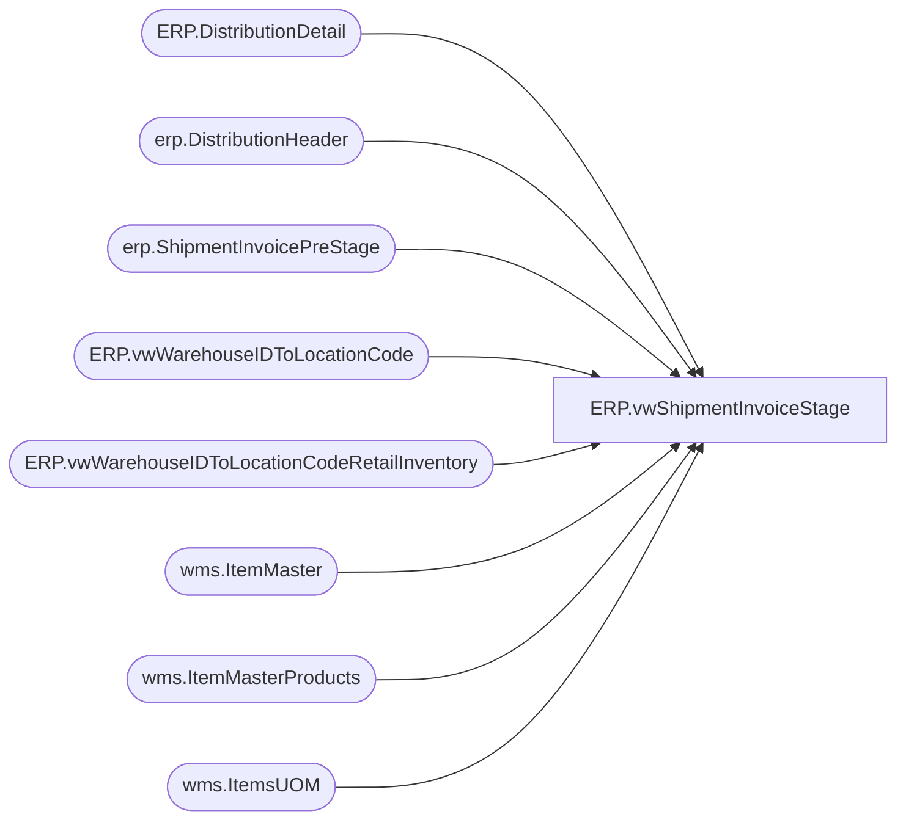

# ERP.vwShipmentInvoiceStage

**Database:** IntegrationStaging  
**Server:** STL-SSIS-P-01  

## Architecture Diagram



## Table Dependencies

| Referenced Table |
|---|
| ERP.DistributionDetail |
| erp.DistributionHeader |
| erp.ShipmentInvoicePreStage |
| ERP.vwWarehouseIDToLocationCode |
| ERP.vwWarehouseIDToLocationCodeRetailInventory |
| wms.ItemMaster |
| wms.ItemMasterProducts |
| wms.ItemsUOM |

## View Code

```sql
CREATE view [ERP].[vwShipmentInvoiceStage] 

as 

with 
ShipmentSource as
	(
		select 
			s.DlvMode,
			s.InventLocationID,
			cast(s.ItemID as varchar(7)) as ItemID,
			s.OrderRef,
			s.CartonNumber,
			s.PalletID,
			case 
				when s.InventLocationID = '9970' 
				then s.QTY * -1
				else s.Qty
			end as Qty,
			s.ShipDate,
			s.ShipTo,
			cast(s.RecType as varchar(8)) as RecType,
			s.Entity 
		from erp.ShipmentInvoicePreStage s 
		where s.ShipTo NOT in (select distinct LocationCode from [ERP].[vwWarehouseIDToLocationCodeRetailInventory] ) -- Begin Using This Where condition on 5/1/2023 - Retail Inventory  Pilot 2 Start
		
	)
select 
	--s.DivMode,
--	isnull(h.MODEOFDELIVERY,1) as DivMode, --I THINK I'LL USE THIS ONE INSTEAD SO IT ALWAYS USES SAME DLVMODE FROM THE HEADER
	h.MODEOFDELIVERY as DivMode,
	s.InventLocationID,
	s.ItemID,
	s.OrderRef,
	s.ShipDate,
	s.CartonNumber,
	s.PalletID,
	cast(s.Qty / isnull(uom.Factor,1) as int) as QTY, --CORRECT
	--s.QTY, --TEMPORARY IF I MANUALLY STAGED INTO PRESTAGE TABLE 
	s.Qty as WhseUnitQty,
	cast(uom.Factor as int) as Factor,
	s.ShipTo,
	s.RecType,
	cast(s.Entity as nvarchar(10)) as Entity,
	case when left(OrderRef,2) = 'SO'
		then d.Warehouse 
		else NULL
	end as UDALocation,
	d.Warehouse
from ShipmentSource s
join erp.DistributionHeader h with (nolock)
	on s.OrderRef = h.OrderID 
	and s.Entity = h.Entity 
join ERP.DistributionDetail d with (nolock) 
	on h.OrderID = d.OrderID 
	and h.PickListID = d.PickListID 
	and h.Entity = d.Entity 
	and s.ItemID = d.ITEMNUMBER 
join wms.ItemMaster im with (nolock) 
	on d.ItemNumber = im.ProductNumber 
	and d.Entity = im.Entity  
join wms.ItemMasterProducts p with (nolock) on d.ItemNumber = p.ProductNumber
left join wms.ItemsUOM uom with (nolock) 
	on d.ItemNumber = uom.ProductNumber
	and d.UOM = uom.FromUnitSymbol
	and d.Entity = uom.Entity
	and uom.ToUnitSymbol = 'wmea'
left join ERP.vwWarehouseIDToLocationCode lc1 with (nolock) on 
			case when left(h.OrderType,8) = 'Transfer'
				then h.FROMWAREHOUSE
				else d.Warehouse 
			 end = lc1.WarehouseID
			 and s.Entity = lc1.Entity 
group by 	
h.MODEOFDELIVERY,
s.InventLocationID,
s.ItemID,
s.OrderRef,
s.ShipDate,
s.CartonNumber,
s.PalletID,
cast(s.Qty / isnull(uom.Factor,1) as int) , --CORRECT
--s.QTY, --TEMPORARY IF I MANUALLY STAGED INTO PRESTAGE TABLE 
s.Qty,
cast(uom.Factor as int),
s.ShipTo,
s.RecType,
cast(s.Entity as nvarchar(10)),
case when left(OrderRef,2) = 'SO'
	then d.Warehouse 
	else NULL
end,
d.Warehouse
```

