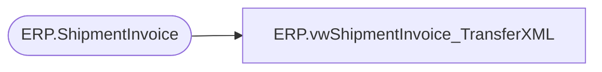

# ERP.vwShipmentInvoice_TransferXML

**Database:** IntegrationStaging  
**Server:** STL-SSIS-P-01  

## Architecture Diagram



## Table Dependencies

| Referenced Table |
|---|
| ERP.ShipmentInvoice |

## View Code

```sql
CREATE view [ERP].[vwShipmentInvoice_TransferXML]

as

with 
XMLStage (XML) as
	(
		select 
			DlvMode,
			InventLocationId,
			ItemId,
			--Null as LineNum, NULL,
			OrderRef,
			cast(sum(Qty) as int) as Qty,
			convert(varchar, ShipDate, 101) as ShipDate
			--NULL as UnitOfMeasure, NULL
		from ERP.ShipmentInvoice with (nolock)
		where Transmitted = 0
		and left(OrderRef, 2) = 'TO'
		group by DlvMode, InventLocationId, ItemId, OrderRef, convert(varchar, ShipDate, 101)
		for xml path('rsmBABWMShipmentEntity'), root('Document'), Type
	)
select XML as XMLData
from XMLStage
```

