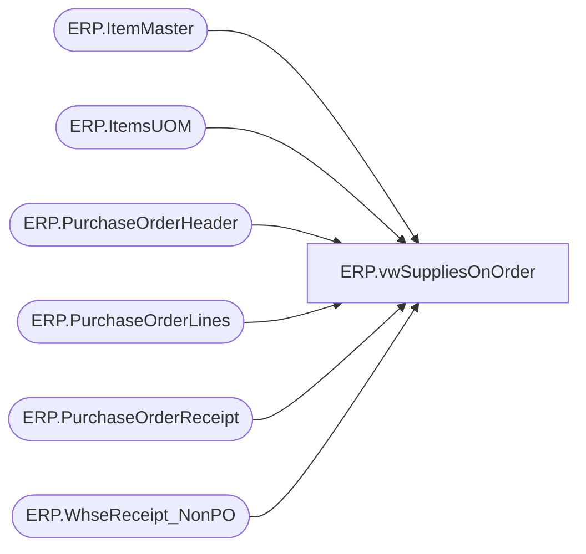

# ERP.vwSuppliesOnOrder

**Database:** IntegrationStaging  
**Server:** STL-SSIS-P-01  

## Architecture Diagram



## Table Dependencies

| Referenced Table |
|---|
| ERP.ItemMaster |
| ERP.ItemsUOM |
| ERP.PurchaseOrderHeader |
| ERP.PurchaseOrderLines |
| ERP.PurchaseOrderReceipt |
| ERP.WhseReceipt_NonPO |

## View Code

```sql
CREATE VIEW [ERP].[vwSuppliesOnOrder]
AS
  --WITH onOrderSupplies ([PurchaseOrderNumber]
	 -- ,[ItemID]
	 -- ,[Qty])
  --AS
  --(
  --SELECT poh.[PurchaseOrderNumber]
	 -- ,pol.[ItemID]
	 -- ,pol.[CurrQty] AS 'Qty'
  --FROM [ERP].[PurchaseOrderHeader] poh
  --LEFT JOIN [ERP].[PurchaseOrderLines] pol ON poh.PurchaseOrderNumber = pol.PurchaseOrderNumber
  --WHERE pol.DestinationWarehouse IN ('9940', '9941', '9960', '9970', '9980')
  --EXCEPT
  --SELECT [PurchaseOrderNumber]
  --      ,[ItemID]
  --      ,[Qty]
  --FROM [ERP].[PurchaseOrderReceipt]
  --UNION
  --SELECT 'CNV'+CAST([PurchaseOrderNumber] AS VARCHAR(7))
  --      ,[ItemNumber]
  --      ,[inventoryQuantity]
  --FROM [ERP].[vwSuppliesReceived]
  --)
  --SELECT pol.[ItemID]
	 --   ,SUM(pol.[CurrQty]) AS 'Qty'
  --      ,[OrderCreateDate]
		--,poh.PurchaseOrderNumber
  --FROM [ERP].[PurchaseOrderHeader] poh
  --LEFT JOIN [ERP].[PurchaseOrderLines] pol ON poh.PurchaseOrderNumber = pol.PurchaseOrderNumber
  --WHERE poh.PurchaseOrderNumber IN (SELECT PurchaseOrderNumber FROM onOrderSupplies)
  --GROUP BY OrderCreateDate, CurrQty, ItemID, poh.PurchaseOrderNumber
  WITH NonPORecieved
  AS
  ( SELECT IM.PRODUCTNUMBER AS ItemNumber
      ,SUM([Qty]/CAST(UOM.[FACTOR] AS INT)) AS inventoryQuantity
      ,[ReceiptDate] AS transactionDate
      ,[ReceiptLocation] AS inventoryWarehouseId
	  ,CASE
	     WHEN LEN(NonPO.ReferenceNumber) = 7 THEN 'CNV' + NonPO.ReferenceNumber
		 ELSE NonPO.ReferenceNumber
	   END AS 'PurchaseOrderNumber'
  FROM [IntegrationStaging].[ERP].[WhseReceipt_NonPO] NonPO
  LEFT JOIN [IntegrationStaging].[ERP].[ItemMaster] IM ON NonPO.ItemID = RIGHT(IM.ProductNumber, 6)
  INNER JOIN [STL-SSIS-P-01].IntegrationStaging.ERP.ItemsUOM UOM ON IM.PRODUCTNUMBER = UOM.PRODUCTNUMBER AND UOM.Entity = 1100 AND IM.PURCHASEUNITSYMBOL = UOM.FROMUNITSYMBOL AND TOUNITSYMBOL = 'WMEA'
  GROUP BY [ReferenceNumber]
      ,[ReceiptLocation]
      ,IM.PRODUCTNUMBER
      ,[ReceiptDate]
	  ,NonPO.ReferenceNumber
), exceptions
AS
(
  SELECT [PurchaseOrderNumber]
        ,[ItemID]
  FROM [ERP].[PurchaseOrderReceipt]
  UNION
  SELECT [PurchaseOrderNumber]
        ,[ItemNumber]
  FROM NonPORecieved
),onOrderSupplies ([PurchaseOrderNumber]
	  ,[ItemID])
  AS
  (
  SELECT poh.[PurchaseOrderNumber]
	  ,pol.[ItemID]
  FROM [ERP].[PurchaseOrderHeader] poh
  LEFT JOIN [ERP].[PurchaseOrderLines] pol ON poh.PurchaseOrderNumber = pol.PurchaseOrderNumber
  WHERE pol.DestinationWarehouse IN ('9940', '9941', '9960', '9970', '9980') 
  EXCEPT
  SELECT *
  FROM exceptions
  )
SELECT pol.[ItemID]
	    ,SUM(pol.[CurrQty]) AS 'Qty'
        ,[OrderCreateDate]
		,pol.EndDeliverDateTime
		,poh.PurchaseOrderNumber
  FROM [ERP].[PurchaseOrderHeader] poh
  LEFT JOIN [ERP].[PurchaseOrderLines] pol ON poh.PurchaseOrderNumber = pol.PurchaseOrderNumber
  WHERE poh.PurchaseOrderNumber IN (SELECT PurchaseOrderNumber FROM onOrderSupplies)
  GROUP BY OrderCreateDate, EndDeliverDateTime, CurrQty, ItemID, poh.PurchaseOrderNumber
```

