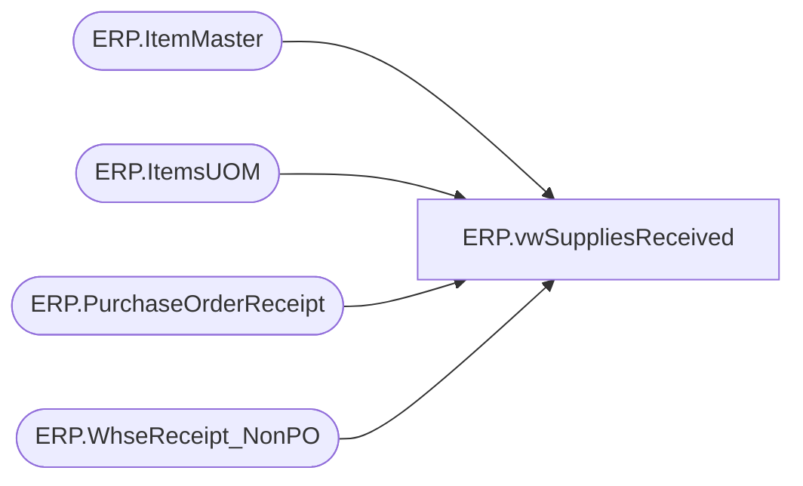

# ERP.vwSuppliesReceived

**Database:** IntegrationStaging  
**Server:** STL-SSIS-P-01  

## Architecture Diagram



## Table Dependencies

| Referenced Table |
|---|
| ERP.ItemMaster |
| ERP.ItemsUOM |
| ERP.PurchaseOrderReceipt |
| ERP.WhseReceipt_NonPO |

## View Code

```sql
CREATE VIEW [ERP].[vwSuppliesReceived]
AS
SELECT        ItemID AS ItemNumber
             ,SUM(Qty) AS inventoryQuantity
			 ,ReceiptDate AS transactionDate
			 ,ReceiptLocation AS inventoryWarehouseId
			 ,PurchaseOrderNumber
FROM            ERP.PurchaseOrderReceipt
GROUP BY ItemID, ReceiptLocation, ReceiptDate, PurchaseOrderNumber
UNION
 --SELECT pol.[ItemID] AS ItemNumber
 --     ,pol.[CurrQty] AS 'inventoryQuantity'
	--  ,CAST(pol.EndDeliverDateTime AS DATE) AS 'transactionDate'
	--  ,pol.DestinationWarehouse AS 'inventoryWarehouseId'
 -- FROM [ERP].[PurchaseOrderHeader] poh
 -- LEFT JOIN [ERP].[PurchaseOrderLines] pol ON poh.PurchaseOrderNumber = pol.PurchaseOrderNumber
 -- WHERE pol.DestinationWarehouse IN ('9940', '9941', '9960', '9970', '9980') AND poh.PurchaseOrderNumber LIKE 'CNV%'

 SELECT IM.PRODUCTNUMBER AS ItemNumber
      ,SUM([Qty]/CAST(UOM.[FACTOR] AS INT)) AS inventoryQuantity
      ,[ReceiptDate] AS transactionDate
      ,[ReceiptLocation] AS inventoryWarehouseId
	  ,NonPO.ReferenceNumber AS 'PurchaseOrderNumber'
  FROM [IntegrationStaging].[ERP].[WhseReceipt_NonPO] NonPO
  LEFT JOIN [IntegrationStaging].[ERP].[ItemMaster] IM ON NonPO.ItemID = RIGHT(IM.ProductNumber, 6) AND IM.Entity = 1100
  INNER JOIN [STL-SSIS-P-01].IntegrationStaging.ERP.ItemsUOM UOM ON IM.PRODUCTNUMBER = UOM.PRODUCTNUMBER AND UOM.Entity = 1100 AND IM.PURCHASEUNITSYMBOL = UOM.FROMUNITSYMBOL AND TOUNITSYMBOL = 'WMEA'
  --WHERE  ItemID = '056229'
  GROUP BY [ReferenceNumber]
      ,[ReceiptLocation]
      ,IM.PRODUCTNUMBER
      ,[ReceiptDate]
	  ,NonPO.ReferenceNumber
```

