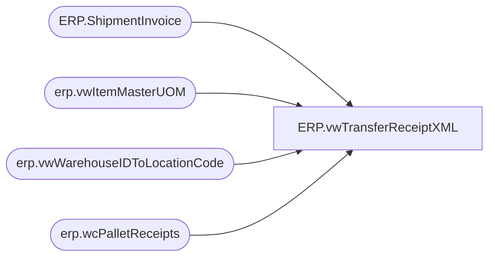

# ERP.vwTransferReceiptXML

**Database:** IntegrationStaging  
**Server:** STL-SSIS-P-01  

## Architecture Diagram



## Table Dependencies

| Referenced Table |
|---|
| ERP.ShipmentInvoice |
| erp.vwItemMasterUOM |
| erp.vwWarehouseIDToLocationCode |
| erp.wcPalletReceipts |

## View Code

```sql
CREATE view [ERP].[vwTransferReceiptXML]

as

with 
PalletReceipts as
	(
		select 
			PalletID,
			cast(ReceiptDate as date) ReceiptDate
		from erp.wcPalletReceipts
		where datediff(dd, ReceiptDate, getdate()) = 0
	),
InventoryMultiple as
	(
		select ProductNumber, InventoryMultiple, InventoryUnitSymbol, Entity 
		from erp.vwItemMasterUOM
		where left(ProductNumber, 1) = 'S'
	),
ReceiptData as
	(
		select 
			concat(
				replace(p.ReceiptDate, '-', ''),
				w.WarehouseID,
				rank() over(order by w.WarehouseID, p.ReceiptDate) 
			  ) as ReceiptID,
			im.InventoryUnitSymbol as UnitOfMeasure,
			si.DlvMode,
			w.WarehouseID as InventLocationId,
			si.ItemId,
			si.OrderRef,
			sum(si.WhseUnitQty / im.InventoryMultiple) as Qty,
			--sum(si.qty) as Qty,
			convert(varchar, p.ReceiptDate, 101) as ReceiptDate
		from ERP.ShipmentInvoice si with (nolock)
		join InventoryMultiple im on si.ItemID = im.ProductNumber and si.Entity = im.Entity
		join PalletReceipts p on si.PalletID = p.PalletID
		join erp.vwWarehouseIDToLocationCode w on si.ShipTo = w.LocationCode 
		group by si.DlvMode, w.WarehouseID, si.ItemId, si.OrderRef, p.ReceiptDate,im.InventoryUnitSymbol
	),

XMLStage (XML) as
	(
		select 
			DlvMode,
			InventLocationId,
			ItemId,
			OrderRef,
			sum(Qty) as Qty,
			ReceiptDate,
			ReceiptID,
			UnitOfMeasure
		from ReceiptData 
		where Qty > 0
		group by DlvMode, InventLocationId, ItemId, OrderRef, ReceiptDate, ReceiptID, UnitOfMeasure
		for xml path('RSMWMSTransferOrderReceiptEntity'), root('Document'), Type
	)
select XML as XMLData
from XMLStage
```

