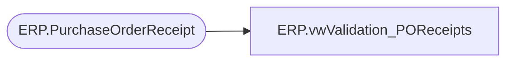

# ERP.vwValidation_POReceipts

**Database:** IntegrationStaging  
**Server:** STL-SSIS-P-01  

## Architecture Diagram



## Table Dependencies

| Referenced Table |
|---|
| ERP.PurchaseOrderReceipt |

## View Code

```sql
CREATE view [ERP].[vwValidation_POReceipts]

as 


with 
DynamicsReceipts as
	(
		select 
			Entity,
			ReceiptLocation,
			ReceiptDate,
			PurchaseOrderNumber,
			ItemID as ItemNumber,
			cast(sum(Qty) as int) as Qty,
			UOM,
			'Processed' as ImportStatus
		from ERP.PurchaseOrderReceipt
		WHERE ReceiptLocation <> '9980'
		group by 
			Entity,
			ReceiptLocation,
			ReceiptDate,
			PurchaseOrderNumber,
			ItemID,
			UOM

		--select 
		--	Entity,
		--	InventLocationID as ReceiptLocation,
		--	cast(ReceiptDate as date) as ReceiptDate,
		--	PurchID as PurchaseOrderNumber,
		--	ItemID as ItemNumber,
		--	cast(sum(Qty) as int) as Qty,
		--	UnitOfMeasure as UOM,
		--	ImportStatus
		--ERP.DynamicsValidationPOReceipt
		--WHERE InventLocationID <> '9980'
		--group by 
		--	Entity,
		--	InventLocationID,
		--	cast(ReceiptDate as date),
		--	PurchID,
		--	ItemID,
		--	UnitOfMeasure,
		--	ImportStatus
	),
StagedReceipts as
	(
		select 
			Entity,
			ReceiptLocation,
			ReceiptDate,
			PurchaseOrderNumber,
			ItemID as ItemNumber,
			sum(Qty) Qty,
			UOM
		from ERP.PurchaseOrderReceipt 
		where ReceiptLocation <> '9980'
		group by 
			Entity,
			ReceiptLocation,
			ReceiptDate,
			PurchaseOrderNumber,
			ItemID,
			UOM
	)
select 
	ir.Entity,
	ir.ReceiptLocation,
	ir.ReceiptDate,
	ir.PurchaseOrderNumber,
	ir.ItemNumber,
	ir.Qty,
	ir.UOM,
	--dre.ImportStatus ErrorImportStatus,
	--drp.ImportStatus ProcessedImportStatus,
	isnull(isnull(drp.ImportStatus, dre.ImportStatus), 'No Data') as AssumedImportStatus
from StagedReceipts ir
left join DynamicsReceipts dre
	on ir.Entity = dre.Entity
	and ir.ReceiptLocation = dre.ReceiptLocation 
	and ir.ReceiptDate = dre.ReceiptDate 
	and ir.PurchaseOrderNumber = dre.PurchaseOrderNumber
	and ir.ItemNumber = dre.ItemNumber 
	and ir.Qty = dre.Qty
	and ir.UOM = dre.UOM
	and isnull(dre.ImportStatus,'xx') = 'Error'
left join DynamicsReceipts drp
	on ir.Entity = drp.Entity
	and ir.ReceiptLocation = drp.ReceiptLocation 
	and ir.ReceiptDate = drp.ReceiptDate 
	and ir.PurchaseOrderNumber = drp.PurchaseOrderNumber
	and ir.ItemNumber = drp.ItemNumber 
	and ir.Qty = drp.Qty 
	and ir.UOM = drp.UOM
	and isnull(drp.ImportStatus,'xx') = 'Processed'
where 1=1
--and isnull(isnull(drp.ImportStatus, dre.ImportStatus), 'No Data') in ('Error', 'No Data')
--order by ir.ReceiptDate desc, entity, PurchaseOrderNumber
```

