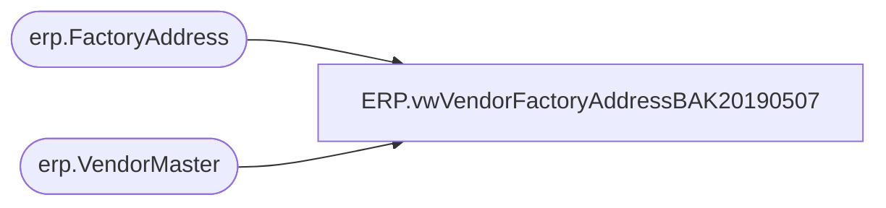

# ERP.vwVendorFactoryAddressBAK20190507

**Database:** IntegrationStaging  
**Server:** STL-SSIS-P-01  

## Architecture Diagram



## Table Dependencies

| Referenced Table |
|---|
| erp.FactoryAddress |
| erp.VendorMaster |

## View Code

```sql
CREATE view [ERP].[vwVendorFactoryAddressBAK20190507] 
as

--the Vendor record in Dynamics has field called OrganizationPhoneticName which holds the VendorCode, but if vendor has multiple Factory Addresses, the field holds VendorCode-FactoryCode
--The view will return a single factory per vendor, per Entity
with 
VendorFactory as
(
	select --vendors setup in Dynamics to have more than 1 factory address, as notated by including VendorCode and Factory code in the OrganizationPhoneticName field as 'VendorCode-FactoryCode'
		vm.VENDORACCOUNTNUMBER,
		fa.VendorCode,
		fa.FactoryCode,
		vm.Entity,
		fa.FactoryName,
		fa.Port,
		fa.address,
		fa.city,
		fa.province,
		fa.country
	from erp.VendorMaster vm with (nolock)
	join erp.FactoryAddress fa with (nolock) 
		on substring(vm.OrganizationPhoneticName, 1, charindex('-',vm.OrganizationPhoneticName)-1) = fa.VendorCode 
		and substring(vm.OrganizationPhoneticName, charindex('-',vm.OrganizationPhoneticName)+1,10 ) = fa.FactoryCode 
	where vm.OrganizationPhoneticName like '%-%'
	--and fa.VendorCode in --COMMENTED OUT BECAUSE THEY HAVE SETUP SOME ITEMS WITH HYPHEN DESPITE NOT HAVING MULTIPLE FACTORIES, FOR EXAMPLE HPIDIRE-HPISCH
	--	(		--vendors with multiple factory addresses
	--		select VendorCode 
	--		from erp.FactoryAddress 
	--		group by VendorCode 
	--		having count(*) > 1
	--	)
	UNION
	select ---vendors setup in Dynamics to have only 1 factory address, as notated by only including VendorCode in the OrganizationPhoneticName field and not including '-'
		vm.VENDORACCOUNTNUMBER,
		vm.OrganizationPhoneticName VendorCode, 
		fa.FactoryCode,
		vm.entity,
		fa.FactoryName,
		fa.Port,
		fa.address,
		fa.city,
		fa.province,
		fa.country
	from erp.VendorMaster vm with (nolock)
	join erp.FactoryAddress fa with (nolock) on vm.OrganizationPhoneticName = fa.VendorCode 
	where vm.OrganizationPhoneticName NOT like '%-%'
	and fa.VendorCode not in 
		(		--vendors with multiple factory addresses
			select VendorCode 
			from erp.FactoryAddress 
			group by VendorCode 
			having count(*) > 1
		)
)
SELECT *
from VendorFactory
```

