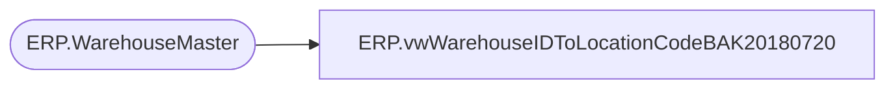

# ERP.vwWarehouseIDToLocationCodeBAK20180720

**Database:** IntegrationStaging  
**Server:** STL-SSIS-P-01  

## Architecture Diagram



## Table Dependencies

| Referenced Table |
|---|
| ERP.WarehouseMaster |

## View Code

```sql
CREATE view [ERP].[vwWarehouseIDToLocationCodeBAK20180720]

as

---------------------------------------------------------------------------------
-- Dan Tweedie	-	2017-12-01	-	Maps D365 WarehouseID to Aptos Location Code
---------------------------------------------------------------------------------

select 
	cast(WarehouseID as varchar(5)) as WarehouseID,
	cast(
			case 
				when left(WarehouseID,1) in ('1','9')
					then 
						case 
							when WarehouseID = 9970
								then '2970'
							when WarehouseID = 9940
								then '3970'
							when WarehouseID = 9941
								then '3980'
							when WarehouseID = 9991
								then '9991' 
							when left(WarehouseID,2) = '93'
								then WarehouseID 
							else concat(cast('0' as varchar), right(cast(WarehouseID as varchar),3))
						end 
					else WarehouseID
				end as varchar(4)
		)
		 as LocationCode,
	PrimaryAddressDescription,
	OperationalSiteID,
	cast(
			case 
				when left(OperationalSiteID,1) in ('1','9') 
					then 
						case 
							when OperationalSiteID = 9970
								then '2970'
							when OperationalSiteID = 9940
								then '3970'
							when OperationalSiteID = 9941
								then '3980'
							when OperationalSiteID = 9991
								then '9991'
							when OperationalSiteID = 9901 ----POOL POINTS ---
								then '9365' 
							else concat(cast('0' as varchar), right(cast(OperationalSiteID as varchar),3))
						end 
					else cast(OperationalSiteID as varchar)
				end as varchar(4)
		)
		 as OperationalSiteCode,
		 Entity 
from ERP.WarehouseMaster with (nolock)
where 1=1
and WarehouseID not like '%[^0-9]%'
and left(WarehouseID,2) not in ('92','94') --excludes various hubs, pool points, etc 
and WarehouseID <> '8010' --Keenpac - uk 
--and WarehouseID = '9980'
```

