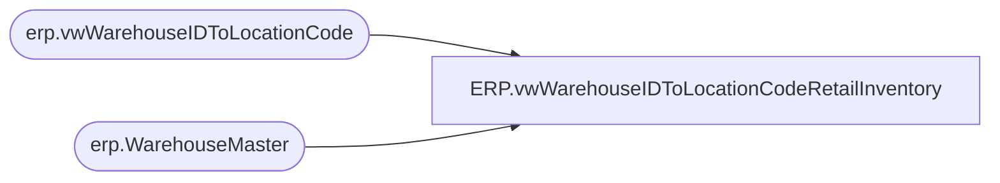

# ERP.vwWarehouseIDToLocationCodeRetailInventory

**Database:** IntegrationStaging  
**Server:** STL-SSIS-P-01  

## Architecture Diagram



## Table Dependencies

| Referenced Table |
|---|
| erp.vwWarehouseIDToLocationCode |
| erp.WarehouseMaster |

## View Code

```sql
CREATE view [ERP].[vwWarehouseIDToLocationCodeRetailInventory]

as

---------------------------------------------------------------------------------
-- Tim Callahan	-	2023-04-26	-	Created View 
---------------------------------------------------------------------------------

with RetailInventory as
(
select WarehouseId, AreAdvancedWarehouseManagementProcessesEnabled, IsRetailStoreWarehouse, Entity

from erp.WarehouseMaster wm 
where 1=1
and
(
AreAdvancedWarehouseManagementProcessesEnabled = 'Yes'
and IsRetailStoreWarehouse = 'Yes'
) 
--or wm.WarehouseId in ('2079') -- Added 8/14/2024 as a Test to Hard Allow a partner Store in this view\ May need to add back in if they change the flags

) 

select 
v.WarehouseID, 
v.LocationCode, 
v.PrimaryAddressDescription, 
v.OperationalSiteID, 
v.OperationalSiteCode, 
v.Entity,
r.AreAdvancedWarehouseManagementProcessesEnabled, -- Retail Inventory Enabled 
r.IsRetailStoreWarehouse -- Selling Location aka Store 

from erp.vwWarehouseIDToLocationCode v
join RetailInventory R on r.WarehouseId=v.WarehouseID
	and r.Entity=v.Entity
```

