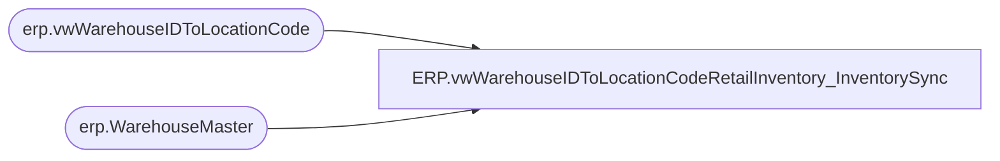

# ERP.vwWarehouseIDToLocationCodeRetailInventory_InventorySync

**Database:** IntegrationStaging  
**Server:** STL-SSIS-P-01  

## Architecture Diagram



## Table Dependencies

| Referenced Table |
|---|
| erp.vwWarehouseIDToLocationCode |
| erp.WarehouseMaster |

## View Code

```sql
CREATE view [ERP].[vwWarehouseIDToLocationCodeRetailInventory_InventorySync]

as

---------------------------------------------------------------------------------
-- Tim Callahan	-	2023-11-07	-	Created View 
---------------------------------------------------------------------------------

with RetailInventory as
(
select WarehouseId, AreAdvancedWarehouseManagementProcessesEnabled, IsRetailStoreWarehouse, Entity

from erp.WarehouseMaster wm 
where 1=1
and AreAdvancedWarehouseManagementProcessesEnabled = 'Yes'
and IsRetailStoreWarehouse = 'Yes'

) , 

Summary1 as 
(

select 
v.WarehouseID, 
v.LocationCode, 
v.PrimaryAddressDescription, 
v.OperationalSiteID, 
v.OperationalSiteCode, 
v.Entity,
r.AreAdvancedWarehouseManagementProcessesEnabled, -- Retail Inventory Enabled 
r.IsRetailStoreWarehouse -- Selling Location aka Store 

from erp.vwWarehouseIDToLocationCode v
join RetailInventory R on r.WarehouseId=v.WarehouseID
	and r.Entity=v.Entity
) 

select distinct LocationCode
From Summary1
union 
select '2019' as LocationCode
union
select '2079' as LocationCode
union 
select '2080' as LocationCode
union 
select '2083' as LocationCode -- Added 6/5/25 at the request of Paige Lingren; LT BearAssist #76292
```

