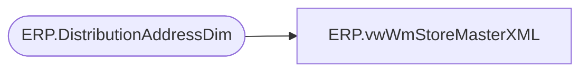

# ERP.vwWmStoreMasterXML

**Database:** IntegrationStaging  
**Server:** STL-SSIS-P-01  

## Architecture Diagram



## Table Dependencies

| Referenced Table |
|---|
| ERP.DistributionAddressDim |

## View Code

```sql
CREATE view [ERP].[vwWmStoreMasterXML]

as


with 
StoreMaster as
	(
		select 	'980' as WHSE,
			isnull(Location_Code, [AddressID]) as STORE_NBR,
			left([ShipToName], 35) as NAME,
			--[ShipToStreet] as ADDR_LINE_1,
			REPLACE(REPLACE(ShipToStreet, CHAR(13), ''), CHAR(10), '') as ADDR_LINE_1,
			NULL as ADDR_LINE_2,
			NULL as ADDR_LINE_3,
			[ShipToCity] as CITY,
			[ShipToState] as STATE,
			case when [ShipToCountry] in ('US', 'USA')
			then right('00000' + convert(varchar(5),left([ShipToZipCode],5)),5)
			else [ShipToZipCode] 
			end as ZIP,
			case when [ShipToCountry] = 'USA' then 'US' else [ShipToCountry] end as CNTRY,
			[ShipToName] as CONTACT,
			'000-000-0000' as PHONE,
			'001' as DFLT_CO,
			'001' AS DFLT_DIV,
			0 as STAT_CODE,
			'001' as CARTON_CNT_TYPE,
			'' as CARTON_LABEL_TYPE,
			51 as CARTON_CUBNG_INDIC,
			'N' as USE_INBD_LPN_AS_OUT_BD_LPN,
			'D365' as USER_ID	
		from [ERP].[DistributionAddressDim]
		where datediff(dd, isnull(InsertDate, UpdateDate), getdate()) = 0
	) ,
XMLStage (XML) as
	(
		select
				whse as 'Warehouse',
				store_nbr as 'StoreNumber',
				(select 
					name as 'StoreName',
					addr_line_1 as 'StoreAddr1',
					addr_line_2 as 'StoreAddr2',
					city as 'StoreCity',
					state as 'StoreState',
					zip as 'StoreZip',
					cntry as 'StoreCountry'
				for xml path('StoreDetail'), type),
				(select
					phone as 'TelephoneNumber',
					dflt_co as 'DefaultCompany',
					dflt_div as 'DefaultDivision',
					stat_code as 'StatusCode',
					carton_cnt_type as 'CtnCounterRecType',
					carton_label_type as 'CartonLabelType',
					carton_cubng_indic as 'CartonCubingIndic',
					use_inbd_lpn_as_out_bd_lpn as 'CaseAsCarton'
				for xml path('StoreFields'), type)
		from StoreMaster
		for xml path('StoreMaster'), root ('StoreMasterBridge'), type
	)
select XML as XMLData
from XMLStage
```

