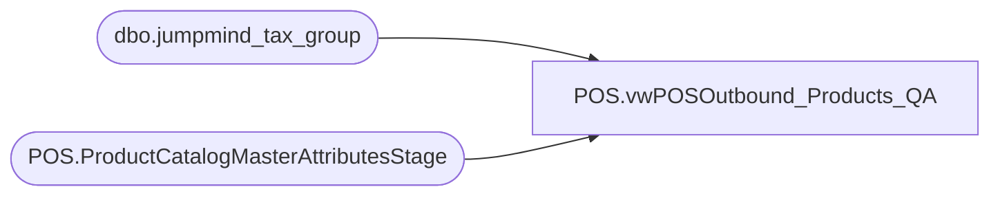

# POS.vwPOSOutbound_Products_QA

**Database:** IntegrationStaging  
**Server:** STL-SSIS-P-01  

## Architecture Diagram



## Table Dependencies

| Referenced Table |
|---|
| dbo.jumpmind_tax_group |
| POS.ProductCatalogMasterAttributesStage |

## View Code

```sql
--select ProductNumber, isTaxExempt, Class, SubClass, tax_item_group_id, tax_item_group_code, tax_item_group_description 
--from [POS].[vwPOSOutbound_Products] 
--where isTaxExempt = 1
--order by ProductNumber asc 

--select * from [POS].[vwPOSOutbound_Products] where ProductNumber = '480804'


CREATE VIEW  [POS].[vwPOSOutbound_Products_QA] AS


SELECT p.[AccessoryType]
      ,p.[AnimalSoldSeparately]
      ,p.[AsthmaFriendly]
      ,p.[ColorCode]
      ,p.[LicensedCollection]
      ,p.[BirthCertificateRequired]
      ,p.[BodyType]
      ,p.[Bottoms]
      ,p.[Boy]
      ,p.[CommodityCode]
      ,p.[Department]
      ,p.[DisplayOnAmazon]
      ,p.[EyeColor]
      ,p.[WebExclusive]
      ,p.[Girl]
      ,p.[Neutral]
      ,p.[Outfits]
      ,p.[GiftBoxType]
      ,p.[KeyStory]
      ,p.[ManufacturerCountry]
      ,p.[MerchInDate]
      ,p.[Mini]
      ,p.[Music]
      ,p.[NoInternationalShipping]
      ,p.[SAC]
      ,p.[SNC]
      ,p.[ProductSellingGeography]
     --,p.[QuantityRestriction]
	  ,999 as 'QuantityRestriction'
      ,p.[RefundEligible]
      ,p.[Seasonal]
      ,p.[ThirdPartySiteEligible]
      ,p.[ShippingClass]
      ,p.[Stuffable]
      ,p.[Tops]
      ,p.[WarningLabel]
      ,p.[AccessoryEligible]
      ,p.[SkinType]
      ,p.[FriendHeight]
      ,p.[FriendWeight]
      ,p.[SoundEligible]
      ,p.[MSTAT]
      ,p.[EmbroideryProductList]
      ,p.[ProductCanBeEmbroidered]
      ,p.[ProductMustBeEmbroidered]
      ,p.[UPC]
      ,p.[Purses]
      ,p.[LICEN]
      ,p.[OnOrderFlag]
      ,p.[sportsTeam]
      ,p.[occasion]
      ,p.[giftCardType]
      ,p.[OccasionCode]
      ,p.[PackageOption]
      ,p.[Web]
      ,p.[BRF]
      ,p.[Inline]
      ,p.[AvailB]
      ,p.[BaseID]
      ,p.[Shoes]
      ,p.[Sound]
      ,p.[fourLeggedAnimal]
      ,p.[merchOutDate]
      ,p.[MLBTeams]
      ,p.[NBATeams]
      ,p.[NFLTeams]
      ,p.[NHLTeams]
      ,p.[UKFootball]
      ,p.[isEndlessAisleEligible]
      --,p.[isTaxExempt]
	  ,case when p.[ProductCountry] not in ('IE','UK') then 
		 case when tg.id is not null and tg.id like 'R%' then 1 
		 else 0 end 
		when p.[ProductCountry] in ('IE','UK') then 
			case when p.[Department] in ('UK UK Mandated Fees','UK-Donations / Disc') or (p.[ProductDescription] = 'Round-up - Donation')  then 1				
			when p.[Department] = 'School Supplies' then 0									
			When p.[Department] = 'Candy' then 0									
			when p.[Department] in ('Human CLothes','UK Clothes','UK-Footwear','Accessories','Clothes','Footwear') then 0  	
			--when p.[Department] in ('UK-Gift Cards','UK-Transaction Flags') then 1	
			when p.[Department] in ('UK-Gift Cards') then 1		
			when p.[Department] = 'Virtual World' then 0									 
			else 0 end 
		end as isTaxExempt
	  ,p.[isCouponEligible]
      ,p.[isEmployeeDiscountEligible]
      ,p.[isReturnEligible]
      ,p.[ItemDescription]
      ,p.[ProductDescription]
      ,p.[ItemName]
      ,p.[isCashierEnterQty]
      --,p.[isCashierEntersPrice]
      ,case when p.StyleCode in 
	  (
	    '013585',
		'009761',
		'013574',
		'013572',
		'013573',
		'022862',
		'022864',
		'013571',
		'009758',
		'023970',
		'023971',
		'026010',
		'023972',
		'022761',
		'009737',
		'023490',
		'026011',
		'023973',
		'020236',
		'009759',
		'020478',
		'009760',
		'022760',
		'009786',
		'010341',
		'026792',
		'026793',
		'026794',
		'090892',
        '190892',
        '490892',
		'083503',
		'183503',
		'483503',
		'083503',
		'480760',
		'080760',
		'180760'
		) THEN '1' ELSE p.[isCashierEntersPrice] END AS isCashierEntersPrice
	  ,p.[isQtyRestricted]
      ,p.[ProductNumber]
      ,p.[ProductCountry]
      ,p.[StoreFrontEligible]
      ,p.[Class]
      ,p.[SubClass]
      ,p.[DepartmentCode]
      ,p.[ClassCode]
      ,p.[SubClassCode]
      ,p.[StyleCode]
      ,p.[DepartmentHierarchyGroupID]
      ,p.[ClassHierarchyGroupID]
      ,p.[SubClassHierarchyGroupID]
      ,p.[ClassParentGroupID]
      ,p.[SubClassParentGroupID]
      ,p.[StyleParentGroupID]
      ,p.[SellingStatus]
      ,p.[ItemType]
    -- ,p.[tax_item_group_id]
     ,case when p.[ProductCountry] in ('IE','UK') then 
			case when p.[Department] in ('UK UK Mandated Fees','UK-Donations / Disc')  then 'BAB10'					
			when p.[Department] = 'School Supplies' then 'BAB22'									
			When p.[Department] = 'Candy' then	'BAB41'										
			when p.[Department] in ('Human CLothes','UK Clothes','UK-Footwear','Accessories','Clothes','Footwear') then 'BAB20'  	
			when p.[Department] in ('UK-Gift Cards') then 'BAB52'	
			when p.[Department] in ('UK-Transaction Flags') then 'BAB20'	
			when p.[Department] = 'Virtual World' then  'BAB53'									 
			else 'BAB20' end
	else null end as [tax_item_group_id]	
	-- ,p.[tax_item_group_code]
	 ,case when p.[ProductCountry] in ('IE','UK') then 
		case when p.[Department] in ('UK UK Mandated Fees','UK-Donations / Disc')  then ' '					
		when p.[Department] = 'School Supplies' then 'Z'									
		When p.[Department] = 'Candy' then	'Z'										
		when p.[Department] in ('Human CLothes','UK Clothes','UK-Footwear','Accessories','Clothes','Footwear') then 'S'  	
		when p.[Department] in ('UK-Gift Cards') then 'Z'		
			when p.[Department] in ('UK-Transaction Flags') then 'S'
		when p.[Department] = 'Virtual World' then  'S'									 
		else 'S' end 
	 else null end as [tax_item_group_code]	
  --   ,p.[tax_item_group_description]
    ,case when p.[ProductCountry] in ('IE','UK') then 
	    case when p.[Department] in ('UK UK Mandated Fees','UK-Donations / Disc')  then 'Non-Taxable'					
		when p.[Department] = 'School Supplies' then 'School Supplies'									
		When p.[Department] = 'Candy' then 'Cookies'										
		when p.[Department] in ('Human CLothes','UK Clothes','UK-Footwear','Accessories','Clothes','Footwear') then 'Clothing'  	
		when p.[Department] in ('UK-Gift Cards','UK-Transaction Flags') then 'Taxable'						
		when p.[Department] = 'Virtual World' then  'Digital Goods'									 
		else 'Taxable' end 
	 else null end as  [tax_item_group_description]	
	 ,p.[isLoyaltyRewardsDiscountEligible]
  FROM [stl-ssis-p-01].[IntegrationStaging].[POS].[ProductCatalogMasterAttributesStage] p
  left join SILVERDELTALAKE.silverdeltalake.dbo.jumpmind_tax_group tg on p.SubClassCode COLLATE Latin1_General_100_BIN2 = tg.id
  where p.StyleCode not in ('080761', '080771', '180761', '180771', '480771', '480761',
   '010588','014386','019885','019887','019886','019889','020549','018925')  -- taxable R-B-D-37-01-01 items
```

