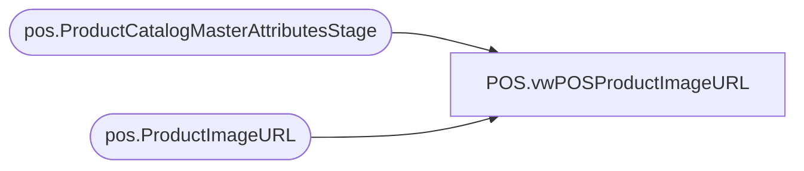

# POS.vwPOSProductImageURL

**Database:** IntegrationStaging  
**Server:** STL-SSIS-P-01  

## Architecture Diagram



## Table Dependencies

| Referenced Table |
|---|
| pos.ProductCatalogMasterAttributesStage |
| pos.ProductImageURL |

## View Code

```sql
CREATE view [POS].[vwPOSProductImageURL]

as

select 
	ItemNumber,
	ImageURL,
	isPrimary 
from pos.ProductImageURL
where ItemNumber in (select StyleCode from pos.ProductCatalogMasterAttributesStage)
UNION
select --use US as CA
	concat(cast('1' as varchar), cast(right(ItemNumber,5) as varchar)) ItemNumber,
	ImageURL,
	isPrimary 
from pos.ProductImageURL
where left(ItemNumber,1) in ('0')
and concat(cast('1' as varchar), cast(right(ItemNumber,5) as varchar)) in (select StyleCode from pos.ProductCatalogMasterAttributesStage)
--UNION
--select 
--	concat(cast('4' as varchar), cast(right(ItemNumber,5) as varchar)) ItemNumber,
--	ImageURL,
--	isPrimary 
--from pos.ProductImageURL
--where left(ItemNumber,1) in ('0')
--and concat(cast('4' as varchar), cast(right(ItemNumber,5) as varchar)) in (select StyleCode from pos.ProductCatalogMasterAttributesStage)
--and concat(cast('4' as varchar), cast(right(ItemNumber,5) as varchar)) not in (select ItemNumber from pos.ProductImageURL)
--UNION
--select 
--	concat(cast('5' as varchar), cast(right(ItemNumber,5) as varchar)) ItemNumber,
--	ImageURL,
--	isPrimary 
--from pos.ProductImageURL
--where left(ItemNumber,1) in ('2')
--and concat(cast('5' as varchar), cast(right(ItemNumber,5) as varchar)) in (select StyleCode from pos.ProductCatalogMasterAttributesStage)
--and concat(cast('5' as varchar), cast(right(ItemNumber,5) as varchar)) not in (select ItemNumber from pos.ProductImageURL)
--UNION
--select 
--	concat(cast('6' as varchar), cast(right(ItemNumber,5) as varchar)) ItemNumber,
--	ImageURL,
--	isPrimary 
--from pos.ProductImageURL
--where left(ItemNumber,1) in ('3')
--and concat(cast('6' as varchar), cast(right(ItemNumber,5) as varchar)) in (select StyleCode from pos.ProductCatalogMasterAttributesStage)
--and concat(cast('6' as varchar), cast(right(ItemNumber,5) as varchar)) not in (select ItemNumber from pos.ProductImageURL)
--GO
```

