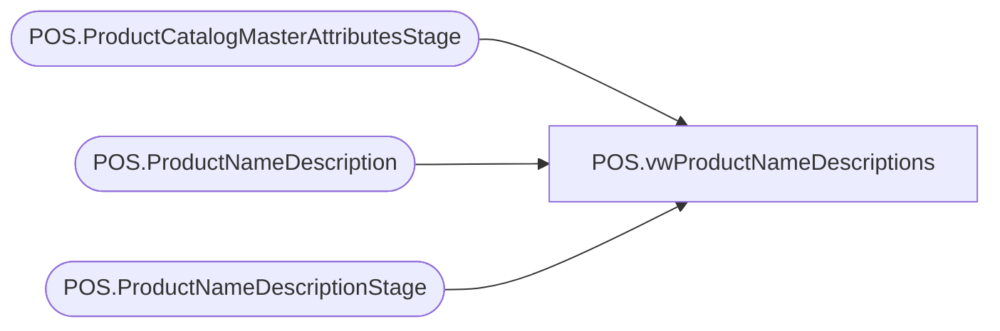

# POS.vwProductNameDescriptions

**Database:** IntegrationStaging  
**Server:** STL-SSIS-P-01  

## Architecture Diagram



## Table Dependencies

| Referenced Table |
|---|
| POS.ProductCatalogMasterAttributesStage |
| POS.ProductNameDescription |
| POS.ProductNameDescriptionStage |

## View Code

```sql
CREATE view [POS].[vwProductNameDescriptions]

as 

--select 
--	p.PrimaryID,
--	p.LocalProductCode,
--	p.DisplayName,
--	p.Description 
--from POS.ProductCatalogMasterAttributesStage pp
--join POS.ProductNameDescription p on pp.StyleCode=p.LocalProductCode
--group by 
--	p.PrimaryID,
--	p.LocalProductCode,
--	p.DisplayName,
--	p.Description 


--with
--PreStage as
--	(
--		select 
--			right(concat(cast('000000' as varchar), LocalProductCode),6) as PrimaryID,
--			right(concat(cast('000000' as varchar), LocalProductCode),6) as LocalProductCode,
--			max(DisplayName) MaxDisplayName
--		from POS.ProductNameDescriptionStage
--		group by 
--			right(concat(cast('000000' as varchar), LocalProductCode),6)
--	)
select 
	p.PrimaryID,
	p.LocalProductCode,
	p.DisplayName,
	p.Description 
from POS.ProductCatalogMasterAttributesStage pp
join POS.ProductNameDescription p on pp.StyleCode=p.LocalProductCode
--join POS.ProductNameDescriptionStage p on pp.StyleCode=p.LocalProductCode --enforces only sending for products in our table
--join PreStage ps 
--	on right(concat(cast('000000' as varchar), p.LocalProductCode),6)=ps.LocalProductCode
--	and p.DisplayName=ps.MaxDisplayName
where left(pp.StyleCode,1)<>'1'
and p.LocalProductCode not in (select LocalProductCode from POS.ProductNameDescriptionStage group by LocalProductCode having count(*)>1) --excludes dupe rows (like 009728)
group by 
	p.PrimaryID,
	p.LocalProductCode,
	p.DisplayName,
	p.Description 
UNION 
select --use US data as CA 
	--cast(concat(cast('1' as varchar), cast(p.PrimaryID as varchar)) as int) as PrimaryID,
	pp.StyleCode as PrimaryID,
	pp.StyleCode as LocalProductCode,
	p.DisplayName,
	p.Description
from POS.ProductCatalogMasterAttributesStage pp
join POS.ProductNameDescription p on right(pp.StyleCode,5)=right(p.LocalProductCode,5) --enforces only sending for products in our table
--join PreStage ps 
--	on right(concat(cast('000000' as varchar), p.LocalProductCode),6)=ps.LocalProductCode
--	and p.DisplayName=ps.MaxDisplayName
where left(pp.StyleCode,1)='1'
and left(p.LocalProductCode,1)='0'
and p.LocalProductCode not in (select LocalProductCode from POS.ProductNameDescriptionStage group by LocalProductCode having count(*)>1) --excludes dupe rows (like 009728)
group by pp.StyleCode,
	pp.StyleCode,
	p.DisplayName,
	p.Description
--UNION
--select 
--	--cast(concat(cast('1' as varchar), cast(p.PrimaryID as varchar)) as int) as PrimaryID,
--	pp.StyleCode as PrimaryID,
--	pp.StyleCode as LocalProductCode,
--	p.DisplayName,
--	p.Description
--from POS.ProductCatalogMasterAttributesStage pp
--join POS.ProductNameDescriptionStage p on right(pp.StyleCode,5)=right(p.LocalProductCode,5) --enforces only sending for products in our table
----join PreStage ps 
----	on right(concat(cast('000000' as varchar), p.LocalProductCode),6)=ps.LocalProductCode
----	and p.DisplayName=ps.MaxDisplayName
--where left(pp.StyleCode,1)='4'
--and left(p.LocalProductCode,1)='0'
--and pp.StyleCode not in (select LocalProductCode from POS.ProductNameDescriptionStage)
--and p.LocalProductCode not in (select LocalProductCode from POS.ProductNameDescriptionStage group by LocalProductCode having count(*)>1) --excludes dupe rows (like 009728)
--group by pp.StyleCode,
--	pp.StyleCode,
--	p.DisplayName,
--	p.Description
--UNION
--select 
--	--cast(concat(cast('1' as varchar), cast(p.PrimaryID as varchar)) as int) as PrimaryID,
--	pp.StyleCode as PrimaryID,
--	pp.StyleCode as LocalProductCode,
--	p.DisplayName,
--	p.Description
--from POS.ProductCatalogMasterAttributesStage pp
--join POS.ProductNameDescriptionStage p on right(pp.StyleCode,5)=right(p.LocalProductCode,5) --enforces only sending for products in our table
----join PreStage ps 
----	on right(concat(cast('000000' as varchar), p.LocalProductCode),6)=ps.LocalProductCode
----	and p.DisplayName=ps.MaxDisplayName
--where left(pp.StyleCode,1)='5'
--and left(p.LocalProductCode,1)='2'
--and pp.StyleCode not in (select LocalProductCode from POS.ProductNameDescriptionStage)
--and p.LocalProductCode not in (select LocalProductCode from POS.ProductNameDescriptionStage group by LocalProductCode having count(*)>1) --excludes dupe rows (like 009728)
--group by pp.StyleCode,
--	pp.StyleCode,
--	p.DisplayName,
--	p.Description
--UNION
--select 
--	--cast(concat(cast('1' as varchar), cast(p.PrimaryID as varchar)) as int) as PrimaryID,
--	pp.StyleCode as PrimaryID,
--	pp.StyleCode as LocalProductCode,
--	p.DisplayName,
--	p.Description
--from POS.ProductCatalogMasterAttributesStage pp
--join POS.ProductNameDescriptionStage p on right(pp.StyleCode,5)=right(p.LocalProductCode,5) --enforces only sending for products in our table
----join PreStage ps 
----	on right(concat(cast('000000' as varchar), p.LocalProductCode),6)=ps.LocalProductCode
----	and p.DisplayName=ps.MaxDisplayName
--where left(pp.StyleCode,1)='6'
--and left(p.LocalProductCode,1)='3'
--and pp.StyleCode not in (select LocalProductCode from POS.ProductNameDescriptionStage)
--and p.LocalProductCode not in (select LocalProductCode from POS.ProductNameDescriptionStage group by LocalProductCode having count(*)>1) --excludes dupe rows (like 009728)
--group by pp.StyleCode,
--	pp.StyleCode,
--	p.DisplayName,
--	p.Description
```

