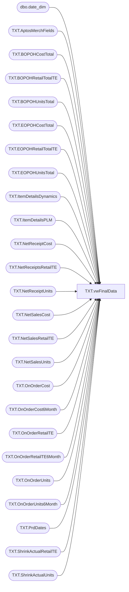

# TXT.vwFinalData

**Database:** IntegrationStaging  
**Server:** STL-SSIS-P-01  

## Architecture Diagram



## Table Dependencies

| Referenced Table |
|---|
| dbo.date_dim |
| TXT.AptosMerchFields |
| TXT.BOPOHCostTotal |
| TXT.BOPOHRetailTotalTE |
| TXT.BOPOHUnitsTotal |
| TXT.EOPOHCostTotal |
| TXT.EOPOHRetailTotalTE |
| TXT.EOPOHUnitsTotal |
| TXT.ItemDetailsDynamics |
| TXT.ItemDetailsPLM |
| TXT.NetReceiptCost |
| TXT.NetReceiptsRetailTE |
| TXT.NetReceiptUnits |
| TXT.NetSalesCost |
| TXT.NetSalesRetailTE |
| TXT.NetSalesUnits |
| TXT.OnOrderCost |
| TXT.OnOrderCost6Month |
| TXT.OnOrderRetailTE |
| TXT.OnOrderRetailTE6Month |
| TXT.OnOrderUnits |
| TXT.OnOrderUnits6Month |
| TXT.PrdDates |
| TXT.ShrinkActualRetailTE |
| TXT.ShrinkActualUnits |

## View Code

```sql
CREATE view [TXT].[vwFinalData] 

as 
WITH stylePrd AS (
	SELECT d.StyleCode, p.Fiscal_year_pd
	  FROM 
		(SELECT DISTINCT plm.style_code AS StyleCode
		   FROM TXT.ItemDetailsPLM plm
			JOIN TXT.ItemDetailsDynamics d ON plm.style_code = d.StyleCode) d
	  CROSS JOIN 
		(SELECT DISTINCT Fiscal_year_pd 
		   FROM TXT.PrdDates WHERE Fiscal_year_pd IN (SELECT DISTINCT CONCAT(fiscal_year, right('00' + cast(fiscal_period as varchar), 2)) FROM date_dim --WHERE CAST(actual_date AS date) <= CAST(getdate() AS date)
			)
		   ) p
)

SELECT ISNULL(plm.ConceptCode, ' ') ConceptCode
	, ISNULL(plm.ChainLabel, ' ') ChainLabel
	, ISNULL(plm.DepartmentLabel, ' ') DepartmentLabel
	, ISNULL(plm.ClassLabel, ' ') ClassLabel
	, ISNULL(plm.SubClassLabel, ' ') SubClassLabel
	, ISNULL(plm.StyleCustomPropertyValue, ' ') StyleCustomPropertyValue
	, ISNULL(plm.StyleAttributeSetCodeO, ' ') StyleAttributeSetCodeO
	, ISNULL(sp.stylecode, ' ') ItemID
	, ISNULL(d.StyleShortDesc, ' ') StyleShortDesc
	, sp.Fiscal_year_pd
	, ISNULL(brtte.BOPOHRetailTotalTE,0) BOPOHRetailTotalTE
	, ISNULL(nrrte.NetReceiptsRetailTE,0) NetReceiptsRetailTE
	, ISNULL(oorte.OnOrderRetailTE,0) OnOrderRetailTE
	, ISNULL(oorte6.OnOrderRetailTELast6Months,0) OnOrderRetailTELast6Months
	, ISNULL(ooc6.OnOrderCostLast6Months,0) OnOrderCostLast6Months
	, ISNULL(nsrte.NetSalesRetailTE,0) NetSalesRetailTE
	, ISNULL(amf.perm_md_retail_te,0) perm_md_retail_te
	, ISNULL(amf.perm_mdc_retail_te,0) perm_mdc_retail_te
	, ISNULL(amf.perm_mu_retail_te,0) perm_mu_retail_te
	, ISNULL(amf.perm_muc_retail_te,0) perm_muc_retail_te
	, ISNULL(amf.Promo_pc_total_retail_te,0) Promo_pc_total_retail_te
	, ISNULL(sarte.ShrinkActualRetailTE,0) ShrinkActualRetailTE
	, CAST(ISNULL(nsu.NetSalesUnits,0) AS int) NetSalesUnits
	, ISNULL(nsc.NetSalesCost,0) NetSalesCost
	, ISNULL(nrc.NetReceiptsCost,0) NetReceiptsCost
	, ISNULL(ooc.OnOrderCost,0) OnOrderCost
	, ISNULL(bct.BOPOHCostTotal,0) BOPOHCostTotal
	, ISNULL(ect.EOPOHCostTotal,0) EOPOHCostTotal
	--, 'WIP' EOPOHCostTotal
	, CAST(ISNULL(nru.NetReceiptsUnits,0) AS int) NetReceiptsUnits
	, CAST(ISNULL(oou.OnOrderUnits,0) AS int) OnOrderUnits
	, ISNULL(ertte.EOPOHRetailTotalTE,0) EOPOHRetailTotalTE
	--, 'WIP' EOPOHRetailTotalTE
	, CAST(ISNULL(sau.ShrinkActualUnits,0) AS int) ShrinkActualUnits
	, ISNULL(but.BOPOHUnitsTotal,0) BOPOHUnitsTotal
	, ISNULL(eut.EOPOHUnitsTotal,0) EOPOHUnitsTotal
	--, 'WIP' BOPOHUnitsTotal
	--, 'WIP' EOPOHUnitsTotal
	, CAST(ISNULL(oou6.OnOrderUnitsLast6Months,0) AS int) OnOrderUnitsLast6Months
  FROM stylePrd sp
	JOIN TXT.ItemDetailsPLM plm ON sp.StyleCode = plm.style_code
	JOIN TXT.ItemDetailsDynamics d ON plm.style_code = d.StyleCode
	LEFT JOIN TXT.BOPOHRetailTotalTE brtte ON sp.StyleCode = brtte.ItemID AND sp.Fiscal_year_pd = brtte.Fiscal_year_pd
	LEFT JOIN TXT.EOPOHRetailTotalTE ertte ON sp.StyleCode = ertte.ItemID AND sp.Fiscal_year_pd = ertte.Fiscal_year_pd
	LEFT JOIN TXT.NetReceiptsRetailTE nrrte ON sp.StyleCode = nrrte.ItemId AND sp.Fiscal_year_pd = nrrte.Fiscal_Year_Pd
	LEFT JOIN TXT.OnOrderRetailTE oorte ON sp.StyleCode = oorte.ItemId AND sp.Fiscal_Year_Pd = oorte.Fiscal_year_pd
	LEFT JOIN TXT.NetSalesRetailTE nsrte ON sp.StyleCode = nsrte.ItemId AND sp.Fiscal_year_pd = nsrte.Fiscal_Year_Pd
	LEFT JOIN TXT.AptosMerchFields amf ON sp.StyleCode = amf.style_code AND sp.Fiscal_Year_Pd = amf.fiscal_year_pd
	LEFT JOIN TXT.ShrinkActualRetailTE sarte ON sp.StyleCode = sarte.ItemID AND sp.Fiscal_year_pd = sarte.Fiscal_year_pd
	LEFT JOIN TXT.NetSalesUnits nsu ON sp.StyleCode = nsu.ItemID AND sp.Fiscal_year_pd = nsu.Fiscal_Year_Pd
	LEFT JOIN TXT.NetSalesCost nsc ON sp.StyleCode = nsc.ItemID AND sp.Fiscal_year_pd = nsc.Fiscal_Year_Pd
	LEFT JOIN TXT.NetReceiptCost nrc ON sp.StyleCode = nrc.ItemID AND sp.Fiscal_year_pd = nrc.Fiscal_year_pd
	LEFT JOIN TXT.OnOrderCost ooc ON sp.StyleCode = ooc.ItemId AND sp.Fiscal_year_pd = ooc.Fiscal_year_pd
	LEFT JOIN TXT.BOPOHCostTotal bct ON sp.StyleCode = bct.ItemID AND sp.Fiscal_year_pd = bct.Fiscal_year_pd
	LEFT JOIN TXT.EOPOHCostTotal ect ON sp.StyleCode = ect.ItemID AND sp.Fiscal_year_pd = ect.Fiscal_year_pd
	LEFT JOIN TXT.BOPOHUnitsTotal but ON sp.StyleCode = but.ItemID AND sp.Fiscal_year_pd = but.Fiscal_year_pd
	LEFT JOIN TXT.EOPOHUnitsTotal eut ON sp.StyleCode = eut.ItemID AND sp.Fiscal_year_pd = eut.Fiscal_year_pd
	LEFT JOIN TXT.NetReceiptUnits nru ON sp.StyleCode = nru.ItemID AND sp.Fiscal_year_pd = nru.Fiscal_year_pd
	LEFT JOIN TXT.OnOrderUnits oou	ON sp.StyleCode = oou.ItemId AND sp.Fiscal_year_pd = oou.Fiscal_year_pd
	LEFT JOIN TXT.ShrinkActualUnits sau ON sp.StyleCode = sau.ItemID AND sp.Fiscal_year_pd = sau.Fiscal_year_pd
	LEFT JOIN TXT.OnOrderRetailTE6Month oorte6 ON sp.StyleCode = oorte6.ItemId
	LEFT JOIN TXT.OnOrderCost6Month ooc6 ON sp.StyleCode = ooc6.ItemId
	LEFT JOIN TXT.OnOrderUnits6Month oou6 ON sp.StyleCode =oou6.ItemId
--  ORDER BY sp.Fiscal_year_pd, 
--	sp.stylecode
```

