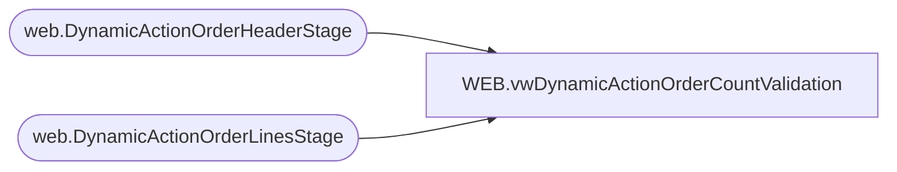

# WEB.vwDynamicActionOrderCountValidation

**Database:** IntegrationStaging  
**Server:** STL-SSIS-P-01  

## Architecture Diagram



## Table Dependencies

| Referenced Table |
|---|
| web.DynamicActionOrderHeaderStage |
| web.DynamicActionOrderLinesStage |

## View Code

```sql
create view [WEB].[vwDynamicActionOrderCountValidation]

as

with HeaderCount as (
select Site, count (distinct orderid) as OrderCountHeader
from web.DynamicActionOrderHeaderStage
group by Site 
) , 

LineCount as (
select Site, count (distinct orderid) as OrderCountLines
from web.DynamicActionOrderLinesStage
group by Site 
) 

Select h.*, 
l.OrderCountLines
from HeaderCount H 
join LineCount L on h.Site=L.Site
--order by 1 desc 


WEB,vwGiftCardDisplayNameLookup,CREATE view WEB.vwGiftCardDisplayNameLookup as


select 
	BABWProductID, 
	DisplayName,
	case 
		when substring(HierarchyGroupCode,1,11) in ('R-B-D-80-01', 'R-B-U-80-01')
			then 'Mail'
		else 'eMail'
	end as GiftCardType
from WEB.ProductCatalogMasterAttributes
where substring(HierarchyGroupCode,1,11) in ('R-B-D-80-01', 'R-B-U-80-01', 'R-B-D-80-02', 'R-B-U-80-02')
and StorefrontEligible = 1
```

