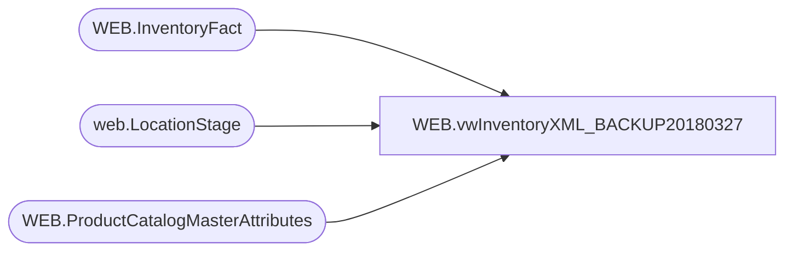

# WEB.vwInventoryXML_BACKUP20180327

**Database:** IntegrationStaging  
**Server:** STL-SSIS-P-01  

## Architecture Diagram



## Table Dependencies

| Referenced Table |
|---|
| WEB.InventoryFact |
| web.LocationStage |
| WEB.ProductCatalogMasterAttributes |

## View Code

```sql
CREATE view [WEB].[vwInventoryXML_BACKUP20180327]

as

--------------------------------------------------------------------------------------------------
-- vwInventoryXML - Outputs XML for eCommerce Inventory XML - Integrates with Deck
--- 2017-05-18 - Dan Tweedie - Created View
--	2018-01-30	- Dan Tweedie	- Updated view to join to WEB.ProductCatalogMasterAttributes to get UPC as GTIN, just to ensure we are always referencing the same 
---------------------------------------------------------------------------------------------------

With 
BundleSKU as
	(
		select '20389_20389' as BundleSKU, '020389' as MerchSKU
		UNION				
		select '20631_20631' as BundleSKU,	'020631' as MerchSKU
		UNION				
		select '20663_20663' as BundleSKU,	'020663' as MerchSKU
		UNION				
		select '20666_20666'  as BundleSKU,	'020666' as MerchSKU
		UNION				
		select '21512_21512'  as BundleSKU,	'021512' as MerchSKU
		UNION				
		select '21617_21617' as BundleSKU,	'021617' as MerchSKU
		UNION				
		select '21943_21943'  as BundleSKU,	'021943' as MerchSKU
		UNION				
		select '24517_24517' as BundleSKU,	'024517' as MerchSKU
		UNION				
		select '24625_24625' as BundleSKU,	'024625' as MerchSKU
		UNION				
		select '24630_24630' as BundleSKU,	'024630' as MerchSKU
		UNION				
		select '25282_25282' as BundleSKU,	'025282' as MerchSKU
		UNION				
		select '420389_420389' as BundleSKU, '420389' as MerchSKU
		UNION				
		select '420631_420631' as BundleSKU, '420631' as MerchSKU
		UNION				
		select '420663_420663' as BundleSKU, '420663' as MerchSKU
		UNION				
		select '420666_420666' as BundleSKU, '420666' as MerchSKU
		UNION				
		select '421512_421512' as BundleSKU, '421512' as MerchSKU
		UNION				
		select '421617_421617' as BundleSKU, '421617' as MerchSKU
		UNION				
		select '421943_421943' as BundleSKU, '421943' as MerchSKU
		UNION				
		select '424517_424517' as BundleSKU, '424517' as MerchSKU
		UNION				
		select '424625_424625' as BundleSKU, '424625' as MerchSKU
		UNION				
		select '424630_424630' as BundleSKU, '424630' as MerchSKU
		UNION				
		select '425282_425282' as BundleSKU, '425282' as MerchSKU
	),
BundleInventory as 
	(
		select 
			case 
				when left(bs.MerchSKU,1) = '4'
					then '2013'
				else '0013'
			end as LocationCode,
			bs.BundleSKU, 
			i.SKUDescription,
			case 
				when floor(i.QTY / 2) <= 100 
					then 0 
				else floor(i.QTY / 2) 
			end as QTY,
			--i.GTIN
			bs.BundleSKU as GTIN
		from BundleSKU bs
		join WEB.InventoryFact i on bs.MerchSKU = i.StyleCode
			and i.LocationCode = case 
									when left(bs.MerchSKU,1) = '4'
										then '2013'
									else '0013'
								end				
	),
LoadType as
	(
		select count(*) RowsNotSent
		from WEB.InventoryFact
		where SendData = 0
	),
Inventory as
	(
		select 
			c.UPC as GTIN,
			--i.GTIN,
			i.QTY,
			i.LocationCode,
			i.StyleCode,
			i.SKUDescription
		from WEB.InventoryFact i
		join WEB.ProductCatalogMasterAttributes c on i.StyleCode = c.Style_Code and c.StoreFrontEligible = 1
		UNION
		select 
			GTIN,
			QTY,
			LocationCode,
			BundleSKU as StyleCode,
			SKUDescription
		from BundleInventory
	),

XMLStage (XML) as
	(
		select 
			case when (select RowsNotSent from LoadType) > 0
				then 'Delta'
				else 'Full'
			end as 'LoadType', 
			(
				select 
					GTIN as 'GTIN',
					QTY as 'TotalQuantity',
					0 as 'ProtectedQuantity',
					LocationCode as 'WarehouseCode',
					StyleCode as 'CustomerSKU',
					StyleCode as 'ProductCode',
					left(SKUDescription, 50) as 'Attribute1',
					0 as PreBackOrderQuantity, NULL,
					getdate() as InStockDateUTC, NULL,
					'' as InventoryType, NULL
				from Inventory
				where LocationCode in (select code from web.LocationStage)
				for xml path('Product'), root('Products'), Type
			)
		for xml path('ProductInventory'), TYPE
	)
select XML as XMLData
from XMLStage
```

