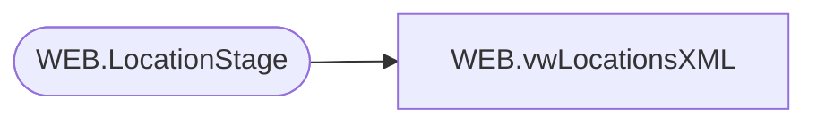

# WEB.vwLocationsXML

**Database:** IntegrationStaging  
**Server:** STL-SSIS-P-01  

## Architecture Diagram



## Table Dependencies

| Referenced Table |
|---|
| WEB.LocationStage |

## View Code

```sql
CREATE view [WEB].[vwLocationsXML]

as 

--------------------------------------------------------------------------------------------------
-- vwLocations - Outputs XML for eCommerce location integration to Deck
--- 2017-05-16 - Dan Tweedie - Created View
--------------------------------------------------------------------------------------------------

with XMLStage (XML) as
	(
		select
			(
				select 
					LocationName as Name,	
					Address1,
					Address2,	
					City,	
					State,	
					ZipCode	as PostalCode,
					Country,
					GeoLongitude,	
					GeoLatitude,
					Phone,	
					Email,	
					'' as Custom1
				from WEB.LocationStage
				where Code  in (
									'0805',
									'0801',
									'0548',
									'0806',
									'0804',
									'0803',
									'0437',
									'0807',
									'0547',
									'0478',
									'2083',
									'0545',
									'0546',
									'0558',
									'2082',
									'0476',
									'0802',
									'0800',
									'0808',
									'2081'
								)
				for xml path('Warehouse'), root('Warehouses'), Type
			)
		for xml path('WarehouseLocations'), Type
	)
select XML as XMLData
from XMLStage
```

