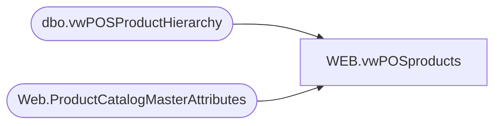

# WEB.vwPOSproducts

**Database:** IntegrationStaging  
**Server:** STL-SSIS-P-01  

## Architecture Diagram



## Table Dependencies

| Referenced Table |
|---|
| dbo.vwPOSProductHierarchy |
| Web.ProductCatalogMasterAttributes |

## View Code

```sql
create view [WEB].[vwPOSproducts]

as

select 
	ph.StyleCode as ProductNumber,
	case 
		when left(ph.StyleCode,1) in ('0','2','3') then 'US'
		when left(ph.StyleCode,1) in ('4','5','6') then 'UK'
		when Left(ph.StyleCode,1) = '1' then 'CA'
	end as ProductCountry,
	p.UPC,	
	ph.short_desc as ProductDescription,
	p.AccessoryType,	
	p.AnimalSoldSeparately,	
	p.AsthmaFriendly,	
	p.ColorCode,	
	p.LicensedCollection,	
	p.BirthCertificateRequired,	
	p.BodyType,	
	p.Bottoms,	
	p.Boy,	
	p.CommodityCode,	
	p.DepartmentSortOrder,	
	p.DisplayOnAmazon,	
	p.EyeColor,	
	p.WebExclusive,	
	p.Girl,	
	p.Neutral,	
	p.Outfits,	
	p.GiftBoxType,	
	p.KeyStory,	
	p.ManufacturerCountry,	
	p.MerchInDate,	
	p.Mini,	
	p.Music,	
	p.NoInternationalShipping,	
	p.SAC,	
	p.SNC,	
	p.ProductSellingGeography,	
	p.QuantityRestriction,	
	p.RefundEligible,	
	p.Seasonal,	
	p.ThirdPartySiteEligible,	
	p.ShippingClass,	
	p.Stuffable,	
	p.Tops,	
	p.WarningLabel,	
	p.AccessoryEligible,	
	p.SkinType,	
	p.FriendHeight,	
	p.FriendWeight,	
	p.SoundEligible,	
	p.MSTAT,	
	p.EmbroideryProductList,	
	p.ProductCanBeEmbroidered,	
	p.ProductMustBeEmbroidered,	
	p.Purses,		
	p.CategoryTree,	
	p.SendData,	
	p.LICEN,	
	p.sportsTeam,	
	p.occasion,	
	p.OccasionCode,	
	p.StoreFrontEligible,	
	p.OnOrderFlag,	
	p.InventoryBuffer,	
	p.Inventory,	
	p.OnlineFlag,	
	p.SearchableFlag,	
	p.SearchableIfUnavailableFlag,	
	p.IsFirstTransmit,	
	p.giftCardType,	
	p.PackageOption,	
	p.isCPS,	
	p.Web,	
	p.WebBuf,	
	p.BRF,	
	p.Inline,	
	p.AvailB,	
	p.WebInStock,	
	p.StoreInStock,	
	p.OnOrder,

	ph.Department,
	ph.Class,
	ph.SubClass,

	ph.DepartmentCode,
	ph.ClassCode,
	ph.SubClassCode,
	ph.StyleCode,

	ph.DepartmentHierarchyGroupID,
	ph.ClassHierarchyGroupID,
	ph.SubClassHierarchyGroupID,

	ph.ClassParentGroupID,
	ph.SubClassParentGroupID,
	ph.StyleParentGroupID,

	--Added for PIM,  including in case needed
	p.BaseID,	
	p.Shoes,	
	p.Sound,	
	p.fourLeggedAnimal,	
	p.merchOutDate,	
	p.MLBTeams,	
	p.NBATeams,
	p.NFLTeams,	
	p.NHLTeams,	
	p.UKFootball
from Bedrockdb02.me_01.dbo.vwPOSProductHierarchy ph
join Web.ProductCatalogMasterAttributes p on ph.StyleCode=p.BABWProductID
where left(ph.StyleCode,1) in ('0','1','2','3','4','5','6')
--order by
--	ph.DepartmentCode,
--	ph.ClassCode,
--	ph.SubClassCode,
--	ph.StyleCode
```

