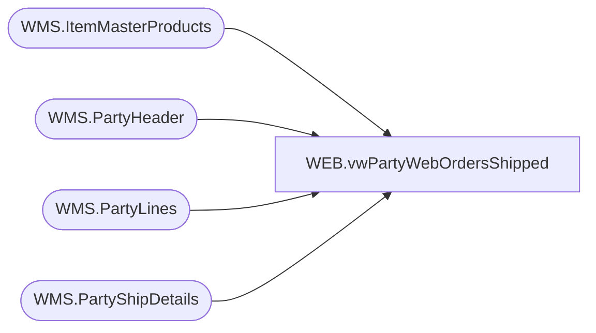

# WEB.vwPartyWebOrdersShipped

**Database:** IntegrationStaging  
**Server:** STL-SSIS-P-01  

## Architecture Diagram



## Table Dependencies

| Referenced Table |
|---|
| WMS.ItemMasterProducts |
| WMS.PartyHeader |
| WMS.PartyLines |
| WMS.PartyShipDetails |

## View Code

```sql
CREATE view [WEB].[vwPartyWebOrdersShipped] 

as 

SELECT 
	CAST(d.PartyID AS int) PartyID
	, CAST(h.PartyDate AS date) PartyDate
	, CAST(d.Store AS varchar(4)) Store
	, CAST(d.Style AS varchar(6)) Style
	, CAST(p.ProductDescription AS varchar(100)) SKUDescription	
	, SUM(d.Qty) QtyShipped
	, SUM(l.Quantity) TransferUnitsSent
	, CAST(d.ShipDate AS date) ShipDate
	, CAST(d.ShipMethod AS varchar(100)) ShipMethod
	, CAST(d.Tracking AS varchar(52)) TrackingNumber
	, CAST(d.TransferNumber AS varchar(52)) TransferNumber
  FROM WMS.PartyShipDetails d
	JOIN WMS.PartyHeader h ON d.PartyID = h.PartyId AND d.TransferNumber = h.OrderId
	JOIN WMS.PartyLines l ON h.PartyId = l.PartyId AND d.Style = l.ItemNumber
	JOIN WMS.ItemMasterProducts p ON l.ItemNumber = p.ProductNumber AND p.Entity = '1100'
  GROUP BY CAST(d.PartyID AS int)
	, CAST(h.PartyDate AS date)
	, CAST(d.Store AS varchar(4))
	, CAST(d.Style AS varchar(6))
	, CAST(p.ProductDescription AS varchar(100))
	, CAST(d.ShipDate AS date)
	, CAST(d.ShipMethod AS varchar(100))
	, CAST(d.Tracking AS varchar(52))
	, CAST(d.TransferNumber AS varchar(52))

-- Replaced with above logic to accomomdate Girl Scout Transfer Orders integration changes; Jira BIB-851; LT 06/20/2024
/*
select 
	c.PartyID,
	c.PartyDate,
	right(concat(cast('0000' as varchar), cast(c.ShipTo as varchar)),4) as StoreNumber,
	cast(c.Style as varchar(6)) as Style,
	c.SKUDescription,
	cast(sum(c.Qty) as int) QtyShipped,
	c.ShipDate,
	c.ShipMethod,
	c.TrackingNumber,
	c.WebOrderNumber,
	cast(t.document_number as varchar(52)) TransferNumber
from WEB.WMShippedCartons c with (nolock) 
join WEB.PartyWebOrderTransferLog t 
	on c.CartonNumber = t.carton_label
	and c.Style = right(t.UPC,6)
where 1=1
and c.PartyType = 'GirlScout'
and datediff(dd, c.ShipDate, getdate()-1) = 0
group by 
	c.PartyID,
	c.PartyDate,
	right(concat(cast('0000' as varchar), cast(c.ShipTo as varchar)),4),
	cast(c.Style as varchar(6)),
	c.SKUDescription,
	c.ShipDate,
	c.ShipMethod,
	c.TrackingNumber,
	c.WebOrderNumber,
	t.document_number
*/
```

