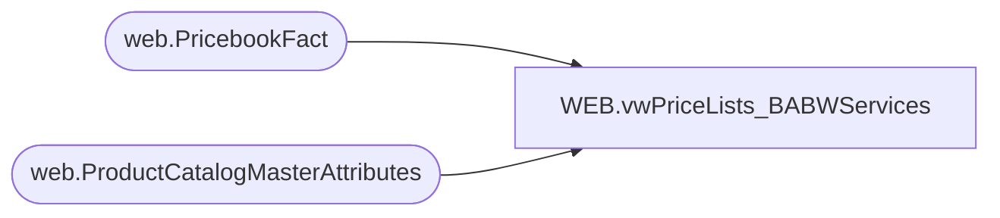

# WEB.vwPriceLists_BABWServices

**Database:** IntegrationStaging  
**Server:** STL-SSIS-P-01  

## Architecture Diagram



## Table Dependencies

| Referenced Table |
|---|
| web.PricebookFact |
| web.ProductCatalogMasterAttributes |

## View Code

```sql
CREATE view [WEB].[vwPriceLists_BABWServices]

as

With 
ItemsAllowedZeroSalePrice as
(
	select BABWProductID 
	from web.ProductCatalogMasterAttributes
	where left(HierarchyGroupCode, 5) in ('R-B-D', 'R-B-U')
	and substring(HierarchyGroupCode, 7,2) in ('46', '47', '60', '65', '75', '80')
	and BABWProductID in (select style_code from web.PricebookFact)
),
SalePrice as
(
	select
		Catalog,
		style_code,
		SalePrice
	from WEB.PricebookFact
	where SalePrice is NOT NULL
	and (
			(SalePrice > 0 OR style_code in (select BABWProductID from ItemsAllowedZeroSalePrice))
		)
),
ListPrice as
(
	select
		Catalog,
		style_code,
		CurrentPrice as ListPrice
	from WEB.PricebookFact
)
select
    ISNULL(ROW_NUMBER() OVER(Order BY f.style_code ASC), -1) AS ID, 
	f.Catalog as SiteCountry,
	f.style_code,
	s.SalePrice,
	l.ListPrice
from WEB.PricebookFact f
left join SalePrice s 
	on f.Catalog = s.Catalog
	and f.style_code = s.style_code
left join ListPrice l 
	on f.Catalog = l.Catalog
	and f.style_code = l.style_code
```

