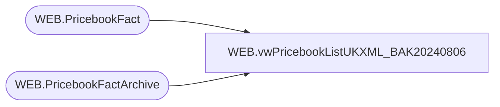

# WEB.vwPricebookListUKXML_BAK20240806

**Database:** IntegrationStaging  
**Server:** STL-SSIS-P-01  

## Architecture Diagram



## Table Dependencies

| Referenced Table |
|---|
| WEB.PricebookFact |
| WEB.PricebookFactArchive |

## View Code

```sql
CREATE view [WEB].[vwPricebookListUKXML_BAK20240806]

as

--------------------------------------------------------------------------------------------------
-- vwPricebookListUKXML - Outputs XML for eCommerce Pricebook-list XML - Integrates with Salesforce
--- 2017-05-30 - Dan Tweedie - Created View
--- 2022-07-06 - Tim Callahan - Modified View to use Sale Price rather than Current Price and filters as related to JIRA Task BIB-402
--- 2022-07-06 - Tim Callahan - Modififed where clauses to capture newly created styles
---------------------------------------------------------------------------------------------------


With 
XMLStage (XML) as
	(
		select
			(
				select
					'buildabear-gbp-list-prices' as '@pricebook-id',
					'GBP' as 'currency',
					'x-default' as 'display-name/@xml:lang',
					'List Prices' as 'display-name',
					'true' as 'online-flag'
				for xml path('header'), Type
			),
			(
				select 
					(
						select *
						from 
							(
								select
									style_code as '@product-id',
									'delete' as '@mode', NULL xtra1,
									'1' as 'amount/@quantity',
									--CurrentPrice as 'amount',NULL xtra2
									 SalePrice as 'amount',NULL xtra2 -- Changed on 2022-07-06 
								from WEB.PricebookFactArchive
								where catalog = 'UK'
								and CurrentPrice is not NULL
								and ChangeType in ('DELETE', 'UPDATE')
								and CurrentBatch = 1
								and style_code not in (select style_code from WEB.PricebookFact)
								and (SalePrice is not null and SalePrice <> 0.00) -- Added 2022-07-06 
								UNION
								select
									style_code as '@product-id',
									NULL as '@mode', NULL xtra1,
									'1' as 'amount/@quantity',
									--CurrentPrice as 'amount',NULL xtra2
									case when SalePrice is null 
										then CurrentPrice else 
									SalePrice end as 'amount',NULL xtra2 -- Changed on 2022-07-06 
								from WEB.PricebookFact
								where catalog = 'UK'
								and (Exported is null and ExportDate is null) -- Added 2022-07-06 
								and (CurrentPrice <> 0.00 and isnull(SalePrice,0.01) <> 0.00)
								--Added as Part of JIRA BIB685 ton include Bundle SKU pricing
								/*
								union 
								select 
									f.BundleSku as '@product-id',
									NULL as '@mode', 
									NULL xtra1,
									'1' as 'amount/@quantity',
									f.BundleSkuPrice as 'amount',
									NULL xtra2 -- Changed on 2022-07-06 
								from web.PricebookBundleSkuFact f
								where 1=1
								and f.BundleSkuCatalog = 'UK'
								and (f.Exported is null and f.ExportDate is null)
								and f.BundleSkuPrice <> 0.00
								*/
							) x
						
						for xml path('price-table'), Type
					)
				for xml path('price-tables'), Type
			)
		for xml path('pricebook'), root('pricebooks'), Type
	)
select 
	XML as XMLData
from XMLStage
```

