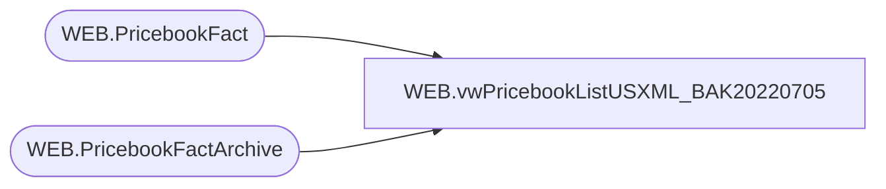

# WEB.vwPricebookListUSXML_BAK20220705

**Database:** IntegrationStaging  
**Server:** STL-SSIS-P-01  

## Architecture Diagram



## Table Dependencies

| Referenced Table |
|---|
| WEB.PricebookFact |
| WEB.PricebookFactArchive |

## View Code

```sql
CREATE view [WEB].[vwPricebookListUSXML_BAK20220705]

as

--------------------------------------------------------------------------------------------------
-- vwPricebookListUSXML - Outputs XML for eCommerce Pricebook-list XML - Integrates with Salesforce
--- 2017-05-30 - Dan Tweedie - Created View
---------------------------------------------------------------------------------------------------


With 
XMLStage (XML) as
	(
		select
			(
				select
					'buildabear-usd-list-prices' as '@pricebook-id',
					'USD' as 'currency',
					'x-default' as 'display-name/@xml:lang',
					'List Prices' as 'display-name',
					'true' as 'online-flag'
				for xml path('header'), Type
			),
			(
				select 
					(
						select *
						from 
							(
								select
									style_code as '@product-id',
									'delete' as '@mode', NULL xtra1,
									'1' as 'amount/@quantity',
									CurrentPrice as 'amount',NULL xtra2
								from WEB.PricebookFactArchive
								where catalog = 'US'
								and CurrentPrice is not NULL
								and ChangeType in ('DELETE', 'UPDATE')
								and CurrentBatch = 1
								and style_code not in (select style_code from WEB.PricebookFact)
								UNION
								select
									style_code as '@product-id',
									NULL as '@mode', NULL xtra1,
									'1' as 'amount/@quantity',
									CurrentPrice as 'amount',NULL xtra2
								from WEB.PricebookFact
								where catalog = 'US'
							) x
						
						for xml path('price-table'), Type
					)
				for xml path('price-tables'), Type
			)
		for xml path('pricebook'), root('pricebooks'), Type
	)
select 
	XML as XMLData
from XMLStage
```

