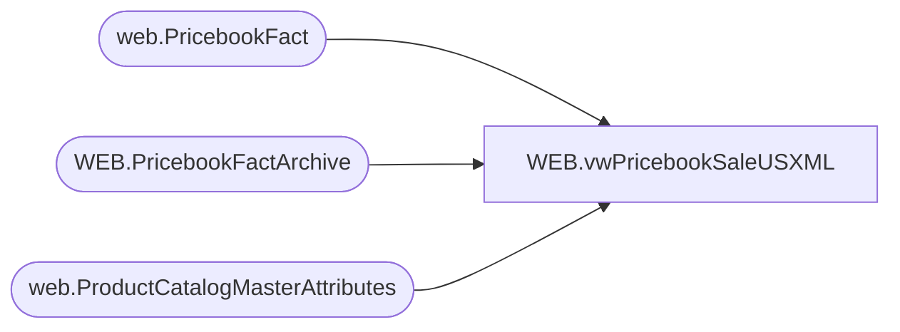

# WEB.vwPricebookSaleUSXML

**Database:** IntegrationStaging  
**Server:** STL-SSIS-P-01  

## Architecture Diagram



## Table Dependencies

| Referenced Table |
|---|
| web.PricebookFact |
| WEB.PricebookFactArchive |
| web.ProductCatalogMasterAttributes |

## View Code

```sql
CREATE view [WEB].[vwPricebookSaleUSXML]

as

--------------------------------------------------------------------------------------------------
-- vwPricebookSaleUSXML - Outputs XML for eCommerce Pricebook-list XML - Integrates with Salesforce
--- 2017-05-30 - Dan Tweedie - Created View
---------------------------------------------------------------------------------------------------


With 
ItemsAllowedZeroSalePrice as
(
	select BABWProductID 
	from web.ProductCatalogMasterAttributes
	where left(HierarchyGroupCode, 5) in ('R-B-D', 'R-B-U')
	and substring(HierarchyGroupCode, 7,2) in ('46', '47', '60', '65', '75', '80')
	and BABWProductID in (select style_code from web.PricebookFact)
),
XMLStage (XML) as
	(
		select
			(
				select
					'buildabear-usd-sale-prices' as '@pricebook-id',
					'USD' as 'currency',
					'x-default' as 'display-name/@xml:lang',
					'Sale Prices' as 'display-name',
					'true' as 'online-flag'
				for xml path('header'), Type
			),
			(
				select 
					(
						select *
						from 
							(
								select
									style_code as '@product-id',
									'delete' as '@mode', NULL xtra1,
									'1' as 'amount/@quantity',
									SalePrice as 'amount', NULL xtra2
								from WEB.PricebookFactArchive
								where catalog = 'US'
								and SalePrice is not NULL
								and ChangeType in ('DELETE', 'UPDATE')
								and CurrentBatch = 1
								and style_code not in (select style_code from WEB.PricebookFact where SalePrice is NOT NULL
																										and (--same logic from union
																												(SalePrice > 0 OR style_code in (select BABWProductID from ItemsAllowedZeroSalePrice))
																												)
														)
								UNION
								select
									style_code as '@product-id',
									NULL as '@mode', NULL xtra1,
									'1' as 'amount/@quantity',
									SalePrice as 'amount', NULL xtra2
								from WEB.PricebookFact
								where catalog = 'US'
								and SalePrice is NOT NULL
								and (
									 (SalePrice > 0 OR style_code in (select BABWProductID from ItemsAllowedZeroSalePrice))
									 )
							) x
						for xml path('price-table'), Type
					)
				for xml path('price-tables'), Type
			)
		for xml path('pricebook'), root('pricebooks'), Type
	)
select 
	XML as XMLData
from XMLStage
```

