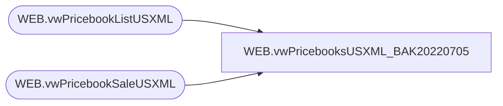

# WEB.vwPricebooksUSXML_BAK20220705

**Database:** IntegrationStaging  
**Server:** STL-SSIS-P-01  

## Architecture Diagram



## Table Dependencies

| Referenced Table |
|---|
| WEB.vwPricebookListUSXML |
| WEB.vwPricebookSaleUSXML |

## View Code

```sql
create view [WEB].[vwPricebooksUSXML_BAK20220705]

as 

--------------------------------------------------------------------------------------------------
-- vwPricebooksUSXML - Outputs XML for eCommerce US pricebooks
--- 2017-05-31 - Dan Tweedie - Created View
---------------------------------------------------------------------------------------------------

WITH
Stage1 (XML) as
	(
		select cast(XMLData as nvarchar(max)) as XMLData
		from WEB.vwPricebookListUSXML
		UNION
		select cast(XMLData as nvarchar(max)) as XMLData
		from WEB.vwPricebookSaleUSXML
	),
Stage2 (XML) as
	(
		select cast(XML as xml)
		from Stage1
		for xml path, Type
	),
Stage3 (XML) as
	(
		select --yes this is confusing, but I need to play with the output and must be nvarchar to do that, then i want final output to be XML
					--also, my xml wasn't coming out correctly with both pricebook(s) under a single <pricebooks> element, so I had to take matters in to my own hands
			cast(replace(replace(replace(replace(cast(XML as nvarchar(max)), '<pricebooks>', ''), '</pricebooks>', ''), '<row>', ''), '</row>', '') as xml)
		from Stage2
		for xml path('pricebooks'), Type
	)
select 
	cast(replace(cast(XML as nvarchar(max)), '<pricebooks>', '<pricebooks xmlns="http://www.demandware.com/xml/impex/pricebook/2006-10-31">') as xml) as XMLData
from Stage3
```

