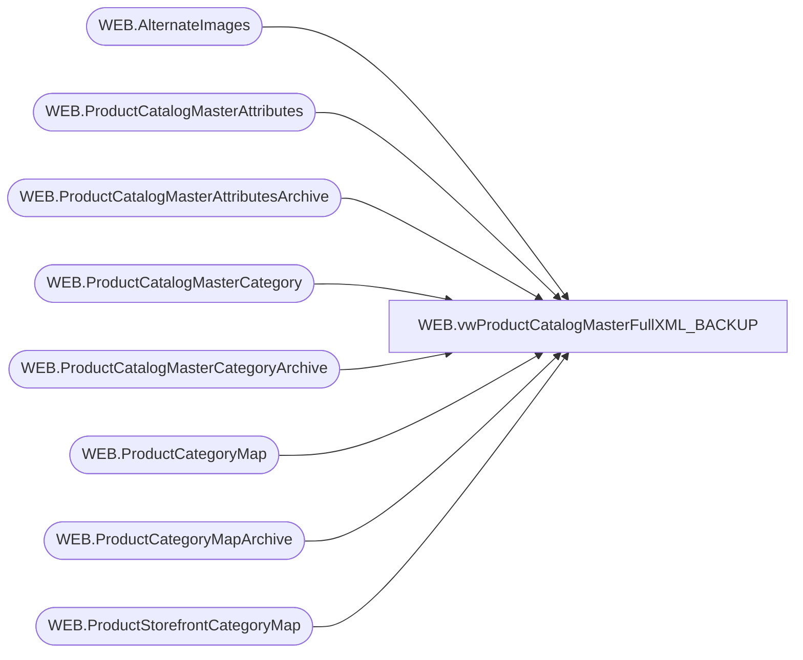

# WEB.vwProductCatalogMasterFullXML_BACKUP

**Database:** IntegrationStaging  
**Server:** STL-SSIS-P-01  

## Architecture Diagram



## Table Dependencies

| Referenced Table |
|---|
| WEB.AlternateImages |
| WEB.ProductCatalogMasterAttributes |
| WEB.ProductCatalogMasterAttributesArchive |
| WEB.ProductCatalogMasterCategory |
| WEB.ProductCatalogMasterCategoryArchive |
| WEB.ProductCategoryMap |
| WEB.ProductCategoryMapArchive |
| WEB.ProductStorefrontCategoryMap |

## View Code

```sql
CREATE view [WEB].[vwProductCatalogMasterFullXML_BACKUP]

as

--------------------------------------------------------------------------------------------------
-- vwProductCatalogMasterFullXML - Outputs XML for eCommerce Product Catalog XML 
--							Queries tables that are populated via SSIS, view is tied to same package flow
--- 2017-05-10 - Dan Tweedie - Created View
--------------------------------------------------------------------------------------------------


with 
Header (XML) as
	( 
		select 
			(
				select '/' as 'internal-location/@base-path',
				(
					select
						'hi-res' as 'view-type' 
					for xml path('view-types'), Type
				),
				'color' as 'variation-attribute-id',
				'${productname}, ${variationvalue}, ${viewtype}' as 'alt-pattern',
				'${productname}, ${variationvalue}' as 'title-pattern'
				for xml path('image-settings'), Type
			) 
		for xml path ('header'), Type
	),
Categories (XML) as
	(
		select *
		from
			(
			select 
				CategoryID as '@category-id',
				NULL as '@mode', NULL xtra1,
				'x-default' as 'display-name/@xml:lang',
				DisplayName as 'display-name',
				'true' as 'online-flag',
				Parent as 'parent'
			from WEB.ProductCatalogMasterCategory
			where CategoryID <> 'root'
			UNION
			select 
				CategoryID as '@category-id',
				'delete' as '@mode', NULL xtra1,
				'x-default' as 'display-name/@xml:lang',
				DisplayName as 'display-name',
				'true' as 'online-flag',
				Parent as 'parent'
			from WEB.ProductCatalogMasterCategoryArchive
			where CategoryID <> 'root'
			and ChangeType = 'DELETE'
			and CurrentBatch = 1
			and CategoryID not in (select CategoryID from WEB.ProductCatalogMasterCategory)
		) x
		order by [@category-id]
		for xml path('category'), Type
	),
ViewTypes as
	(
		select
			BABWProductID,
			case 
				when left(BABWProductID,1) = 4 then '/' + cast(cast(right(BABWProductID,5) as int) as varchar)+'x.jpg' 
				else '/' + cast(cast(right(BABWProductID,6) as int) as varchar)+'x.jpg' 
			end as 'imagePath',
			1 as PrimaryImage
		from WEB.ProductCatalogMasterAttributes
		UNION
		select 
			BABWProductID,
			'/' + ImageName as 'imagePath',
			0 as PrimaryImage
		from WEB.AlternateImages
	),
CatalogCountry as
	(
		select 
			Style,
			left(CategoryID,2) CatalogCountry
		from WEB.ProductStorefrontCategoryMap
		where PrimaryCategory = 1
	),
ProductStage as
	(
		select 
			Style_Code,
			DisplayName,
			ShortDescription,
			UPC,
			DefaultDisplayName,
			AccessoryType,
			AnimalSoldSeparately,
			AsthmaFriendly,
			ColorCode,
			LicensedCollection,
			BABWProductID,
			BirthCertificateRequired,
			BodyType,
			Bottoms,
			Boy,
			ClassName,
			CommodityCode,
			Department,
			DepartmentSortOrder,
			DisplayOnAmazon,
			EyeColor,
			WebExclusive,
			Girl,
			Neutral,
			Outfits,
			GiftBoxType,
			HierarchyGroupCode,
			KeyStory,
			ManufacturerCountry,
			MerchInDate,
			Mini,
			Music,
			NoInternationalShipping,
			SAC,
			SNC,
			ProductSellingGeography,
			QuantityRestriction,
			RefundEligible,
			Seasonal,
			ThirdPartySiteEligible,
			ShippingClass,
			Stuffable,
			Tops,
			WarningLabel,
			sportsTeam,
			AccessoryEligible,
			SkinType,
			FriendHeight,
			FriendWeight,
			SoundEligible,
			MSTAT,
			EmbroideryProductList,
			ProductCanBeEmbroidered,
			ProductMustBeEmbroidered,
			Purses,
			--occasion,
			EnableEmailAFriend,
			CopyStatus,
			GoogleTag1,
			GoogleTag2,
			GoogleTag3,
			GoogleTag4,
			GoogleTag5,
			NewProduct,
			PrimaryCategoryDerived,
			ChildSKUs,
			DisplayableSkuAttributes,
			PreOrderable,
			PreorderEndDate,
			DefaultKeywords,
			CategoryTree,
			InsertDate,
			UpdateDate,
			OnlineFlag,
			SendData,
			NULL as mode,
			StoreFrontEligible,
			SearchableFlag,
			SearchableIfUnavailableFlag,
			IsFirstTransmit,
			giftCardType
		from WEB.ProductCatalogMasterAttributes
		UNION
		select 
			Style_Code,
			DisplayName,
			ShortDescription,
			UPC,
			DefaultDisplayName,
			AccessoryType,
			AnimalSoldSeparately,
			AsthmaFriendly,
			ColorCode,
			LicensedCollection,
			BABWProductID,
			BirthCertificateRequired,
			BodyType,
			Bottoms,
			Boy,
			ClassName,
			CommodityCode,
			Department,
			DepartmentSortOrder,
			DisplayOnAmazon,
			EyeColor,
			WebExclusive,
			Girl,
			Neutral,
			Outfits,
			GiftBoxType,
			HierarchyGroupCode,
			KeyStory,
			ManufacturerCountry,
			MerchInDate,
			Mini,
			Music,
			NoInternationalShipping,
			SAC,
			SNC,
			ProductSellingGeography,
			QuantityRestriction,
			RefundEligible,
			Seasonal,
			ThirdPartySiteEligible,
			ShippingClass,
			Stuffable,
			Tops,
			WarningLabel,
			sportsTeam,
			AccessoryEligible,
			SkinType,
			FriendHeight,
			FriendWeight,
			SoundEligible,
			MSTAT,
			EmbroideryProductList,
			ProductCanBeEmbroidered,
			ProductMustBeEmbroidered,
			Purses,
			--occasion,
			EnableEmailAFriend,
			CopyStatus,
			GoogleTag1,
			GoogleTag2,
			GoogleTag3,
			GoogleTag4,
			GoogleTag5,
			NewProduct,
			PrimaryCategoryDerived,
			ChildSKUs,
			DisplayableSkuAttributes,
			PreOrderable,
			PreorderEndDate,
			DefaultKeywords,
			CategoryTree,
			InsertDate,
			UpdateDate,
			OnlineFlag,
			1 as SendData,
			'delete' as mode,
			StoreFrontEligible,
			SearchableFlag,
			SearchableIfUnavailableFlag,
			IsFirstTransmit,
			giftCardType
		from WEB.ProductCatalogMasterAttributesArchive
		where ChangeType = 'DELETE'
		AND CurrentBatch = 1
	),
Products (XML) as
	(
		select
			BABWProductID as '@product-id',
			mode as '@mode', NULL as xtra1,
			'' as 'ean',
			UPC as 'upc',
			'' as 'unit',
			'1' as 'min-order-quantity',
			'1' as 'step-quantity',	
				--'x-default' as 'display-name/@xml:lang',
				--DisplayName as 'display-name', 
				--'x-default' as 'short-description/@xml:lang',
				--ShortDescription as 'short-description', 
			---IN ORDER TO PREVENT OVERWRITES OF THIS PARTICULAR DATA, WE DON'T SEND IF WE'VE ALREADY SENT
			(
				select 
					case 
						when IsFirstTransmit = 1
						then
							(
								select  
									'x-default'
								from ProductStage paX
								where pax.BABWProductID = pa.BABWProductID
							) 
						end 
			) AS 'display-name/@xml:lang',
			(
				select 
					case 
						when IsFirstTransmit = 1
						then
							(
								select  
									DisplayName 
								from ProductStage paX
								where pax.BABWProductID = pa.BABWProductID
							) 
						end 
			) AS 'display-name',
			(
				select 
					case 
						when IsFirstTransmit = 1
						then
							(
								select  
									'x-default'
								from ProductStage paX
								where pax.BABWProductID = pa.BABWProductID
							) 
						end 
			) AS 'short-description/@xml:lang',
			(
				select 
					case 
						when IsFirstTransmit = 1
						then
							(
								select  
									ShortDescription 
								from ProductStage paX
								where pax.BABWProductID = pa.BABWProductID
							) 
						end 
			) AS 'short-description',
			case when OnlineFlag = 1 then 'true' else 'false' end as 'online-flag', NULL,
			dateadd(hh, +5,cast(MerchInDate as datetime)) as 'online-from', --add 5 hours for GMT, site converts it back to 12am
			case when SearchableFlag = 1 and StoreFrontEligible = 1 then 'true' else 'false' end as 'searchable-flag', 
			case when SearchableIfUnavailableFlag = 1 and StoreFrontEligible = 1 then 'true' else 'false' end as 'searchable-if-unavailable-flag',
			(
				select 
					'hi-res' as '@view-type',
						(
							select
								vt.imagePath as '@path'
							from ViewTypes vt
							where vt.BABWProductID = pa.BABWProductID
							order by vt.PrimaryImage desc, vt.imagePath
							for xml path('image'), Type
						)
				for xml path('image-group'), root('images'), TYPE
			),
			case 
				when giftCardType is NULL 
				then 'standard' 
				else 'exempt'
			end as 'tax-class-id', 
			--'x-default' as 'page-attributes/page-title/@xml:lang',
			--DisplayName as 'page-attributes/page-title',
			--'x-default' as 'page-attributes/page-description/@xml:lang',
			--ShortDescription as 'page-attributes/page-description', 
			(
				select 
					case 
						when IsFirstTransmit = 1
						then
							( 
								select							
									'x-default' as 'page-title/@xml:lang',
									DisplayName as 'page-title',
									'x-default' as 'page-description/@xml:lang',
									ShortDescription as 'page-description'
								for xml path('page-attributes'), Type 
							)
					end
			),
				( 
					select
						'asthmaFriendly' as 'custom-attribute/@attribute-id',
						AsthmaFriendly as 'custom-attribute', 
						NULL,
						'color' as 'custom-attribute/@attribute-id',
						ColorCode as 'custom-attribute', 
						NULL,
						'licensedCollection' as 'custom-attribute/@attribute-id',
						LicensedCollection as 'custom-attribute', 
						NULL,
						'babwProductId' as 'custom-attribute/@attribute-id',
						BABWProductID as 'custom-attribute', 
						NULL,
						'birthCertificateRequired' as 'custom-attribute/@attribute-id',
						BirthCertificateRequired as 'custom-attribute', 
						NULL,
						'className' as 'custom-attribute/@attribute-id',
						ClassName as 'custom-attribute', 
						NULL,
						'commodityCode' as 'custom-attribute/@attribute-id',
						CommodityCode as 'custom-attribute',
						NULL,
						'department' as 'custom-attribute/@attribute-id', 
						Department as 'custom-attribute', 
						NULL,
						'exclusive' as 'custom-attribute/@attribute-id',
						WebExclusive as 'custom-attribute', 
						NULL,
						'eyeColor' as 'custom-attribute/@attribute-id',
						EyeColor as 'custom-attribute', 
						NULL,
						'outfits' as 'custom-attribute/@attribute-id',
						Outfits as 'custom-attribute', 
						NULL,
						'hierarchygroupcode' as 'custom-attribute/@attribute-id', 
						HierarchyGroupCode as 'custom-attribute', 
						NULL,
						'keyStory' as 'custom-attribute/@attribute-id',
						KeyStory as 'custom-attribute', 
						NULL,
						'manufacturerCountry' as 'custom-attribute/@attribute-id',
						ManufacturerCountry as 'custom-attribute', 
						NULL,
						'mini' as 'custom-attribute/@attribute-id',
						Mini as 'custom-attribute', 
						NULL,
						'music' as 'custom-attribute/@attribute-id',
						Music as 'custom-attribute', 
						NULL,
						'productSellingGeography' as 'custom-attribute/@attribute-id',
						ProductSellingGeography as 'custom-attribute',
						NULL,
						'shippingClass' as 'custom-attribute/@attribute-id',
						ShippingClass as 'custom-attribute',
						NULL,
						'stuffedAndClosedProduct' as 'custom-attribute/@attribute-id',
						SAC as 'custom-attribute',
						NULL,
						'tops' as 'custom-attribute/@attribute-id',
						Tops as 'custom-attribute',
						NULL,
						'sportsTeam' as 'custom-attribute/@attribute-id',
						sportsTeam as 'custom-attribute',
						NULL,
						--'warninglabel' as 'custom-attribute/@attribute-id',
						--WarningLabel as 'custom-attribute',
						--NULL,
						'accessoryEligible' as 'custom-attribute/@attribute-id',
						AccessoryEligible as 'custom-attribute',
						NULL,
						'skinType' as 'custom-attribute/@attribute-id',
						SkinType as 'custom-attribute',
						NULL,
						'friendHeight' as 'custom-attribute/@attribute-id',
						FriendHeight as 'custom-attribute',
						NULL,
						'friendWeight' as 'custom-attribute/@attribute-id',
						FriendWeight as 'custom-attribute',
						NULL,
						'soundEligible' as 'custom-attribute/@attribute-id',
						SoundEligible as 'custom-attribute',
						NULL,
						'productCanBeEmbroidered' as 'custom-attribute/@attribute-id',
						ProductCanBeEmbroidered as 'custom-attribute',
						NULL,
						'productMustBeEmbroidered' as 'custom-attribute/@attribute-id',
						ProductMustBeEmbroidered as 'custom-attribute',
						NULL,
						'purses' as 'custom-attribute/@attribute-id',
						Purses as 'custom-attribute', 
						NULL,
						--'occasion' as 'custom-attribute/@attribute-id',
						--occasion as 'custom-attribute',
						--NULL,
						'giftCardType' as 'custom-attribute/@attribute-id',
						giftCardType as 'custom-attribute',
						NULL,
						'departmentSortOrder' as 'custom-attribute/@attribute-id',
						DepartmentSortOrder as 'custom-attribute'
					for xml path('custom-attributes'), Type
				) ,
			case 
					when cc.CatalogCountry = 'US' 
						then 'buildabear-storefront-us'
					when cc.CatalogCountry = 'UK' 
						then 'buildabear-storefront-uk'
					else 'buildabear-master'
				end as 'classification-category/@catalog-id',
			CategoryTree as 'classification-category' --THIS COMES FROM THE STOREFRONT DATA VIA THE ETL
		--from WEB.ProductCatalogMasterAttributes pa
		from ProductStage pa
		left join CatalogCountry cc on pa.BABWProductID = cc.Style
		order by pa.BABWProductID
		for xml path('product'), Type
	),
CategoryAssignment (XML) as 
	(
		select *
			from 
				(
					select 
						CategoryID as '@category-id',
						Style as '@product-id',
						NULL as '@mode', NULL xtra1,
						'true' as 'primary-flag', NULL xtra2
					from WEB.ProductCategoryMap
					UNION
					select 
						CategoryID as '@category-id',
						Style as '@product-id',
						'delete' as '@mode',NULL xtra1,
						NULL as 'primary-flag', NULL xtra2
					from WEB.ProductCategoryMapArchive
					where ChangeType = 'DELETE' 
					and CurrentBatch = 1
				) x
			order by 2, 1
			for xml path('category-assignment'), Type
	),
XMLStage (XML) as
	(
		select
			'buildabear-master' as '@catalog-id',
			--(
			--	select *
			--	from Header
			--),
			(
				select *
				from Categories
			),
			(
				select *
				from Products
			),
			(
				select *
				from CategoryAssignment
			)
		for xml path('catalog'), Type
	)
select 
cast(
	replace(cast(XML as nvarchar(max)), '<catalog catalog-id="buildabear-master">', '<catalog catalog-id="buildabear-master" xmlns="http://www.demandware.com/xml/impex/catalog/2006-10-31">') 
as xml) as XMLData
from XMLStage
```

