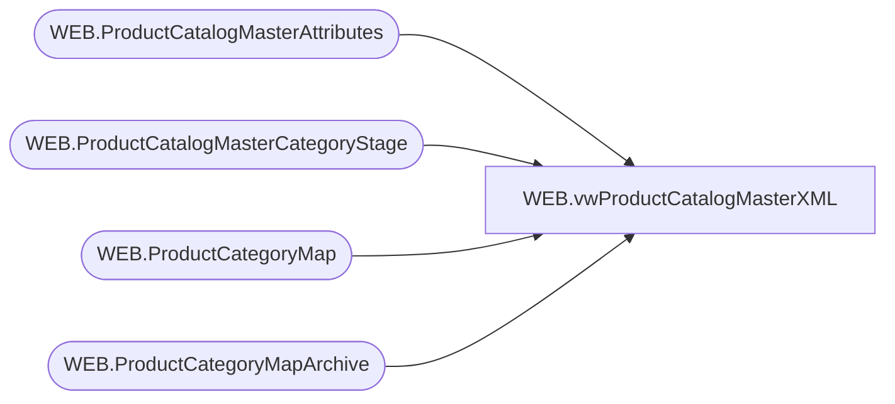

# WEB.vwProductCatalogMasterXML

**Database:** IntegrationStaging  
**Server:** STL-SSIS-P-01  

## Architecture Diagram



## Table Dependencies

| Referenced Table |
|---|
| WEB.ProductCatalogMasterAttributes |
| WEB.ProductCatalogMasterCategoryStage |
| WEB.ProductCategoryMap |
| WEB.ProductCategoryMapArchive |

## View Code

```sql
CREATE view [WEB].[vwProductCatalogMasterXML]

as

--------------------------------------------------------------------------------------------------
-- vwProductCatalogMasterXML - Outputs XML for eCommerce Product Catalog XML 
--							Queries tables that are populated via SSIS, view is tied to same package flow
--- 2017-05-10 - Dan Tweedie - Created View
--------------------------------------------------------------------------------------------------


with 
Header (XML) as
	( 
		select 
			(
				select '/images' as 'internal-location/@base-path',
				(
					select
						--'large' as 'view-type', NULL,
						--'medium' as 'view-type', NULL,
						--'small' as 'view-type', NULL,
						--'swatch' as 'view-type', NULL,
						'hi-res' as 'view-type' 
					for xml path('view-types'), Type
				),
				'color' as 'variation-attribute-id',
				'${productname}, ${variationvalue}, ${viewtype}' as 'alt-pattern',
				'${productname}, ${variationvalue}' as 'title-pattern'
				for xml path('image-settings'), Type
			) 
		for xml path ('header'), Type
	),
Categories (XML) as
	(
		select 
			CategoryID as '@category-id',
			'x-default' as 'display-name/@xml:lang',
			DisplayName as 'display-name',
			'true' as 'online-flag',
			Parent as 'parent',

			'' as 'template',
			'' as 'page-attributes'
		from WEB.ProductCatalogMasterCategoryStage
		order by CategoryID
		for xml path('category'), Type
	),
ViewTypes as
	(
		--select 
		--	BABWProductID,
		--	'large' as 'viewType',
		--	'large/'+cast(cast(BABWProductID as int) as varchar)+'x.jpg' as 'imagePath'
		--from WEB.ProductCatalogMasterAttributes
		--union
		--select 
		--	BABWProductID,
		--	'medium' as 'viewType',
		--	'medium/'+cast(cast(BABWProductID as int) as varchar)+'x.jpg' as 'imagePath'
		--from WEB.ProductCatalogMasterAttributes
		--union
		--select
		--	BABWProductID,
		--	'small' as 'viewType',
		--	'small/'+cast(cast(BABWProductID as int) as varchar)+'x.jpg' as 'imagePath'
		--from WEB.ProductCatalogMasterAttributes
		--union
		--select
		--	BABWProductID,
		--	'swatch' as 'viewType',
		--	'swatch/'+cast(cast(BABWProductID as int) as varchar)+'x.jpg' as 'imagePath'
		--from WEB.ProductCatalogMasterAttributes
		--union
		select
			BABWProductID,
			'hi-res' as 'viewType',
			'/' + cast(cast(BABWProductID as int) as varchar)+'x.jpg' as 'imagePath'
		from WEB.ProductCatalogMasterAttributes
	),
Products (XML) as
	(
		select 
			BABWProductID as '@product-id',
			'' as 'ean',
			UPC as 'upc',
			'' as 'unit',
			'1' as 'min-order-quantity',
			'1' as 'step-quantity',
			'x-default' as 'display-name/@xml:lang',
			SKUDescription as 'display-name',
			'x-default' as 'short-description/@xml:lang',
			'Enter descriptive product text here' as 'short-description', --need to find out from where to pull this
			'x-default' as 'long-description/@xml:lang',
			'true' as 'online-flag', --always true?
			'true' as 'available-flag', --always true?
			'true' as 'searchable-flag', --always true?
			--'large' as 'images/image-group/@view-type',
			--'large/'+BABWProductID+'L.jpg' as 'images/image-group/image/@path',
			(
				select 
					vt.viewType as '@view-type',
					vt.imagePath as 'image/@path'
				from ViewTypes vt
				where vt.BABWProductID = pa.BABWProductID
				for xml path('image-group'), root('images'), TYPE
			),
			'standard' as 'tax-class-id', --do we need to put this in the view? where does it come from?
			'x-default' as 'page-attributes/page-title/@xml:lang',
			SKUDescription as 'page-attributes/page-title',
			'x-default' as 'page-attributes/page-description/@xml:lang',
			'More product descriptive text here' as 'page-attributes/page-description',
				( 
					select
						'asthmaFriendly' as 'custom-attribute/@attribute-id',
						AsthmaFriendly as 'custom-attribute', 
						NULL,
						'color' as 'custom-attribute/@attribute-id',
						ColorCode as 'custom-attribute', 
						NULL,
						'licensedCollection' as 'custom-attribute/@attribute-id',
						LicensedCollection as 'custom-attribute', 
						NULL,
						'occasion' as 'custom-attribute/@attribute-id',
						Occasion as 'custom-attribute',
						NULL,
						'babwProductId' as 'custom-attribute/@attribute-id',
						BABWProductID as 'custom-attribute', 
						NULL,
						'birthCertificateRequired' as 'custom-attribute/@attribute-id',
						BirthCertificateRequired as 'custom-attribute', 
						NULL,
						'className' as 'custom-attribute/@attribute-id',
						ClassName as 'custom-attribute', 
						NULL,
						'commodityCode' as 'custom-attribute/@attribute-id',
						CommodityCode as 'custom-attribute',
						NULL,
						'department' as 'custom-attribute/@attribute-id', --may not need, its a category level
						Department as 'custom-attribute', 
						NULL,
						'exclusive' as 'custom-attribute/@attribute-id',
						WebExclusive as 'custom-attribute', 
						NULL,
						'eyeColor' as 'custom-attribute/@attribute-id',
						EyeColor as 'custom-attribute', 
						NULL,
						'girl' as 'custom-attribute/@attribute-id',
						Girl as 'custom-attribute', 
						NULL,
						'neutralMerch' as 'custom-attribute/@attribute-id',
						Neutral as 'custom-attribute', 
						NULL,
						'outfits' as 'custom-attribute/@attribute-id',
						Outfits as 'custom-attribute', 
						NULL,
						'hierarchygroupcode' as 'custom-attribute/@attribute-id', --may not need --why would we need this??
						HierarchyGroupCode as 'custom-attribute', 
						NULL,
						'keyStory' as 'custom-attribute/@attribute-id',
						KeyStory as 'custom-attribute', 
						NULL,
						'merchInDate' as 'custom-attribute/@attribute-id',
						MerchInDate as 'custom-attribute', 
						NULL,
						'manufacturerCountry' as 'custom-attribute/@attribute-id',
						ManufacturerCountry as 'custom-attribute', 
						NULL,
						'mini' as 'custom-attribute/@attribute-id',
						Mini as 'custom-attribute', 
						NULL,
						'music' as 'custom-attribute/@attribute-id',
						Music as 'custom-attribute', 
						NULL,
						'productSellingGeography' as 'custom-attribute/@attribute-id',
						ProductSellingGeography as 'custom-attribute',
						NULL,
						'seasonal' as 'custom-attribute/@attribute-id',
						Seasonal as 'custom-attribute',
						NULL,
						'shippingClass' as 'custom-attribute/@attribute-id',
						ShippingClass as 'custom-attribute',
						NULL,
						'stuffedAndClosedProduct' as 'custom-attribute/@attribute-id',
						SAC as 'custom-attribute',
						NULL,
						'tops' as 'custom-attribute/@attribute-id',
						Tops as 'custom-attribute',
						NULL,
						'collegeTeams' as 'custom-attribute/@attribute-id',
						CollegeTeam as 'custom-attribute',
						NULL,
						'MLBTeams' as 'custom-attribute/@attribute-id',
						MLBTeam as 'custom-attribute',
						NULL,
						'NBATeams' as 'custom-attribute/@attribute-id',
						NBATeam as 'custom-attribute',
						NULL,
						'NFLTeams' as 'custom-attribute/@attribute-id',
						NFLTeam as 'custom-attribute',
						NULL,
						'NHLTeams' as 'custom-attribute/@attribute-id',
						NHLTeam as 'custom-attribute',
						NULL,
						'UKFootball' as 'custom-attribute/@attribute-id',
						UKFootball as 'custom-attribute',
						NULL,
						'warninglabel' as 'custom-attribute/@attribute-id',
						WarningLabel as 'custom-attribute',
						NULL,
						'accessoryEligible' as 'custom-attribute/@attribute-id',
						AccessoryEligible as 'custom-attribute',
						NULL,
						'skinType' as 'custom-attribute/@attribute-id',
						SkinType as 'custom-attribute',
						NULL,
						'friendHeight' as 'custom-attribute/@attribute-id',
						FriendHeight as 'custom-attribute',
						NULL,
						'friendWeight' as 'custom-attribute/@attribute-id',
						FriendWeight as 'custom-attribute',
						NULL,
						'soundEligible' as 'custom-attribute/@attribute-id',
						SoundEligible as 'custom-attribute',
						NULL,
						'productCanBeEmbroidered' as 'custom-attribute/@attribute-id',
						ProductCanBeEmbroidered as 'custom-attribute',
						NULL,
						'productMustBeEmbroidered' as 'custom-attribute/@attribute-id',
						ProductMustBeEmbroidered as 'custom-attribute',
						NULL,
						'purses' as 'custom-attribute/@attribute-id',
						Purses as 'custom-attribute'
					for xml path('custom-attributes'), Type
				) ,
				--(---NEED TO ADD A VARIANTS PATH FOR VARIANT PRODUCT-IDS	
				--	select 
				--		'' as 'variant/@product-id'--,NULL,
				--		--'' as 'variant/@product-id',NULL,
				--		--'' as 'variant/@product-id'
				--	for xml path('variants'), ROOT('variations'), Type
				--),
			CategoryTree as 'classification-category' 
		from WEB.ProductCatalogMasterAttributes pa
		order by BABWProductID
		for xml path('product'), Type
	),
CategoryAssignment (XML) as 
	(
		select *
			from 
				(
					select 
						CategoryID as '@category-id',
						Style as '@product-id',
						NULL as '@mode', NULL xtra1,
						'true' as 'primary-flag', NULL xtra2
					from WEB.ProductCategoryMap
					UNION
					select 
						CategoryID as '@category-id',
						Style as '@product-id',
						'delete' as '@mode',NULL xtra1,
						NULL as 'primary-flag', NULL xtra2
					from WEB.ProductCategoryMapArchive
					where ChangeType = 'Deleted' 
					and CurrentBatch = 1
				) x
			order by 2, 1
			for xml path('category-assignment'), Type
	),
XMLStage (XML) as
	(
		select
			'buildabear-master' as '@catalog-id',
			--(
			--	select *
			--	from Header
			--),
			(
				select *
				from Categories
			),
			(
				select *
				from Products
			),
			(
				select *
				from CategoryAssignment
			)
		for xml path('catalog'), Type
	)
select 
cast(
	replace(cast(XML as nvarchar(max)), '<catalog catalog-id="buildabear-master">', '<catalog catalog-id="buildabear-master" xmlns="http://www.demandware.com/xml/impex/catalog/2006-10-31">') 
as xml) as XMLData
from XMLStage
```

